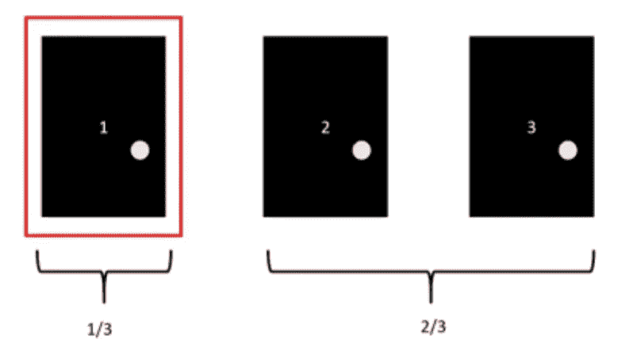
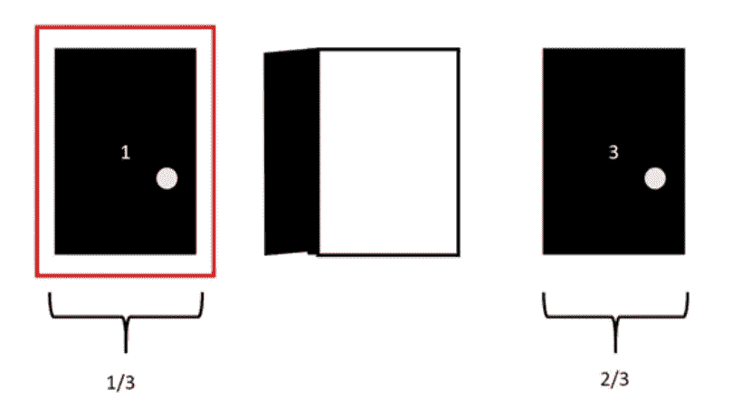
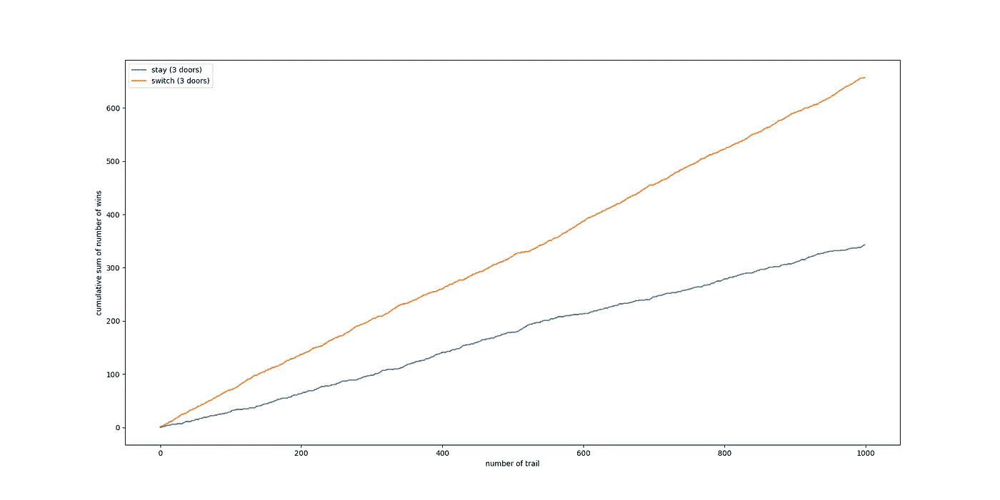
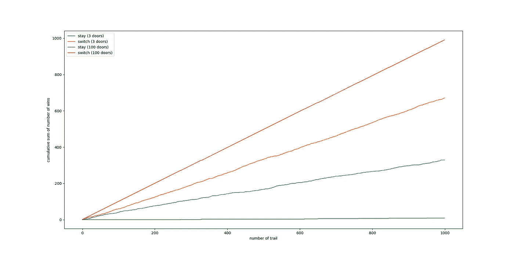

# 为什么转行比留在天魔堂好？

> 原文：<https://medium.com/geekculture/why-switch-strategy-is-better-than-stay-strategy-in-monty-hall-9cd5a8065b75?source=collection_archive---------19----------------------->

## 有三扇门 A、B 和 c。其中一扇门后是奖励。你选择 A 门，主持人打开 C 门，显示 C 门没有奖励，现在是留在 A 门还是切换到 B 门？答案是你需要经常换人，因为这样赢的机会更大。在 python 模拟中找出原因！


Photo by [Akriti Singh](https://unsplash.com/@akriti_singh?utm_source=unsplash&utm_medium=referral&utm_content=creditCopyText) on [Unsplash](https://unsplash.com/s/photos/three-doors?utm_source=unsplash&utm_medium=referral&utm_content=creditCopyText)

# 什么是蒙蒂大厅？

Monty Hall 是一个游戏展示，有 3 扇门，其中一扇门后面有一个奖励，是一辆汽车。首先，你需要从三扇门中选择一扇门。然后，知道汽车在哪里的主人将总是打开另一个你没有选择并且也不包含汽车的门。主持人接着问“你想呆在你选择的同一个门还是想换到另一个门？”。

人们通常认为选择留下或换工作的可能性是 50%。事实上并不是这样，经常换车比呆在你选择的同一扇门前更有可能赢得一辆车。

# 为什么会这样呢？

如果有三扇门:1、2 和 3，其中一扇门后是奖励。如果选择门 1。然后，主人打开 2 号门，显示 2 号门没有奖励。现在主持人问:“你想留下还是换？”

你可能会想，你获奖的概率是 1/3。当主人打开 2 号门时，你剩下 2 个门，那么你中奖的概率是 1/2，要么留在 1 号门，要么换到 3 号门。



Probability of wining and losing before the door is open (my screen shot)



Probability of wining and losing after the door is open (my screen shot)

如果我们再想想。1 号门你赢的概率是 1/3。同样，你不会赢的概率也就是奖励出现在你没有选择的门的概率是 2/3(在门 2 和门 3)。然而，一旦主人打开 2 号门并显示这里没有奖励，那么奖励出现在你没有选择的门(现在只剩下 3 号门)的概率是 2/3，这一点也没有错。这意味着你呆在 1 号门中奖的概率是 1/3，而你转到 3 号门中奖的概率是 2/3，这个概率更高。

如果我们把门的数量增加到更高。假设有 100 扇门，即 1，2，3，4，5 …,100.如果选择门 1。然后主持人打开 2 号门到 99 号门，你现在只剩下 1 号门和 100 号门，“你想留下还是换？”。如果我们使用与之前相同的逻辑，停留在 1 号门的获胜概率是 1/100，而切换到 100 号门的获胜概率是 99/100。现在看来，留下和换工作有很大的不同。我们将在后面的文章中证明，在 100 门游戏中使用转换策略获胜的概率甚至高于在 3 门游戏中使用转换策略获胜的概率。此外，在 100 门游戏中使用停留策略获胜的概率甚至低于在 3 门游戏中使用停留策略获胜的概率。

# Python 模拟

下面的 python 代码演示了如果我们有两种类型的玩家，一种总是“停留”另一种总是“转换”，玩几次 Monty Hall 游戏会发生什么。这些玩家中的任何一个会比另一个有更高的获胜几率吗？

**注:每一轮模拟中的每一个决策都是在一定条件下随机产生的，这里没有定数。**

首先，我们需要两个输入参数。num_trial，试验次数，是两个玩家玩游戏的次数。num_door，门的数量，是这个游戏中将有多少个门(最初只有 3 个门，但是为了支持上述理论，在这个模拟中将使用更多的门)，但是奖励的数量仍然将固定为 1 个门，而不管门的总数。

```
#input parameters
num_trial = 1000
num_door = 3
```

接下来，我们创建两个函数，一个函数随机选择玩家要选择的门，另一个函数随机分配哪个门包含奖励的汽车。实际上我们可以使用同一个函数，因为它们都在做同样的事情，但是为了演示的目的，我们把它们分开了。

```
def select_function():
    return np.random.randint(1,num_door + 1) #randint 1 to num_doordef car_location_function():
    return np.random.randint(1,num_door + 1) #randint 1 to num_door
```

接下来，函数 open_door 用于主机，它将总是打开玩家没有选择的门，并且应该是不包含奖励的门。该函数返回应该打开的门的名称列表(如果我们有 3 个门，主机将只能打开 1 个门，如果我们有 4 个门，主机需要打开 2 个门)。while 循环确保要打开的门不应该是玩家选择的门，也不应该是包含奖励的门。除此之外都可以打开。

```
def open_door(car_location,select_location):
    o_list = []
    for _ in range(num_door - 2):
        o = np.random.randint(1,num_door + 1)

        while o == car_location or o == select_location or o in o_list:
            #repeat until not open the car door and selected door
            o = np.random.randint(1,num_door + 1)
        o_list.append(o)
    return o_list
```

接下来，这是为经常切换的玩家提供的切换功能。切换功能需要知道主机已经打开了哪个门，以及玩家首先选择了哪个门，以便切换到另一个门。

```
def switch(open_location,select_location):
    o = np.random.randint(1,num_door + 1)

    while o in open_location or o == select_location:
        #repeat until not open the car and selected location
        o = np.random.randint(1,num_door + 1)
    return o
```

最后，我们有检查玩家是否中奖的功能。如果玩家赢了，该值为 1，否则为 0。

```
def check_win_condition(select_location,car_location):   
    if car_location == select_location:
        return 1
    else:
        return 0
```

让我们开始模拟 1000 条路线。每次试验我们都记录玩家在“停留”策略玩家和“切换”策略玩家的列表中是赢是输，这两个列表分别称为停留列表和切换列表；接受地。

```
stay_list = []
switch_list = []
door_list = np.arange(1,num_door)for i in range(0,num_trial):
    print(i)
    select_location = select_function()
    car_location = car_location_function()
    open_location = open_door(car_location,select_location)

    #if stay
    stay_list.append(check_win_condition(select_location,car_location))

    #if switch
    select_location = switch(open_location,select_location)
    switch_list.append(check_win_condition(select_location,car_location))
```

然后，我们对列表和图进行累加和比较。

```
stay_list = np.cumsum(stay_list)
switch_list = np.cumsum(switch_list)#visualisation
plt.plot(stay_list,label = "stay (" + str(num_door) + " doors)")
plt.plot(switch_list,label = "switch (" + str(num_door) + " doors)")
plt.ylabel("cumulative sum of number of wins")
plt.xlabel("number of trail")
plt.legend()
plt.show()
```



The comparison of cumulative count of number of win between “stay” strategy player and “switch” strategy player for 1000 trails for 3 doors game (my screen shot)

显然，转换策略玩家的累积获胜次数高于停留策略玩家，并且这种差异随着尝试次数的增加而增加。这证明总是“掉包”的人有更高的胜算。

现在让我们看看游戏中是否有 100 扇门…



The comparison of cumulative count of number of win between “stay” strategy player and “switch” strategy player for 1000 trails for 3 doors and 100 doors game (my screen shot)

很明显，100 门游戏的开关策略玩家的累积获胜次数甚至高于 3 门游戏的开关策略玩家。此外，100 门游戏的停留策略玩家的累积获胜次数甚至低于 3 门游戏的停留策略玩家。

完整的 python 代码可在此处获得:

# 摘要

切换有更高的机会赢得游戏。此外，使用切换策略的累积获胜次数和使用停留策略的累积获胜次数之间的差异随着门数量的增加而增加。