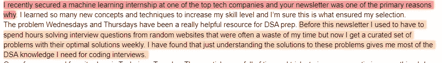

# 为什么会说话的模特不会抢走你的工作

> 原文：<https://medium.com/geekculture/why-talking-models-are-not-going-to-take-your-jobs-58296f8489e0?source=collection_archive---------5----------------------->

## 许多社交媒体有影响力的人正在跳上这辆炒作列车

最近，我看到许多社交媒体影响者在谈论人工智能将如何取代所有人。

如果你一直关注人工智能，你会认识到这一趋势。然而，这一次它获得了一些重要的关注。人工智能代理能够做一些疯狂的事情，比如生成艺术，编写一些令人印象深刻的代码，甚至破译笑话。[本文回顾了一些使这些任务成为可能的最新创新](/geekculture/google-ai-sparks-a-revolution-in-machine-learning-403f4dbf3e70)。

然而，从人工智能和工程的角度来看，这离取代人还有很长的路要走。任何称职的正派人都会告诉你这一点。然而，这些影响者并不真的在乎。他们只是来煽动你的恐惧，制造一些噪音，并从订婚中获利。

For more such top-tier memes, follow me on Instagram and Twitter.

在这篇文章中，我将回顾这些模型不会取代你、你的艺术家朋友或这些影响者声称的许多其他工作的数学原因。

A lot of AI is based on this formula. Don’t worry, I’ll explain what this means. [Image Source](https://cs.carleton.edu/cs_comps/0910/netflixprize/final_results/knn/index.html)

# 主要亮点

1.  **数据是如何存储的-** 为了理解这些东西是如何工作的(以及为什么它们不会取代人)，我们先来理解模型是如何处理输入的。在最简单的情况下(也是最常见的情况)，输入被存储为一个向量(这是一个关于列表的奇特的数学术语)。向量的每个元素代表一个特定的特征。把它看作是你的样品的一个特征。如果我们要创建一个你的数据向量，像身高、体重、被打的次数、喜欢巧克力牛奶等等都是特征。
2.  **比较两个数据点之间的相似性-** 记住，每个数据点都存储为一个向量。要比较相似性，我们要做的就是比较向量之间的距离。这就是上面的公式有用的地方。它被称为余弦相似性。根据您的需求，您可能想要使用其他距离度量。和其他任何决定一样，这里有一个权衡。 [*我已经在这里更详细地介绍了余弦相似性，供那些感兴趣的人使用*](https://youtu.be/SUrs31AYQ8Q) 。就我们的目的而言，需要注意的重要一点是余弦相似性可以给出两个向量之间的相似性。
3.  **这跟大模特有什么关系-** 合理的问题。为了简化一个庞然大物，模型接受你的用户输入，并试图生成一个他们认为会很好地匹配它的答案。匹配是由相似性(或互补，称为不一致)决定的。他们做得很好，因为他们投入了大量的资源来训练他们。他们能够在此基础上建立非常精细的搜索空间，这不是标准模型的情况。
4.  **为什么这些模型不会取代你的工作(效用)-** 现在来看看这些影响者忽略了(或者没有考虑到)的一点。这些模型的模式与现有数据相匹配。他们不能使用新的输入。例如，如果我创建了一个新的库，吹嘘的 GT-CoPilot 会与之斗争(它甚至会与现有的库斗争)。如果你所做的只是从旧的数据中创造艺术/剧本，你将永远不会创造出反映当代观众口味的新角色。
5.  **为什么这些模型不会取代你的工作(工程)-** 这些模型也有一些工程问题，使它们无法大规模使用。首先，运营这些项目非常昂贵。这使得它们在规模上不切实际。其次，它们对扰动非常脆弱，很容易被破坏。对于必须部署到现实世界中的任何东西来说都不是好事。我很快会对 Github CoPilot 做更详细的介绍，所以请保持关注。

对于那些对人工智能感兴趣的人，我在 6 月份制作了一个视频，讲述了为什么谷歌的 Lambda 模型没有生命力。在谷歌创立之初，互联网疯狂地猜测谷歌可能创造了一个活生生的模型。它更详细地讨论了这些要点。看看下面--

如果你喜欢这篇文章，你会喜欢我的每日电子邮件简讯[科技使事情变得简单](https://codinginterviewsmadesimple.substack.com/)。它涵盖了算法设计、数学、人工智能、数据科学、最近的技术事件、软件工程等主题，让你成为更好的开发人员。 [**我目前正在进行一整年的八折优惠，一定要去看看。**](https://codinginterviewsmadesimple.substack.com/subscribe?coupon=1e0532f2) 使用此折扣会降低价格-

***每月 800 卢比(10 美元)→ 533 卢比(8 美元)***

***每年 8000 印度卢比(100 美元)→6400 印度卢比(80 美元)***

你可以在这里了解更多关于时事通讯的信息

# 向我伸出手

使用下面的链接查看我的其他内容，了解更多关于辅导的信息，或者只是打个招呼。另外，查看免费的罗宾汉推荐链接。我们都得到一个免费的股票(你不用放任何钱)，对你没有任何风险。所以不使用它只是在损失免费的钱。

为了帮助我了解您[请填写此调查(匿名)](https://forms.gle/7MfQmKhEhyBTMDUD7)

查看我在 Medium 上的其他文章。:[https://rb.gy/zn1aiu](https://rb.gy/oaojch)

我的 YouTube:【https://rb.gy/88iwdd 

在 LinkedIn 上联系我。我们来连线:【https://rb.gy/m5ok2y】T4

我的 insta gram:[https://rb.gy/gmvuy9](https://rb.gy/gmvuy9)

我的推特:[https://twitter.com/Machine01776819](https://twitter.com/Machine01776819)

如果你想在科技领域发展事业:[https://codinginterviewsmadesimple.substack.com/](https://codinginterviewsmadesimple.substack.com/)

获得罗宾汉的免费股票:[https://join.robinhood.com/fnud75](https://join.robinhood.com/fnud75/)