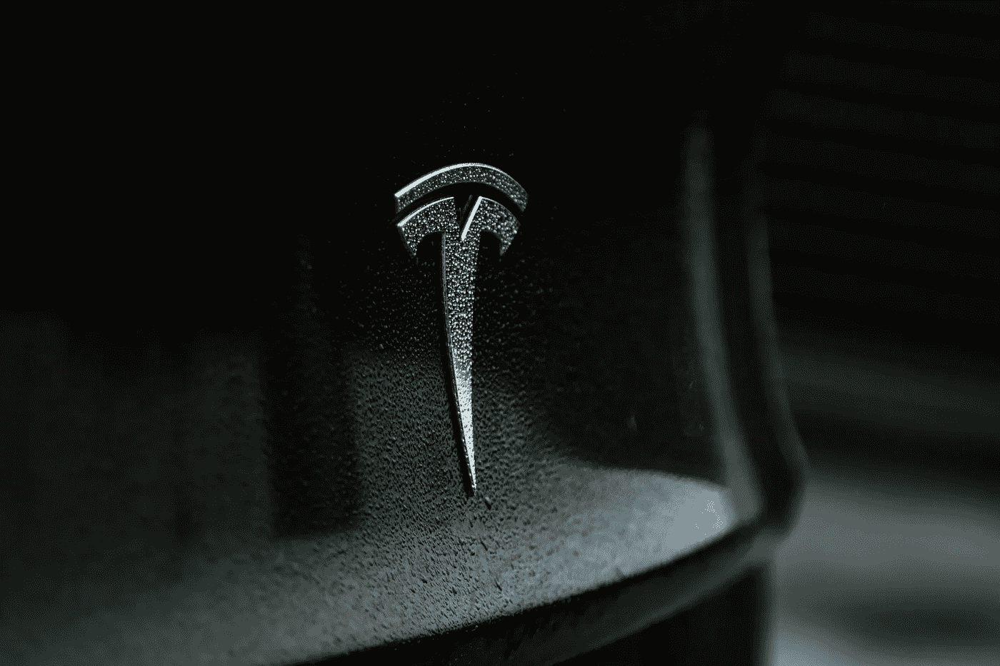

# 为什么特斯拉会在未来几年占据电动汽车的宝座

> 原文：<https://medium.com/geekculture/why-tesla-will-hold-the-ev-throne-for-years-to-come-e057723be5df?source=collection_archive---------21----------------------->

## 传统汽车制造商终于给了特斯拉一次真正的考验。特斯拉仍然有巨大的优势。

Photo by [Austin Ramsey](https://unsplash.com/@austin__ramsey?utm_source=unsplash&utm_medium=referral&utm_content=creditCopyText) on [Unsplash](/s/photos/tesla?utm_source=unsplash&utm_medium=referral&utm_content=creditCopyText)

随着新的政治领导层到位，可持续能源在商界受到更大的重视，美国汽车制造商开始转向电动汽车生产。传统汽车制造商，如通用汽车公司和…