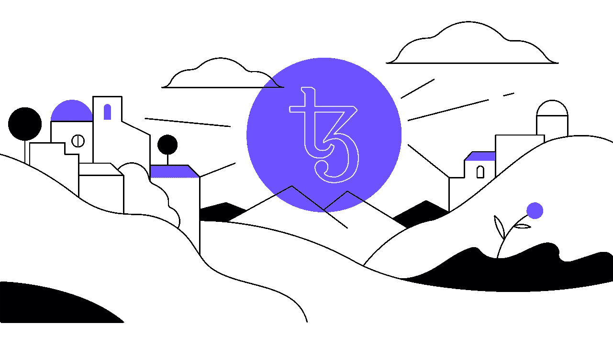
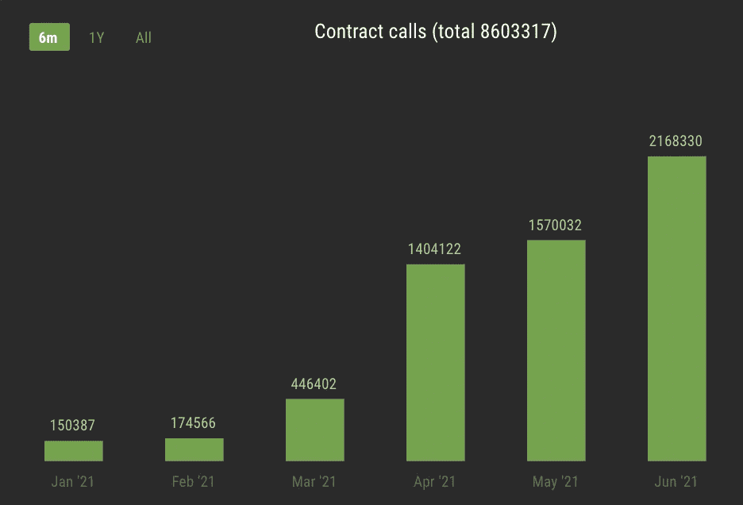
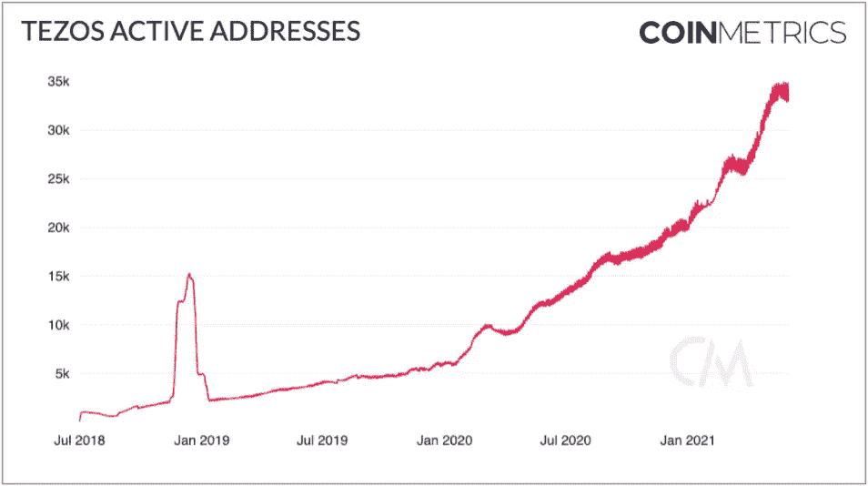
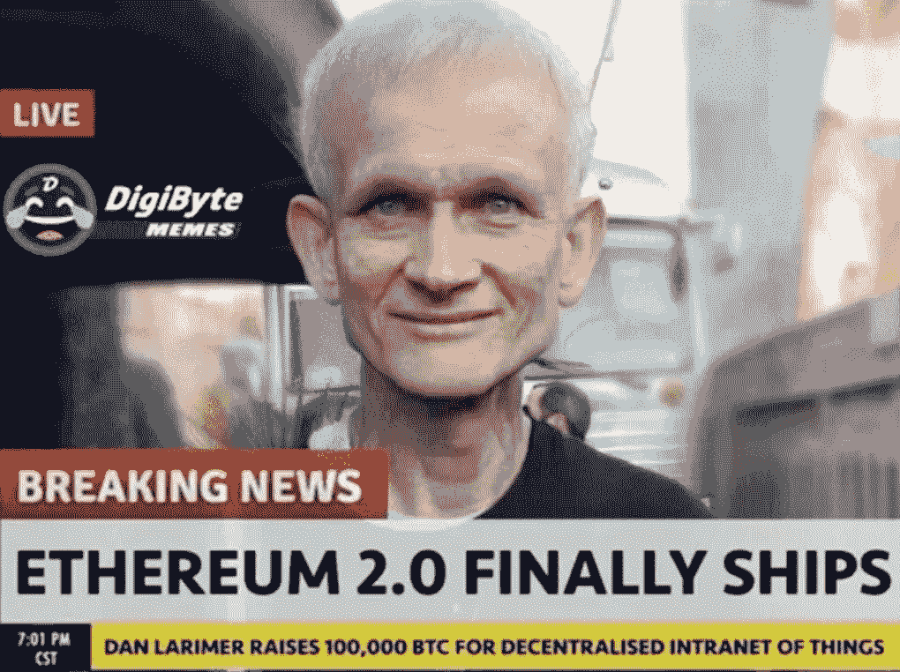
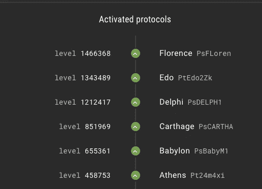
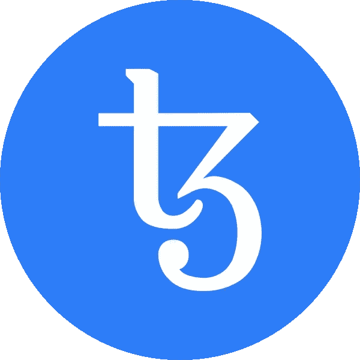

# 为什么泰佐斯能经受住隐星人的战争

> 原文：<https://medium.com/geekculture/why-tezos-will-weather-the-cryptoverse-wars-eb5d85e6f1e8?source=collection_archive---------4----------------------->

Courtesy of Kathleen Breitman on [Gemini](https://www.gemini.com/cryptopedia/what-is-tezos-xtz-governance-use-cases)

在 Polygon 找到竞争对手以太坊的牵引力和 Solana 筹集 3.14 亿美元之间，Tezos 是一个不太可能的话题。正确，2017 年的 mega ICO 卷入了法律问题，并从炒作雷达上消失了。

然而，Tezos 生态系统似乎已经准备好起飞了。 [Hic Et Nunc](https://www.hicetnunc.xyz/) 和 [Kalamint](https://kalamint.io/) 已经成为[NFT 顶级市场](https://dappradar.com/rankings/category/marketplaces)，而[迈凯轮](https://twitter.com/McLarenF1/status/1405495520987123717)、和[红牛车队](https://www.redbull.com/int-en/redbullracing/tezos-joins-as-official-blockchain-partner)之一的[宣布的计划预示着持续的势头。同样，DeFi 也在像](https://www.coindesk.com/oneof-raises-63m-for-music-nft-platform-with-green-credentials) [Kolibri](https://kolibri.finance/) 、 [Plenty](https://www.plentydefi.com/) 、 [Quipuswap](https://quipuswap.com/swap) 和 [Wrap](https://www.benderlabs.io/wrap) 这样的平台上插上翅膀。而且，无论是在[阿斯彭](https://cointelegraph.com/news/aspen-launches-on-tzero-amid-record-security-token-volume)还是[曼谷](https://www.bangkokpost.com/business/1643600/seamico-and-partners-seek-to-tokenise-property)，2020 年 Tezos 上的证券代币发行占全球总量的[12%](https://docsend.com/view/w4xkmby36qtduqae)。

Smart contract interactions have multiplied fourteen-fold since January ([Better Call Dev](https://better-call.dev/stats/mainnet/general))

然而，泰佐斯的案例超越了这一势头。为了阐明这一点，让我们从一个简单的类比开始。是什么让你选择了瑞士法郎而不是黎巴嫩镑？

很简单，你可能认为瑞士法郎是一种更可靠、更有用的资产。类似地，如果加密货币是健全的，并且有一个强大的生态系统，那么它们就很有吸引力。

The surge in active users tells a similar story of growth ([CoinMetrics](https://charts.coinmetrics.io/network-data/#1304))

这些属性是密切相关的。美元具有巨大的网络效应，但如果美联储的政策稀释了大多数持有人，美元的长期价值就值得怀疑。相反，比特币提供了算法稀缺性，但这只有在人们关心的情况下才有意义。

技术呢？

坚实的技术是最低限度的，但它很难在一个基本上没有许可和开源的空间中创建一个护城河。如果加密货币是一种社会、政治或经济结构，那么它超越了技术的未来证明是什么。

毕竟，相对而言，比特币和以太坊都是科技恐龙，为什么它们还能主宰空间？

# 论健全的货币

比特币讲述了一个简单的故事:硬上限供应，以及个人、机构和国家不断上升的需求，这表明比特币是数字时代的硬通货。

以太坊则更复杂。它已经建立了一个巨大的网络效应，但只有通过 EIP-1559，它的资产(以太网)才变得无通胀，并获得协议级效用——即支付交易基础费用。*

* *而* *极不切实际，费用理论上可以用其他货币* [*支付*](https://docs.ethhub.io/questions-about-ethereum/is-ether-needed-for-transaction-fees/) *在——1559 年之前，以太坊核心开发主持人 Tim Beiko 最近强调了一点***。**

**

*The EIP-1559 money meme ([Justin Drake](https://twitter.com/drakefjustin/status/1367900072252473345))*

*然而，这种效用仍然很小，这是以太坊周围的看涨情绪转向股权证明共识的主要原因。也就是说，股权证明将赋予以太一种价值获取机制:持有者将有权生产大宗商品，从而赚取通胀性大宗商品奖励和交易费。*

*如果股权证明通过向验证者支付通货膨胀来保护自己，那么其固有资产的价值储存质量取决于其他持有人随之而来的稀释。如果奖励只属于验证者，那么其他所有人都要支付通货膨胀税。如果所有持有人都按照余额的比例获得它们，那么通货膨胀就没有实际意义。*

*泰佐斯在哪里？首先，自 2018 年年中以来，它一直是一个功能完整的利益证明网络，比 Cardano 或以太坊 2.0 更好。路线图可能比功能产品更令人兴奋，但生产中的成功记录更重要。*

*此外，其授权机制非常有利于非稀释性通胀。任何地址(包括智能合同)都可以将 XTZ 委托给一个[面包师](https://wiki.tezosagora.org/learn/baking)，而不会转移监管权或面临被砍的风险。随着授权增加了面包师生产下一块面包的机会，面包师们就他们付给授权者的奖励百分比展开竞争。*

*XTZ 通胀的非稀释性是一个关键点。打个比方，想象一下，如果美联储通过按余额比例向所有持有者分配新美元来实施货币政策。比特币和 Tezos 可能不会竞争，但这颠覆了比特币健全的货币框架。*

*其他的利益相关链呢？ [Algorand](https://www.algorand.com/technology/faq) 和 [Cardano](https://cardanode.com.au/ep009-how-to-stake-cardano-for-rewards/) 有相似的模型，但是 [BSC](https://docs.binance.org/faq/bsc/del.html) 、 [Celo](https://bisontrails.co/delegate/celo/) 、[多边形](https://docs.matic.network/docs/validate/delegator-faq/#what-is-the-unbonding-period)、[附近](https://docs.near.org/docs/validator/staking-overview)和 [Solana](https://docs.solana.com/staking/stake-accounts#delegation-warmup-and-cooldown) 都锁定了委托令牌，并对其进行解绑。 [Polygon](https://docs.matic.network/docs/validate/delegator/) 和 [Solana](https://docs.solana.com/staking) 甚至让委托人面临被砍的风险。以太坊 2.0 将遵循这一模式，在我看来，这将在资产的可用性及其作为价值储存手段的质量之间产生张力。*

# *论持续网络效应*

*比特币有一个庞大而狂热的群体。还记得迈阿密的那个[奇怪的时刻](https://www.youtube.com/watch?v=ENE15uAMZSE)吗？这种观点认为，为了增加这种网络效应，比特币只需要做好自己——由一致、可预测的技术支持的数字稀缺性。林迪效应是比特币的盟友，使其更难被破坏。*

*另一方面，以太坊渴望成为全球性的计算机。尽管已经诞生了一个欣欣向荣的生态系统，但它更容易受到先进技术的破坏。事实上，高昂的费用和缩放问题已经导致以太坊的网络效果分裂成 Polygon 或 BSC 等替代 EVM。以太坊 2.0 继续滞后，没有一个明确的时间表，这当然没有帮助。*

*这说明了一个更大的问题:区块链必须自我升级以保持其网络效应，但升级在分散的系统上很难执行。解决这个问题归结于治理，这是一个非常主观的主题，很难在一篇文章中解决。然而，我确实观察到以太坊上的[治理既不可扩展也不有效。](https://docs.ethhub.io/ethereum-basics/governance/)*

*首先，没有正式的机制来衡量对改进建议的支持。这实际上将责任推给了以太坊的核心开发者[，他们的负担随着生态系统的规模而增长](https://twitter.com/lrettig/status/1112073071186403329)。同样，激活升级需要与节点运营商进行大量的协调，这一斗争的附带影响在以太坊应用“[于 2020 年 11 月陷入黑暗](https://www.coindesk.com/ethereums-hard-fork-disruption)时变得明显。Vitalik 谈到了“与人相关的问题”，而过去的记录说明了一切。*

**

*另一方面，Tezos 从一个原则出发，即区块链——它本身是一个去中心化的、无信任的协调机制——可以用于它自己的“自我修正”。规范协议存储在链上，可以通过正式的过程进行修改。*

*在一个公开的过程中，任何面包师都可以提交一份修改协议的提案。投票率最高的提案将继续进行两轮投票，如果获得批准，将与当前协议进行热交换，并在 mainnet 上激活。虽然是面包师投票，但用户通过 Tezos 的授权机制获得了具体的发言权。这实际上为 Tezos 的发展提供了一种融资方式，提议的面包师还可以附上一张发票，如果提议获得批准，发票将在新铸造的 XTZ 结算。*

*重要的是，Tezos 上的治理不是一个路线图想法，它有一个跟踪记录。自成立以来，Tezos 已经进行了六次升级，涵盖了各种功能和优化。例如，德尔福实施了气体优化，为生态系统应用带来了[具体利益](https://twitter.com/LukeYoungblood/status/1336220013666074625)。[另一方面，Edo](/tezoscommons/tezos-blockchains-fast-pace-of-evolution-delivers-new-features-with-edo-upgrade-fec6a62a4b8b) 整合了 ZCash 的技术，在 Tezos 上实现了注重隐私的用例。*

**

*Upgrades are named after ancient cities. You can watch them progress on [tezosagora.org](https://www.tezosagora.org/). [Granada](https://www.tezosagora.org/period/49) is currently in progress. ([Better Call Dev](http://Better Call Dev))*

*这种分散升级的节奏不仅对保持网络效果很重要，也是将整个空间变成 R&D 部门的一种方式。就像 Tezos 在隐私问题上借鉴 ZCash 一样，它也在借鉴 Cosmos 来激活一个基于 Tendermint 的[新共识机制](/tqtezos/rapid-innovation-tezos-tenderbake-testnet-spawned-9168da6599d9?source=linkShare-47a88900b404-1625638845)。*

*归根结底，治理系统是复杂的、主观的，而且从来没有最终设计出来。然而，Tezos 可以理直气壮地宣称，它是 L1 去中心化治理的先锋，通过每个季度的升级来检验它的模式。无需相信我的话:以太坊的联合创始人和 Polkadot 的创造者[Gavin Wood 最近强调了可升级性](https://www.coindesk.com/polkadot-gavin-wood-webassembly-smart-contracts-evm)的重要性，强调 Tezos 是“目前唯一拥有这种功能的”。*

*作为对前工业时代智慧的总结，据说查尔斯·达尔文曾说过“幸存下来的物种不是最强壮的，也不是最聪明的，而是最能适应变化的”。他会喜欢泰佐斯的。*

**

*_________________________________________________________________*

**不理财建议。Long 本文中提到的所有货币。想开始使用 Tezos 吗？激活您的* [*Kukai*](https://wallet.kukai.app/direct-auth) *或*[*Temple*](https://chrome.google.com/webstore/detail/temple-tezos-wallet-ex-th/ookjlbkiijinhpmnjffcofjonbfbgaoc?hl=en)*钱包，并查看*[*dapp store*](https://better-call.dev/dapps/list)*。🚀**

**大喊到* [*隐密体*](https://cryptocodeschool.in/tezos/) *在我之前谁创造了“隐密体战争”这个术语。查看他们的 Tezos 开发教程。**

**特别感谢*[*Arthur Breitman*](https://medium.com/u/50f422e6e1a9?source=post_page-----eb5d85e6f1e8--------------------------------)*，Tezos 的早期架构师，通过他的博客帖子和播客帮助我了解 Tezos 的愿景。**