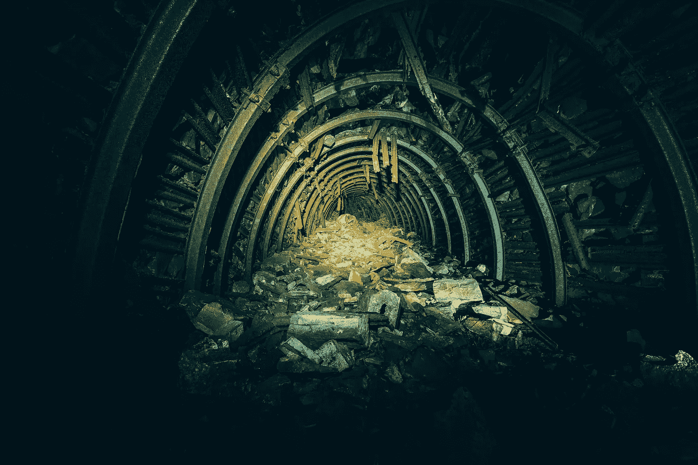

# 为什么 Theta 网络是金矿？

> 原文：<https://medium.com/geekculture/why-theta-network-is-a-gold-mine-a43eadd55e7b?source=collection_archive---------10----------------------->

## 最有前途的加密项目之一

Photo by [Taton Moïse](https://unsplash.com/@moyse?utm_source=unsplash&utm_medium=referral&utm_content=creditCopyText) on [Unsplash](https://unsplash.com/s/photos/gold-mine?utm_source=unsplash&utm_medium=referral&utm_content=creditCopyText)

你在找那个坚如磐石的加密项目吗？Theta 网络可能更多！

让我告诉你我在关于 Theta Network 的研究中发现了什么，这是一个成立于 2017 年的项目，具有巨大的潜力，我将解释 Theta Network 是一座金矿的原因！

该项目是一个点对点流媒体解决方案，正在成为一个超高质量视频和流媒体的分散平台，具有高效率的内容分发。

# Theta 是一个分散的流媒体网络

## 这意味着它在区块链上吗？

是的，它使用验证器节点和边缘节点工作。每个用户都可以是为网络贡献带宽和处理能力的节点，并因共享其资源而获得令牌奖励。这意味着网络以分散的方式工作。

相比之下，如今的常规平台使用集中式内容交付网络，这意味着发送给用户的所有数据都来自这个中央单元。正因为如此，很多时候，向全球某些地区的递送很差，导致需要重新缓冲和增加装载时间。

Theta 解决了所有这些问题，并使用对等网络来有效地分发内容，而不需要昂贵的数据中心。

Official Theta intro video

# 支持 4K、8K 或更好的视频流

## 【Theta 能成为下一个 YouTube 吗？

就技术创新和传输视频数据的全球可扩展性而言，heta 的目标是流媒体，就像 YouTube 的视频一样。

它旨在成为一个分散的视频流平台，这与 YouTube 等平台目前的工作方式相反，因为这些平台是集中的。Theta 允许对视频进行实时编码，以向最终用户输出 4k、8k 甚至更多的视频，而没有中断或缓冲。

YouTube 的联合创始人**陈士骏**谈到这个项目时说

*Theta 的创新将颠覆今天的在线视频行业，就像 2005 年 YouTube 平台颠覆传统视频一样。“我们最大的挑战之一是向世界各地传送视频的高成本，随着高清、4K 和更高质量视频流的出现，这个问题变得越来越大，”YouTube 的联合创始人陈士骏说我很高兴成为流媒体领域下一次发展的一部分，帮助 Theta 创建一个分散的点对点网络，以更低的成本提供更好的视频传输。*

低质量视频和流媒体的时代很快就会结束…

# θ可以变得很大

## 让我们加入浪潮吧！

这个项目最大的好处之一是许多大公司和机构已经开始支持它。美国宇航局选择流媒体平台 [theta.tv](https://www.theta.tv/) 直播他们的频道。YouTube 和 Twitch 的顾问正在帮助 Theta 团队开发他们的平台，这里有一些以某种方式加入的公司:三星、谷歌、微软、威瑞森、Twitch 和许多其他公司。

听起来很有希望，不是吗？

Theta Network 是一个金矿，因为它有无限的增长潜力，如果你是一个密码爱好者，你可以利用这一点。

如果你在电脑上安装了 Edge Node，让它运行某些工作，比如视频编码，你就可以赚取 TFuel，或者你可以加入 [theta.tv](https://www.theta.tv/) ，在那里观看流媒体，赚取 TFuel。我正在利用 Edge Node 和 theta.tv 平台为自己赚取 TFuel。

我们现在能做的就是像前面提到的那样赚到 Tfuel，也许还可以买一些 Theta 和 TFuel，这是项目的两个标志，看看一旦下一次开发和更新发生，项目会如何发展。

> 免责声明:我不是财务顾问或专家，这篇文章不构成任何形式的财务建议。本文包含的信息纯属个人观点，与其他无关。你做的任何投资都是风险自担！