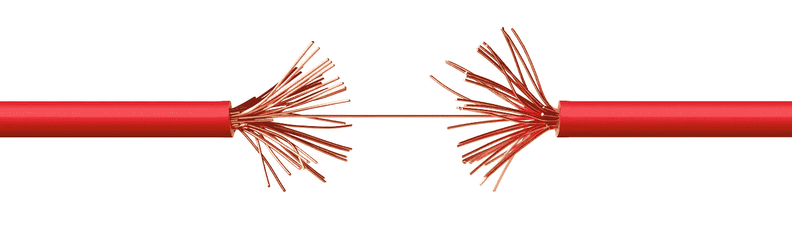
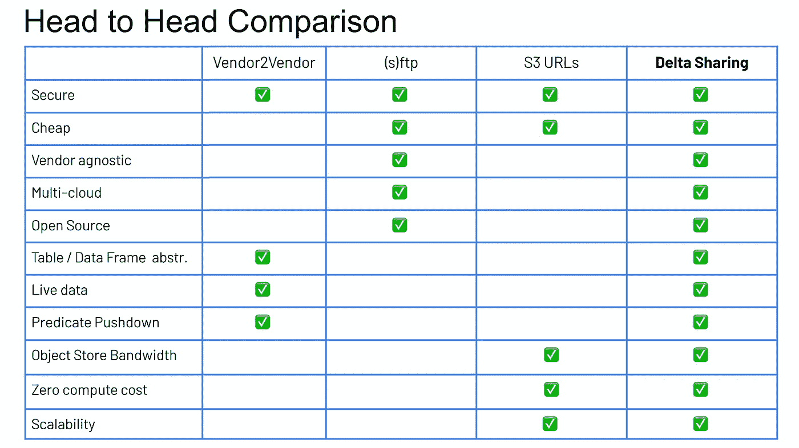
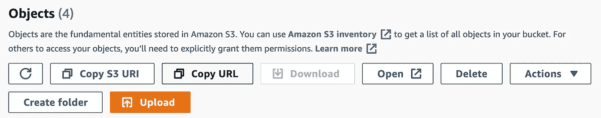

# 为什么四分之三的数据共享技术不再有用

> 原文：<https://medium.com/geekculture/why-three-out-of-four-data-sharing-technologies-dont-cut-it-anymore-a9caea6fc06f?source=collection_archive---------21----------------------->

Delta Sharing — Databricks, Dr. Frank Munz, @frankmunz

越来越多的数字原生创业公司将数据视为战略资产，并通过共享数据创造财务价值。用例层出不穷。从企业中的数据货币化战略到药物发现科学研究中的数据即服务，再到环境数据(如气候变化或火山爆发)的实时公共数据源。

*然而，在不同平台、公司和云之间共享数据并非易事。许多数据共享方法都达不到当今的开放格式、多云和性能要求。*

*新的* [*Delta 共享*](https://github.com/delta-io/delta-sharing) *项目以开源的方式解决了这些现有平台的许多问题。*

# 商业数据库/仓库

商业 **DB 和 DWH 厂商**会告诉你，你可以通过安装(并许可)他们产品的一个新实例来跨他们的系统共享数据。使用这种方法，您会被该供应商的解决方案、他们的规模限制以及他们在特定云平台上的可用性(以及他们的定价)所束缚。

# science for the people 为人类服务的科学

将数据放在一个 **(s)FTP** 服务器上进行数据共享是与供应商无关的。它可以是开源的，可以跨云工作。

在我三十多岁的时候，一所拥有维护良好的 FTP 服务器的大学展示了思想领导力。今天，托管 FTP 服务器可能会让你与 sec 团队进行讨论。还有，FTP 不是云规模的。

# S3 网址

如果你做的只是 AWS，那么 **S3** 允许你用一个 URL 共享对象。你可以从 S3 的可用性和耐用性保证中获益，这是你在自己的家乡无法实现的

像 FTP 一样，预签名的、短命的 S3 URL 是相当低级的。您的 34000 个 CSV 文件是 34000 个 S3 对象，但是您的数据科学家和数据工程师想要处理表和表上的 CRUD 操作。

# 增量共享

全新的 **Delta 共享**是开源的。它使用一个开放的协议和一个记录良好的 REST-API。你可以将 [Delta Sharing 作为 Docker 容器](https://hackernoon.com/share-large-amounts-of-live-data-with-delta-sharing-and-docker)，从 [GitHub 版本](https://github.com/delta-io/delta-sharing/releases)下载并运行你自己的预建服务器，或者从你的 [Databricks 账户](https://databricks.com/product/delta-sharing)使用 Delta Sharing 作为 SQL 的云服务。

增量共享遵循湖优先的方法，因此您的数据保留在云对象存储上，如 S3、ADLS2 或 GCS。

使用任何独立的 Python 客户端或数据科学笔记本(如 Google Colab、Amazon Sagemaker 或 Databricks)，可以跨云访问数据[。此外，最受欢迎的大数据框架，如](/geekculture/delta-sharing-bc9f1939d08b) [Apache Spark](https://spark.apache.org/) 或 [pandas](https://pandas.pydata.org/) 提供直接访问。也支持商业客户端，如 Power BI 或 Tableau。基于简单的 [REST 协议](https://github.com/delta-io/delta-sharing/blob/main/PROTOCOL.md)，可以轻松构建进一步的集成。

# 进一步阅读

*   [ODSC 会议上的 Delta Sharing 网络研讨会](https://www.youtube.com/watch?v=ViVcODZUXcA&t=9s)提供实际操作演示
*   [Delta 与 Google Colab 的分享](/geekculture/delta-sharing-bc9f1939d08b)geek culture 上的文章
*   [使用 Docker 容器的增量共享](https://hackernoon.com/share-large-amounts-of-live-data-with-delta-sharing-and-docker)hacker noon 上的文章
*   [GitHub 上的 Delta 共享](https://github.com/delta-io/delta-sharing)
*   [访问数据块上的共享数据](https://docs.databricks.com/delta-sharing/recipient.html)

如果你喜欢这篇文章，请为它鼓掌或在社交媒体上分享。更多数据科学，数据工程，或者 AI/ML 相关的消息可以关注我 Twitter:[**@ frankmunz**](https://twitter.com/search?q=frankmunz)**。**