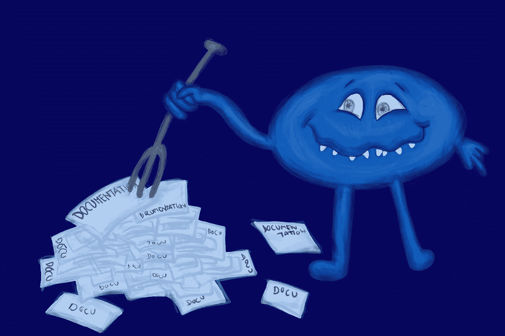

# 为什么今天的代码文档是一堆垃圾

> 原文：<https://medium.com/geekculture/why-todays-code-documentation-is-a-heap-of-garbage-c66ac8aa6cb6?source=collection_archive---------4----------------------->

## 如何解决这个问题

The state of documentation today is pretty bad.

  T 回想一下你最后一次遇到文档精美的代码。

在读取一个小的`README`文件后，您能够使用的现成代码类型。但是它也附带了一个详细的文档，其中解释了每一行代码；不仅仅是这一行的作用，还有为什么要这样写…