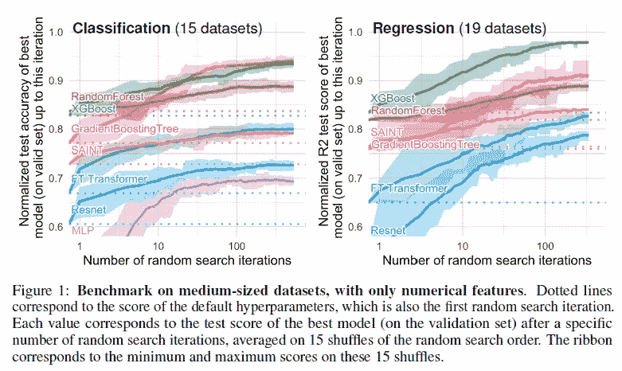
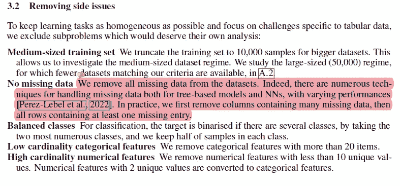
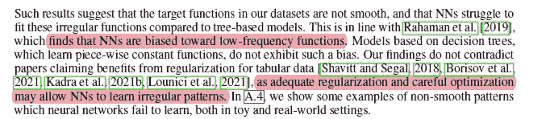
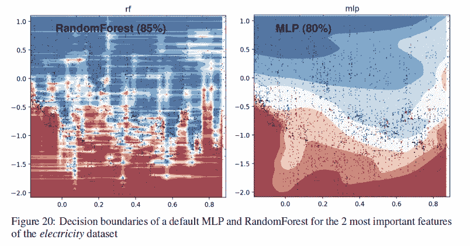
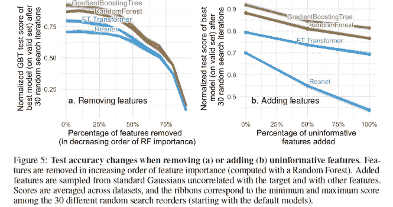
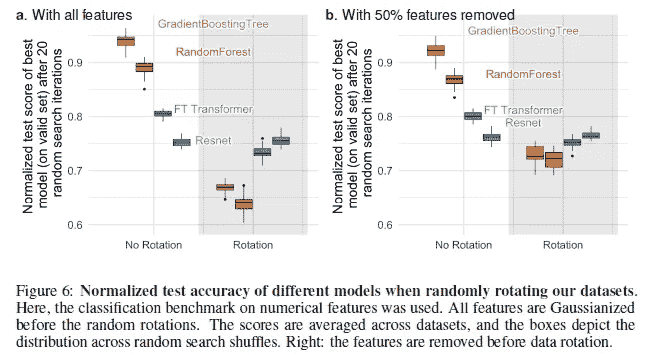
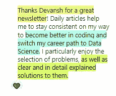

# 为什么基于树的模型在表格数据上胜过深度学习

> 原文：<https://medium.com/geekculture/why-tree-based-models-beat-deep-learning-on-tabular-data-fcad692b1456?source=collection_archive---------0----------------------->

## 对陷入深度学习宣传的人工智能研究人员和工程师来说，这是一次急需的现实检查

为了帮助我了解您[请填写此调查(匿名)](https://forms.gle/7MfQmKhEhyBTMDUD7)

随着围绕深度学习和新的 1 亿个参数模型的大肆宣传，人们很容易忘记这些大型神经网络只是工具，它们有所有的偏见和弱点。我在我的内容中强调的一个观点是，你应该有一个强大的多样化技能集的基础，这样你才能以有效和高效的方式解决问题。

在这篇文章中，我将分解论文- [**为什么基于树的模型在表格数据上仍然优于深度学习？**](https://arxiv.org/abs/2207.08815) 这篇论文解释了世界各地在各种领域工作的机器学习实践者观察到的一个现象——*基于树的模型(如随机森林)，在分析表格数据方面比深度学习/神经网络好得多*。我将分享他们的发现，以帮助你理解为什么会发生这种情况，以及你如何利用这些经验来创建最佳的人工智能管道，以应对你遇到的挑战。

Don’t show this graph to all the people with ‘Deep Learning Expert|Podcaster|Blockchain|Software’ in their bio. They will probably start screeching and get violent.

# 关于论文的注意事项

在我们开始看这篇论文的发现之前，我们应该先了解这篇论文的一些重要方面。这将有助于我们将这些发现联系起来，并更好地评估结果。太多的人直接跳到结果，没有花足够的时间来评估背景。这是致命的罪恶，如果你这样做，我将不再爱你。

我注意到的一件事是这篇论文有很多预处理。有些像删除丢失的数据会妨碍树的性能。正如我在本文中提到的- [如何处理缺失的环境数据](/codex/how-to-handle-missing-environmental-data-ff0354ec013b)，随机森林非常适合缺失数据的情况。当我与约翰·霍普金斯大学合作建立一个系统来预测改变卫生系统政策将如何影响公共卫生时，我经常使用它们。这些数据非常嘈杂，有大量的特征和维度。RF 的稳健性和优势使其优于更“先进”的解决方案，后者很容易崩溃。

大部分都是很标准的东西。我个人不太喜欢应用太多的预处理技术，因为这会导致您丢失数据集的许多细微差别，但这里采取的步骤将产生与工作时发现的数据集相似的数据集。然而，在评估你的最终结果时，请记住这些限制，因为它们很重要。如果您的数据集看起来非常不同，那么对这些结果要有所保留。

他们还使用随机搜索进行超参数调整。这也是行业标准，但根据我的经验，贝叶斯搜索更适合在更广泛的搜索空间中搜索。我很快会在上面制作一个视频，所以请确保你关注我的 YouTube 频道，了解最新动态。链接(和我所有的其他工作)将在这篇文章的结尾。

说完了，是时候回答你点击这篇文章的主要问题了- **为什么基于树的方法胜过深度学习？**

# 原因 1:神经网络偏向于过于平滑的解决方案

这是作者分享深度学习神经网络无法与随机森林竞争的第一个原因。简单地说，当涉及到非光滑函数/决策边界时，神经网络很难创建最佳拟合函数。随机森林在怪异/锯齿状/不规则模式下表现更好。

如果非要我猜的话，一个可能的原因是在神经网络中使用了梯度。梯度依赖于可微分的搜索空间，该空间根据定义是平滑的。尖的、破碎的和随机的函数不能被区分。这也是我推荐学习人工智能概念的原因之一，比如[进化算法](/mlearning-ai/why-you-should-implement-evolutionary-algorithms-in-your-machine-learning-projects-ee386edb4ecc)，传统搜索，以及更多的基本概念，当神经网络失败时，这些概念可以在各种情况下产生巨大的结果。

关于基于树的方法(RandomForests)和深度学习者之间的决策界限的更具体的例子，请看下图

The better performance of RFs can be attributed to the more precise decision boundaries they generate.

在附录中，作者对上述可视化有以下陈述

> 在这一部分中，我们可以看到，RandomForest 能够学习 x 轴上的不规则模式(对应于日期特征)，而 MLP 无法学习这些模式。我们显示了默认超参数的这种差异，但在我们看来，这是神经网络的典型行为，虽然不是不可能，但实际上很难找到成功学习这些模式的超参数。

这显然非常重要。当您意识到基于树的方法具有更低的调优成本时，这一点变得更加显著，这使得它们更适合于性价比高的解决方案。

# 发现 2:无信息特征影响更多的 MLP 样神经网络

另一个重要的因素，尤其是对于那些处理同时编码多种关系的大型数据集的人来说。如果你把不相关的特征输入到你的神经网络中，结果会很糟糕(而且你会浪费更多的资源来训练你的模型)。这就是为什么花大量时间在 EDA/领域探索上如此重要。这将有助于理解功能，并确保一切顺利运行。

该论文的作者测试了添加(随机)和删除无用(更正确-不太重要)特征时的模型性能。基于他们的结果，出现了两件有趣的事情-

1.  删除大量功能缩小了模型之间的性能差距。这清楚地暗示了树木的一个很大的优势是它们能够不受更坏特征的影响。
2.  向数据集添加随机特征向我们展示了网络比基于树的方法更急剧的下降。ResNet 尤其受到这些无用功能的打击。我假设变形金刚的注意力机制在某种程度上保护了它。

Tree Supremacy. One thing to note is that they used only the Random Forest feature importance. Involving more protocols to create a better feature accuracy score would make things much better.

对这种现象的一种可能的解释是决策树的设计方式。任何上过人工智能入门课的人都会知道决策树中的信息增益和熵的概念。这些允许决策树通过比较剩余的特征来挑选最佳的前进路径，从而挑选出允许最佳选择的路径。对于那些不熟悉这个概念(或 RFs)的人，我建议观看关于这些概念的 StatQuests 视频。我在这里把他的指南链接到随机森林。

回到正题，对于表格数据，还有最后一件事让 RFs 比 NNs 表现得更好。这就是旋转不变性。

# 发现 3: NNs 对于旋转是不变的。实际数据不是

神经网络对于旋转是不变的。这意味着，如果旋转数据集，不会改变它们的性能。在旋转数据集后，不同学习者的表现排名发生了变化，ResNets(最差的)名列前茅。**他们保持了原来的表现，而所有其他的学习者实际上失去了相当多的表现。**

这很有趣，但我必须了解更多。具体来说，旋转数据集实际上意味着什么？我浏览了文件，但找不到细节。我已经联系了作者，并将写一篇后续文章。看到一些旋转数据集的例子将有助于我更好地理解这一发现的含义。如果你们中的任何人有任何想法，请在评论中/通过我的链接与我分享。

同时，让我们看看为什么旋转方差很重要。根据作者的说法，采用特征的线性组合(这使得 ResNets 不变)实际上可能会歪曲特征及其关系。

> …有一个自然基(此处为原始基)对最佳数据偏差进行编码，并且不能由旋转不变模型恢复，旋转不变模型可能会混合具有非常不同统计属性的特征

基于性能下降，这显然是一个需要考虑的非常重要的因素。展望未来，我可以看到调查最佳数据方向的巨大价值。但在对此做出任何真正的评论之前，我想了解更多。我花了 4 天时间试图了解这一点，到目前为止(就像琼恩·雪诺一样)，我什么都不知道。现在，我将在这里结束事情。

如果你想进入 ML，t [这篇文章给你一个逐步发展机器学习能力的计划](/geekculture/how-to-learn-machine-learning-in-2022-9ef2ea904986)。它使用免费资源。与其他训练营/课程不同，这个计划将帮助你发展基本技能，并为你在该领域的长期成功做好准备**。**

对于机器学习来说，软件工程、数学和计算机科学的基础至关重要。它将帮助你概念化，建立和优化你的 ML。我的每日时事通讯，[Technology interview simpled](https://codinginterviewsmadesimple.substack.com/)涵盖了算法设计、数学、最近的科技事件、软件工程等主题，让你成为更好的开发人员。 [**我目前正在进行一整年的八折优惠，一定要去看看。**](https://codinginterviewsmadesimple.substack.com/subscribe?coupon=1e0532f2)

我创造了[技术面试，使用通过指导多人进入顶级技术公司而发现的新技术，使面试变得简单](https://codinginterviewsmadesimple.substack.com/p/faqs-and-about-this-newsletter?r=4tnbw&s=w&utm_campaign=post&utm_medium=web)。时事通讯旨在帮助你成功，避免你在 Leetcode 上浪费时间。我有一个 100%满意的政策，所以你可以尝试一下，没有任何风险。[您可以阅读常见问题解答并在此了解更多信息](https://codinginterviewsmadesimple.substack.com/p/faqs-and-about-this-newsletter?r=4tnbw&s=w&utm_campaign=post&utm_medium=web)

如果你也有任何有趣的工作/项目/想法给我，请随时联系我。总是很乐意听你说完。

# 向我伸出手

使用下面的链接查看我的其他内容，了解更多关于辅导的信息，或者只是打个招呼。

机器学习重要更新的免费每周总结(赞助)-[https://lnkd.in/gCFTuivn](https://lnkd.in/gCFTuivn)

查看我在 Medium 上的其他文章。:[https://rb.gy/zn1aiu](https://rb.gy/oaojch)

我的 YouTube:【https://rb.gy/88iwdd 

在 LinkedIn 上联系我。我们来连线:【https://rb.gy/m5ok2y】T4

我的 insta gram:[https://rb.gy/gmvuy9](https://rb.gy/gmvuy9)

我的推特:[https://twitter.com/Machine01776819](https://twitter.com/Machine01776819)

如果你正在准备编码/技术面试:[https://codinginterviewsmadesimple.substack.com/](https://codinginterviewsmadesimple.substack.com/)

获得罗宾汉的免费股票:[https://join.robinhood.com/fnud75](https://join.robinhood.com/fnud75/)