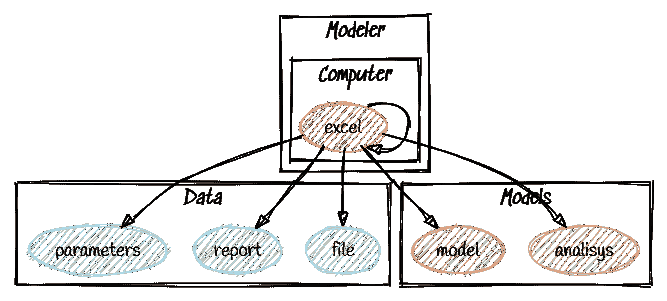

# 为什么使用 Excel，为什么不使用

> 原文：<https://medium.com/geekculture/why-use-excel-and-why-not-2e3af3b63df8?source=collection_archive---------24----------------------->

## Excel 是一个非常受欢迎的工具，但是我们能确定它是万能的吗？

## 介绍

Excel 天生就是用来组织数据的，通常用于执行(有时不是这样)基本分析和建模。它在全球各地的办公室中广泛传播，用于所有工作领域和各种规模的公司。
如果[全球有 10 亿人使用微软 Office](https://www.windowscentral.com/there-are-now-12-billion-office-users-60-million-office-365-commercial-customers) [1]，假设其中大约 1/3 的人主要使用 Excel，这是一个令人惊讶的~3 亿用户[2]，而且他们肯定是不会下去的！

**它是事实上的专业生产力工具**，适用于几乎所有需要数据组织的事情。

但往深里看，它的优势集中在:

*   数据输入和数据管理
*   报告
*   规划
*   时间和任务管理
*   财务分析和建模

潜在的用途似乎是无穷无尽的，显然不局限于需要组织的数据，但是让我们更深入地看看用例

## 用途的种类

主要有三种不同的用户。抛开数据生命周期的第一阶段，数据输入，电子表格工具显然非常有效，我为这些类别使用的驱动因素是产生的输出类型，尽管如此，结果本身的部署。从这个角度来看，数据总是被加载到一个或多个表中，以相同的方式进行清理、组织和扩充，但是这些用例*触发了具有不同关键程度的不同数据流*。

## 单用户—经理案例

在这个用例中，结果是从工作表本身消耗的。这是管理角色的典型用例，例如时间、任务或人员管理，像甘特图或时间表这样的计划。手动数据输入，如报告或投票。生成的数据被剪切并粘贴到演示文稿或报表工具中。文件大小往往很小，因此数据可以通过电子邮件传播。

## 数据分析—分析师案例

当分析员处理电子表格时，会在数据操作、验证、数据扩充和一些报告中引入一点复杂性，但是结果在其他地方是需要的。有时文件存储在一个共享文件夹中，毕竟它的并发性低，它主要由一个用户一次使用。表格数据可以进入数据库，使用 csv 之类的中间文件，或者，彩色图表的报告必须发布或导入到 *power point* 中。也许这些手术必须有规律地进行。对于这些情况，工作空间开始变得紧张，因为存在一些弱点:

*   将 Excel 集成到自动化流程中并不容易。
*   很难将它嵌入到基于云的现代基础设施中，因为没有它的 GUI 就没有可用的 API 来处理它。
*   它只能处理有限的数据。

这意味着季节性分析等重复性操作将需要手工完成。这似乎是显而易见的，因为它是为单个用户和有限的数据而创建的，所以缺少必要的集成工具，但这可能会将团队引入死胡同。

## 高级—建模器案例:

在某些情况下，*很不幸的几个*，excel 被加载了大量的任务。除了先例之外，数据操作有效地变成了一个模型，包括校准、回溯测试和验证等所有阶段。模型和时间序列分析经常涉及到带有大量参数和变量的预测模型。有时要处理的数据变得很大，涉及的人也越来越多。除了表格数据和报告之外，和以前的用例一样，我们有新的参数和模型本身作为结果。

对于所有必须处理这些情况的 IT 部门来说，这个场景是 ***最关键的情况*** 。

*   不能使用版本控制工具。
*   没有可用的变更管理工具
*   共享文件的并发会导致大量工作的丢失。
*   通常 Excel 被赋予了 VS 代码或插件，这增加了更多的关键元素。
*   数据处理只能在一台计算机上完成，几乎不可能在服务器上完成。

## Excel 好像不够用

近年来，一些非常有用的工具已经出现，并被用来试图平息这些问题。我在下面报告了 python 集成领域中我认为最有趣的一些工具。这些库和插件广泛用于工具集成、数据集成、自动化和功能增强等领域。

*   [**pyxll**](https://www.pyxll.com/)**外接程序，由[托尼·罗伯茨](https://pyxll.medium.com/)[于](https://www.linkedin.com/in/troberts79/)开发。“没有 VBA，只有 Python！”宣言是关于能够用 python 语言编写的函数扩展 Excel UDFs，不鼓励使用 VB**
*   **[**XL wings**](https://www.xlwings.org/)**插件，由 [Felix Zumstein](https://www.linkedin.com/in/felix-zumstein) 开发。“让 Excel 飞起来！”同样在这个工具中，Excel 可以使用 python 代码编写的函数，但是底层 com obj 的一些功能是通过 REST API 公开的。****
*   ****[**openpyxl**](https://openpyxl.readthedocs.io/en/stable/) 库由 [Eric Gazoni](http://ericgazoni.me/) 和 [Charlie Clark](https://clark-consulting.eu/) 开发，这比以前的库水平低，但 AFAIK 由于其读取 xlsx 文件数据和公式的能力而被广泛使用。****
*   ****[**pycel**](https://github.com/dgorissen/pycel) ，由[Dirk Gori ssen](https://dirkgorissen.com/)[在](https://www.linkedin.com/in/dirkgorissen/)开发，不幸的是，它是一个过时的库。这个项目有一个创新和非常有趣的方法“可以将 Excel 电子表格翻译成可执行的 python 代码”。这是四个库中不太常见的一个，我从未在生产环境中遇到过。****

******为了获得更多关于用例的信息，**我已经写了[一些关于这些主题的深入文章](/search?q=Glauco%20uri)，与我正在开发的工具相关。XLtoy 库目前还不能在生产环境中使用，但可以用来解决部署和维护过程中的一些关键问题。****

## ****结论****

****尽管用户和库的数量令人印象深刻，但要将 Excel 中生成的数据集成到日益现代化的流程中，仍有许多工作要做。****

****有人用其他语言(如 SAS、R 或 python)重写模型，将数据库迁移到更健壮的基础设施上，但任何时候，他们都必须花费大量时间在没有自动化的情况下做同样的工作。****

****其他人更喜欢将 Excel 表放在半自动环境中，并通过外部脚本来控制它，以自动化模型的导入和执行。****

****其他人更喜欢采用混合方法，混合手动操作，如加载数据库和脚本…但实质并没有改变，这些都是脆弱的解决方案。****

****从我的角度来看，使用 excel 编写频繁使用的复杂模型或在 Excel 之外的环境中使用可能会成为一个痛苦的选择。Excel 简单易学，使用广泛，但它被 it 部门视为一种昂贵的麻烦，在开发过程中有太多的差距，在维护过程中有太多的差距，在集成过程中有太多的差距。这意味着，在全球范围内，例如在银行业，这些脆弱解决方案的成本太高了。数据和软件工程师花大部分时间在敌对环境中追逐性能、翻译错误、执行错误。一个昂贵的麻烦。****

## ****资源****

*   ****[1]Windows Central:[https://www . Windows Central . com/现在有 120 亿 office 用户 6000 万 office-365 商业客户](https://www.windowscentral.com/there-are-now-12-billion-office-users-60-million-office-365-commercial-customers)****
*   ****托马斯·东古兹:[https://tomtunguz.com/unbundling-of-excel/](https://tomtunguz.com/unbundling-of-excel/)****
*   ****[https://www.xlwings.org/](https://www.xlwings.org/)****
*   ****[https://www.pyxll.com/](https://www.pyxll.com/)****
*   ****[https://openpyxl.readthedocs.io/en/stable/](https://openpyxl.readthedocs.io/en/stable/)****
*   ****[https://github.com/dgorissen/pycel](https://github.com/dgorissen/pycel)****