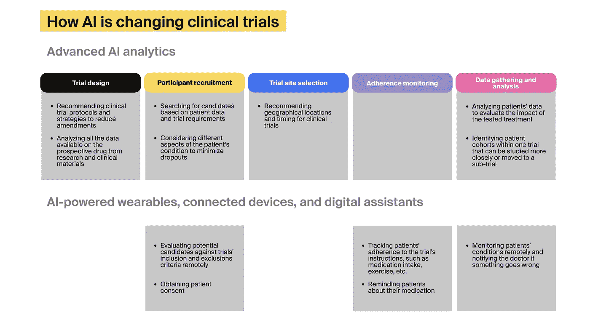
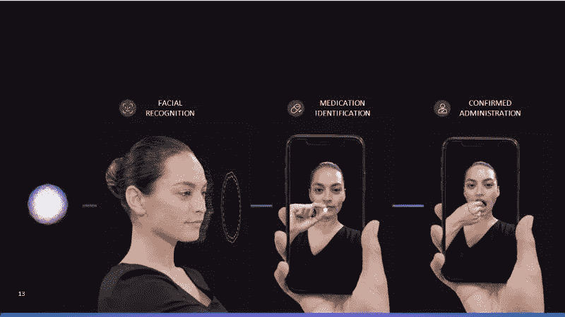

# 为什么在临床试验中使用人工智能成为新常态

> 原文：<https://medium.com/geekculture/why-using-artificial-intelligence-in-clinical-trials-becomes-the-new-normal-715ece3a0cf7?source=collection_archive---------20----------------------->

1994 年，凯文·休斯博士和他的同事们想在老年妇女中测试早期乳腺癌的治疗方法。尽管美国每年约有 40，000 名女性有资格参加这项试验，但休斯和他的团队花了整整五年时间才招募了 636 名参与者。

一段时间后，梅奥诊所正在计划另一项涉及乳腺癌的研究。研究人员依靠 IBM 的沃森进行人工智能(AI)驱动的临床试验患者匹配，并报告每月注册人数增加 80%。如果休斯博士能接触到这样的技术，他会很快招募到足够多的参与者。

如今，制药公司受益于[医疗保健人工智能开发服务](https://itrexgroup.com/services/ai-for-healthcare/)，以促进其临床研究的规划和执行。全球基于人工智能的临床试验解决方案提供商市场正在崛起。2021 年[的价值为 13 亿美元](https://www.grandviewresearch.com/industry-analysis/artificial-intelligence-based-clinical-trials-solution-provider-market)，预计从 2022 年到 2030 年 CAGR 将增长 22%。

那么，AI 还能做些什么让临床试验受益呢？您的组织在实施该技术的过程中会遇到哪些挑战？

# 为什么制药公司需要新的临床试验方法

研究表明，新药[的临床试验平均持续 9 年](https://www.cbinsights.com/research/clinical-trials-ai-tech-disruption/)，实施费用约为 13 亿美元。与此同时，失败的临床试验的成本在 8 亿到 14 亿美元之间。事实上，90%的药物最终都没有通过临床试验，这让事情变得更加复杂。

在传统的临床试验中，医生和研究人员人工寻找参与者，患者必须亲自参加登记和接受评估。这种治疗也通过预约就诊在现场进行。这仍然是开发新疗法的安全方法。然而，它是缓慢的，并且缺乏组成复杂疗法和解决通常是异质的较小人群的需求所需的灵活性。

此外，这种方法无法集成和处理来自医院、研究中心、私人诊所和患者家中的数据。研究人员将努力招募参与者，并要求患者访问试验地点进行系统的病情审查和监测，这可能会增加患者退出的机会。

[人工智能及其子类型](https://itrexgroup.com/blog/ai-types-subsets-use-cases/)可以帮助解决这些问题。

# 人工智能如何实现临床试验的现代化？

AI 可以整合来自多个来源的数据，包括电子健康记录(EHRs)、研究论文、过去的临床试验信息和特殊的医疗案例研究。它还可以处理来自个人医疗设备的连续数据流。

人工智能驱动的临床试验技术可以聚合、清理、处理、管理和可视化所有这些信息，帮助临床医生了解特定疾病以及不同化学化合物在对抗疾病方面的潜力。而[医疗保健中的预测分析](https://itrexgroup.com/blog/predictive-analytics-in-healthcare-top-use-cases/)有助于预见患者对建议的治疗方案会有什么反应。

及时获得来自所有这些信息的见解将使研究人员能够更快地做出更明智的决策。以下是人工智能如何惠及临床试验的不同方面。

# 临床试验中的人工智能:5 大应用

人工智能在医疗保健领域有许多[好处](https://itrexgroup.com/blog/examples-and-benefits-of-ai-in-healthcare/)。例如，自从疫情袭击以来，制药业广泛使用人工智能来加速潜在的新冠肺炎疫苗候选人的临床试验。

AI 在临床试验中有五大应用。技术:

*   帮助设计临床试验
*   促进参与者招募
*   支持试验场地选择
*   监控参与者的遵守情况
*   艾滋病临床试验数据收集和分析

# 1.人工智能帮助设计临床试验

研究表明，糟糕的临床试验设计[可能会阻止](https://www.researchgate.net/publication/326885129_Factors_associated_with_clinical_trials_that_fail_and_opportunities_for_improving_the_likelihood_of_success_A_review)一种潜在有效的药物展示功效，浪费所有用于开发这种药物的资源。

但是设计临床研究具有挑战性，因为制药公司需要查看大量数据，其中 80%的数据[是非结构化的，难以分析](https://www.drugdiscoverytrends.com/how-ai-based-technologies-improve-clinical-trial-design-site-selection-and-competitive-intelligence/)。临床试验的人工智能可以帮助聚合和处理所有这些数据，并找到有用的模式。例如，它可以得出适合试验国家的正确的监管协议、策略和患者招募模型。人工智能还可以帮助确定进行研究的最佳时机。

这将导致遇到更少的方案修改、患者退出和违反法规的情况。塔夫茨药物开发研究中心发现，一个实质性的协议修正案[可以将试验延长三个月](https://www.drugdiscoverytrends.com/how-ai-based-technologies-improve-clinical-trial-design-site-selection-and-competitive-intelligence/)，根据试验的阶段，费用在 14 万美元到 53 万美元之间。

# 2.人工智能促进临床试验中参与者的招募

有三个主要的与患者相关的问题阻碍了临床试验。

## 1.候选患者搜索

传统上，患者可以从他们的医生那里听到相关的试验，或者搜索相应的数据库，如[国家美国临床研究注册中心](https://meandppd.com/)。这些来源是不够的，因为医生不知道所有正在进行的试验，患者可能会发现在政府网站上滚动势不可挡，特别是考虑到他们最近的诊断。

用人工智能增强临床试验可以筛选患者数据，如 EHR 和医学成像，将患者特征与研究的合格标准进行比较，以确定适合这一特定试验的个人。人工智能足够强大，可以选择一组同质的参与者，这对于传统方法来说是一个挑战。

一家人工智能初创公司 [Deep Lens](https://www.deeplens.ai/) 利用其庞大的肿瘤学研究数据库招募患者进行试验。这家初创公司可以匹配新诊断出的癌症患者，并加快他们参加试验的速度。而总部位于加州的个人遗传学公司 23andMe 根据客户的基因构成向他们建议临床研究。

## 2.病人退出

研究表明，大约 30%的参与者倾向于退出临床试验。这导致完成研究所需的费用和时间增加。招募一名患者参加临床试验[的平均成本为 6500 美元](https://mdgroup.com/blog/the-true-cost-of-patient-drop-outs-in-clinical-trials/)，而在试验已经开始的情况下替换一名患者的成本甚至更高。我们可以通过严格的患者选择来解决这两个问题。

如前所述，人工智能研究患者数据，可以超越研究的准入标准，最大限度地减少未来的辍学。

## 3.患者评估

候选参与者需要通过评估，以确保他们符合入选标准，这要求他们亲自到场。根据他们的位置和工作的灵活性，他们可能无法在指定的时间内参观试验设施。人工智能可以简化可穿戴技术的部署，允许患者在家进行一些评估。然后机器学习算法就可以聚合和分析数据。

例如，一家医疗初创公司 [TytoCare](https://www.tytocare.com/) 提供互联检查工具和底层移动应用程序，使患者能够从他们的肺、心脏、皮肤、喉咙等部位获取测量数据。并发送给临床医生。

# 3.AI 支持临床试验选址

人工智能可以分析不同地理位置的可用医生、患者和气候条件的数据，并将其可视化在地图上，这有助于制药公司选择最有潜力的研究地点。

在选址[中使用人工智能的一个例子来自 Innoplexus](https://www.innoplexus.com/blog/leveraging-ai-to-optimize-clinical-trial-design-and-site-enrollment/) 。这家临床试验 AI 公司帮助制药公司设计和准备其临床试验比较器技术的研究。它提供了可视化信息的仪表板，有助于对前瞻性临床研究的地点进行优先排序，包括与竞争对手临床试验的接近程度、地理位置和候选人群。Innoplexus 还开发了一个定制的人工智能仪表盘，带有过滤器，允许其客户集成第三方数据，并为自己的选址标准设置阈值和指标。

# 4.人工智能监测临床试验参与者的依从性

药物治疗不依从是相当普遍的。研究表明，50%的美国人没有按照指示服用长期慢性药物。根据世界卫生组织的说法，坚持服药比治疗本身有更大的影响。

在临床试验中，手动跟踪药物治疗依从性的过程容易出错，因为它依赖于患者的记忆。而且医生经常使用不可靠的记录系统，比如纸笔，会导致信息丢失。

将可穿戴设备与临床试验人工智能一起部署，允许研究人员通过自动数据捕捉来监控患者的行动，而不是等待患者的手动报告。例如， [AiCure](https://aicure.com/) 是著名的人工智能临床试验公司之一，它开发了一种交互式医疗助理，可以发现有不遵守风险的患者。这项技术还允许患者拍摄自己吞下药片的视频，作为他们确实吞下药片的证据。助理可以识别正确的患者和药丸，确认遵守负责的医生。

为了激励患者并鼓励坚持， [optimize.health](https://www.optimize.health/) 制造了一个由移动应用程序支持的智能药瓶。这项技术提醒病人什么时候该服药，跟踪他们的剂量，并提供教育材料。它还可以与临床医生交流，以报告患者的反馈。

# 5.人工智能辅助临床试验数据收集和分析

临床试验消耗并输出大量数据。每个参与者都会产生过多的信息，例如遵守数据、生命体征和任何其他中间反馈。AI 可以聚合、分析，并以可读的格式呈现给临床医生。

此外，在[医疗物联网设备](https://itrexgroup.com/services/iot-healthcare-solutions/)和[物联网](https://itrexgroup.com/blog/internet-of-bodies-iob-definition-benefits-examples/)的帮助下，临床医生可以在家中实时监控患者。这意味着每天要处理大量数据。人工智能可以接管这项任务，发现并报告患者病情的任何恶化，确保患者的健康，并最大限度地减少辍学。

另一个有趣的好处是，机器学习算法可以在一个值得进一步研究的试验中识别患者队列。例如，如果试验似乎没有产生预期的结果，人工智能可以识别出具有特定条件的参与者，这些参与者似乎受益于子试验的研究药物或治疗。

# 关于在临床试验中使用人工智能的挑战

# 医疗数据缺乏互操作性

尽管在统一医疗数据方面做出了努力，但仍有多个医疗 IT 标准，[医疗数据互操作性](https://itrexgroup.com/blog/how-to-achieve-data-interoperability-in-healthcare-tips-from-itrex/)仍是一个挑战。这使得很难从使用不同 EHR 软件的医疗机构集成患者信息。更别说有些医生还靠手写笔记。

即使 AI 的操作受到缺乏互操作性的阻碍，该技术也可以帮助克服这个问题。基于自然语言处理(NLP)的模型可以从不同的异构来源提取临床数据，如症状和诊断，并将这些信息汇总到试验数据库中，而不是标准化健康记录和其他来源。

一个例子是 [Deep 6 AI](https://deep6.ai/) ，它使用 NLP 来解析不同的 EHR 系统。该公司在最近一次融资中估值为 1.4 亿美元。

然而，NLP 算法的工作并不是那么简单，因为没有医生用来表达相同概念的统一术语。例如，一些医生称心脏病发作为“心肌梗塞”或“心肌梗塞”，而一些医生只记下“MI”因此，临床试验 AI 模型需要配备识别所有这些变化的设备。

# 人工智能相关的挑战

人工智能给它应用的每个领域带来了特殊的困难。如果你想了解更多关于人工智能的知识，可以看看我们最近的文章，关于[人工智能实施挑战](https://itrexgroup.com/blog/artificial-intelligence-challenges/)和[人工智能的成本](https://itrexgroup.com/blog/how-much-does-artificial-intelligence-cost/)。

以下是人工智能给临床试验带来的两个最相关的挑战:

## 训练机器学习算法

目前，仍然没有可靠的、全自动的替代方法来取代训练临床试验中使用的人工智能模型所需的手动数据注释过程。这项任务非常耗时，而且结果通常是根据个人医疗保健提供者或特定疾病量身定制的。

*“目前，还没有一种自然语言处理引擎可以接收任何医生写的任何临床笔记，并能理解笔记的内容，”*哥伦比亚大学生物医学信息学家小糯米·埃尔哈达德说，他强调了经过训练的自然语言处理模型的有限可重用性。

## 人工智能偏差和持续评估的必要性

[如果训练数据集不代表实际人群，AI 可能会产生偏差](https://itrexgroup.com/blog/ai-bias-definition-types-examples-debiasing-strategies/)，因为模型的概化能力取决于它在训练期间看到的多样性。例如，训练不当的模型可能会扭曲临床试验的地点建议，或者在肤色较暗的患者身上表现不佳。

即使是训练有素的算法，在不断学习的过程中也会产生偏差。因此，及时进行独立审计以发现并消除任何不当行为非常重要。

*“人工智能是一种活的医疗产品，需要不断调整和重新校准，”* [麻省理工学院首席研究科学家利奥·安东尼·切利](https://www.clinicaltrialsarena.com/analysis/ai-clinical-trials-adherence-retention/)博士说。他认为，临床试验中的人工智能和机器学习需要被视为一种独立的产品，独立于该技术使用的医疗设备。因此，人工智能解决方案必须得到独立和频繁的评估。

# 人工智能驱动的临床试验的未来

[埃森哲预测](https://www.accenture.com/_acnmedia/pdf-107/accenture-the-dock-clinical-trials-lifesciences-aug19.pdf)传统临床试验的三波改进，其中一些需要很长时间才能成熟。

1.  由于增强现实(AR)等新兴技术以及对人工智能将帮助维护和分析的实时患者数据的访问，第一波将大大提高试验的有效性。 [AR 已经在医疗保健领域有了一些应用](https://itrexgroup.com/blog/augmented-reality-in-healthcare-applications-examples-tips/)，咨询公司对 AR 和 VR 在患者依从性监测中的应用尤其充满希望。
2.  第二次浪潮意味着路径将变得虚拟化。这意味着研究人员可以依靠人工智能驱动的数字代理来招募患者，检查他们的资格，获得正式同意，并执行与入职相关的任务。将会有高度安全和所有权意识的分散的数据仓库。患者将完全拥有自己的数据，并根据自己的意愿与临床医生分享。
3.  在第三波中，试验将在对患者没有任何风险的情况下进行，因为人工智能算法将模拟临床结果。用人工智能完全自动化临床试验仍然是遥远的未来，但我们已经见证了基于人工智能的体外测试的尝试。

—一家专门从事芯片上器官技术的生物技术公司联系 ITRex，帮助其构建一个体外疾病建模和药物测试平台，作为临床试验的一部分。这项技术依赖于带有模拟人体器官的微流体细胞的芯片。我们的团队[帮助开发了用于片上器官平台](https://itrexgroup.com/case-studies/organ-on-a-chip-platform-for-biotech-company)的嵌入式物联网软件，用于试验设计、管理和[数据分析的前端和后端软件](https://itrexgroup.com/services/data-analytics/)。

—由此产生的创新临床试验人工智能解决方案被 100 多个实验室采用，包括美国顶级制药公司，并帮助他们加快药物开发和降低成本。

即使埃森哲的一些预测看起来很超前，你今天就可以开始将人工智能纳入临床试验。临床试验咨询公司可以求助于人工智能来简化患者招募、监控依从性、分析和可视化临床数据，并通过可穿戴设备让患者对内部监控感到舒适。

此外，您可以部署 AI 来自动维护试验期间使用的生物材料。例如，这种人工智能解决方案可以经过训练，就如何以及何时分裂细胞做出明智的决定。这表明，人工智能在临床试验中的参与并不局限于本文中提到的应用。如果你有不同的想法，不要犹豫，伸出手来。

> *对加快人工智能临床试验的前景感到兴奋吗？* [*降我们一线*](https://itrexgroup.com/contact-us/) *！我们的团队将帮助您构建/部署联网的可穿戴设备来收集患者数据，并实施人工智能支持的分析工具来处理和可视化这些数据。*

*原载于 2022 年 8 月 12 日 https://itrexgroup.com***。**