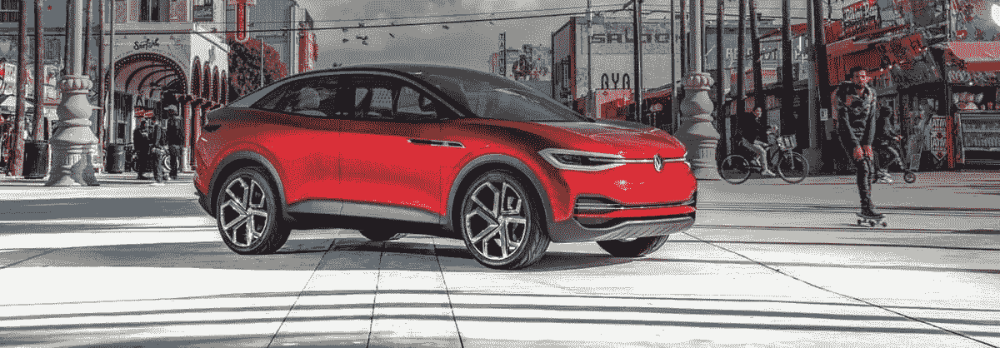

# 为什么大众能在电动汽车的未来大放异彩

> 原文：<https://medium.com/geekculture/why-volkswagen-could-shine-bright-in-an-electric-vehicle-future-1f99aa8251f?source=collection_archive---------27----------------------->

## 电动汽车的旅程还很早，但不要指望大众会赢得很大一部分市场份额

Photo via [Volkswagen](https://www.emichvw.com/2020-vw-id-crozz-suv-coming-to-denver-colorado/)

部分归保时捷所有，并拥有奥迪、宾利、布加迪、兰博基尼和其他汽车制造商，大众拥有广泛的客户群，随时准备吞噬任何击中…