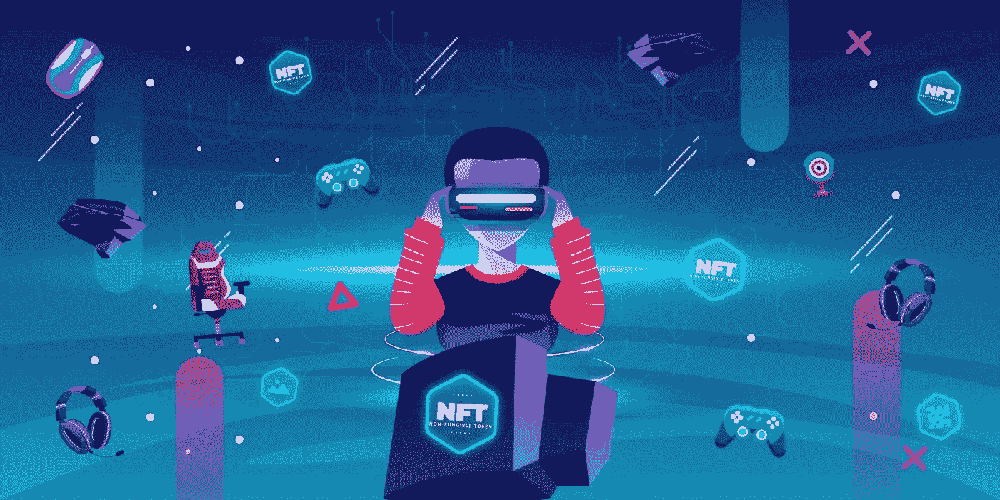
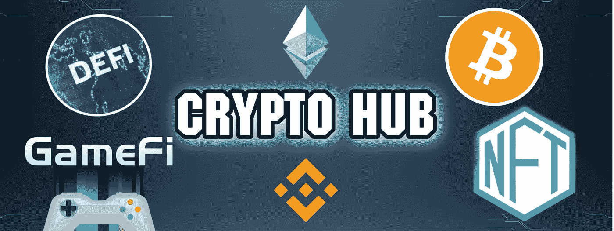

# 为什么我们相信 GameFi 将成为增长最快的加密领域！

> 原文：<https://medium.com/geekculture/why-we-believe-gamefi-will-be-the-fastest-growing-crypto-sector-b7b0bf124402?source=collection_archive---------11----------------------->

Crypto Gaming is one of the fastest-growing Blockchain Industry

今天我们将谈论快速发展的**区块链趋势**叫做 **GameFi** 。我们将向你提供关于这个领域的重要事实，我们将讨论为什么我们认为 **GameFi** 在**未来**作为一个加密领域将会有**最大的潜力之一。**

## GameFi 基础知识

Play-To-Earn is the rewarding mechanism used in Blockchain Games

**GameFi** 被定义为由**区块链科技**促成的**金融激励**游戏的组合。有些人认为 GameFi 只是另一种形式的赌博，这是不正确的，因为 GameFi 的回报不是来自纯粹的运气，而是来自游戏中的技能和你对游戏的投入。

区块链游戏的玩家通常通过完成任务、赢得战斗和通过不同的关卡获得加密货币和 NFT 奖励。这些密码可以兑换成其他加密货币或法定货币，然后在现实世界经济中使用。

## GameFi 相对于传统游戏行业的优势

Many institutions show interest in investing in GameFi projects

尽管熊市肆虐，疯狂的资金正在筹集并涌入 GameFi 项目。由 Andreessen Horowitz 管理的华尔街最著名的风险投资公司之一刚刚为“游戏投资”筹集了****6 亿美元**。**

> **Cointelegraph 的一位主要分析师将区块链游戏行业视为传统游戏行业的激烈竞争对手。**

**以下是 GameFi 相对于传统游戏领域的三大优势。这些是:**

*   **由于 NFT 代币经济学(这使得游戏中的物品可以很容易地在自由市场上以卖家选择的价格进行交易),游戏中资产的所有权**
*   ****分散决策**，这意味着代币或 NFT 的所有者可以投票决定他们参与的游戏的未来**
*   ****对玩家的激励**。既然有类似质量的替代游戏，玩家可以在公开市场上赚钱和交易他们获得的游戏内资产，为什么玩家还要在传统游戏领域玩游戏呢？**

## **为什么我们认为 GameFi 行业将会非常庞大**

****

**GameFi is a main driver of the overall crypto adoption**

**有三件事**推动了加密的采用:****

*   ****价格投机**(当许多人认为投资某些加密项目可以赚钱时，加密货币的整体市值增加，这使得加密公司更容易为他们的项目提供资金)**
*   ****必要性**(没有现实世界的好处，就不会有加密的采用。项目应解决当前存在的具体问题，并借助区块链技术解决)**
*   **最后，还有**的乐趣**。大多数加密采用者并不包括加密迷或技术狂。那些大多是想在空闲时间找乐子的普通人。**

****

**Gaming Crypto Projects solve real-world issues, are fun to play and allure a lot of capital**

**GameFi 符合这三个因素。区块链游戏解决了传统游戏领域目前存在的上述问题。我们相信，拥有坚实基础和经验丰富的团队的 GameFi 项目无疑将在熊市中幸存下来，并将在整体市场情绪转为看涨时成为最大的赢家！**

**我们希望你喜欢我们关于 GameFi 潜力的简短分析；)**

****

**Join Our Crypto Hub Community!**

1.  **欢迎**关注我们**获取更多此类分析**
2.  **也可以查看我们的 [**推特账号**](https://twitter.com/CryptoHub210?s=20&t=ts3bUBYtX7g0s5_ClYnL_A) 获取更简短的分析**
3.  **不要犹豫，加入我们的 [**电报频道**](https://t.me/officialcryptohub) 与志同道合者互动**