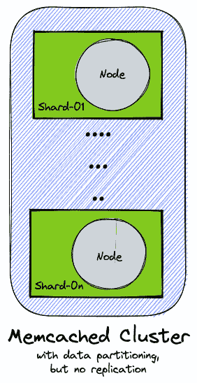
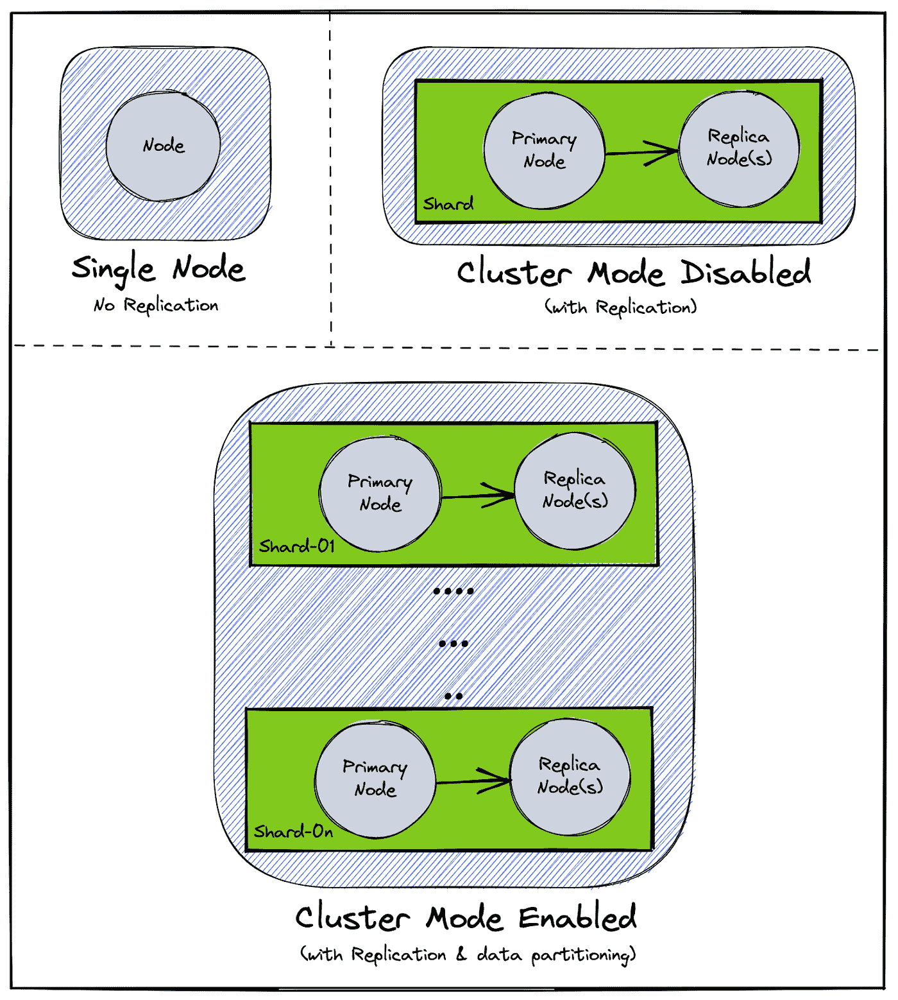

# 为什么我们从 Memcached 迁移到 Redis？

> 原文：<https://medium.com/geekculture/why-we-migrated-from-memcached-to-redis-2ecdd21d68d0?source=collection_archive---------1----------------------->

# 介绍

很多时候缓存解决方案像 Memcached，Redis，Guava 等。用于提高数据检索性能。这是通过在缓存层存储一些数据来实现的，从而减少了访问底层较慢的数据存储层的需要。但是缓存还有另一种使用模式，称为“缓存作为数据存储”。在这种模式中，缓存本身被用作主数据存储。这样做通常是为了存储可能有过期时间戳的短暂数据。

Memcached 和 [Redis](https://redis.io/) 是两种最流行的缓存解决方案。这两者都是由 AWS 作为完全托管的缓存服务在[亚马逊 elastic cache](https://aws.amazon.com/elasticache/)下提供的。在本文的其余部分，Memcached 和 Redis 将分别意味着 AWS ElastiCache 提供 Memcached 和 Redis。

在我们的用例中，我们使用 Memcached 作为数据存储来存储临时数据。随着系统总负载的增加，我们的 Memcached 集群开始遇到一些性能问题。我们决定从 Memcached 迁移到 Redis，因为 Memcached 的架构不支持一些可以帮助减轻这些性能问题的功能。

在接下来的小节中，我们将更深入地探讨我们在使用 Memcached 时遇到的问题，以及我们如何使用 Redis 来克服这些问题。

# Memcached 架构

Memcached 是一个内存中的键值存储服务，可以用作缓存或数据存储，并提供亚毫秒级的延迟。

Memcached 支持数据分片，因此允许跨多个节点划分数据，并将负载分布在一个集群中。Memcached 集群中的每个节点都是完全独立的，不与其他节点通信。集群不知道数据分区，数据分区的逻辑驻留在客户端。因此，添加或删除碎片会导致缓存未命中，直到客户端根据集群中新的碎片计数重新填充所有碎片。

Memcached Cluster

Memcached 是多线程的，因此它可以利用多个处理核心。这意味着您可以通过提高 Memcached 集群的计算能力来处理更多的操作。这是一种处理负载增加的好技术，但是它通常受到货币预算的限制。

# Memcached 的缺点

虽然 Memcached 非常强大并且易于使用，但是有两个功能是 Memcached 不支持的。

首先，Memcached 不提供**分片复制**。一个 Memcached 集群每个分片只能有一个节点。在没有任何副本节点的情况下，节点故障意味着由该节点处理的整个碎片已经发生故障。

第二个问题是 Memcached 不支持**在线重分片**。在分布式缓存系统中，键分布在多个碎片上。通过在线重新分片，可以无缝地在集群中添加或删除分片，而不会导致任何停机。集群将优雅地处理所有请求，同时根据新的碎片计数重新分配密钥。但是在没有在线重分片的情况下，分片数量的任何变化都会导致部分停机，直到所有的键被正确地重新分配。

# 为什么要迁移到 Redis？

[Redis](https://aws.amazon.com/elasticache/redis/) 是一个提供亚毫秒级延迟的内存数据存储。Redis 还提供诸如事务、发布/订阅、Lua 脚本等功能。Memcached 不支持的。Memcached 功能较少，设计简单，因此是我们开始时的选择。

我们的 Memcached 设置在集群中有多个碎片。每个碎片仅由一个节点组成(无复制)。因此，每个分片的单个节点同时服务于读和写请求。

随着业务的增长，读写操作的数量也在增长，导致 MemcacheD 集群的整体负载增加。随着负载的增加，Memcached 集群中的节点偶尔会非常热。解决这种情况的唯一方法是向 Memcached 集群添加更多的碎片。但是正如我们之前讨论过的，Memcached 不支持在线重分片。因此，添加一个新的碎片意味着在所有键被重新分配之前的缓存缺失。因此，我们被迫只能在非高峰流量时段进行这些分片添加，因为我们负担得起维护停机时间。

随着节点变热并需要向 Memcached 集群添加新碎片的频率增加，我们开始寻找替代解决方案。这就是 Redis 的由来。

# Redis 架构

Redis 的 ElastiCache 允许三种配置，(1) *单节点* , (2) *集群模式禁用*,( 3)*集群模式启用*。下图更详细地解释了这些配置。注意，在*启用集群模式的*设置中，Redis 的 ElastiCache 提供了分片复制和在线重分片。

Various cluster modes for Redis

对于我们的用例，我们决定使用(3) *集群模式支持的*模式进行数据复制和分区。这允许我们将数据分布在多个分片上，从而减少了单个分片上的负载。有了数据复制，一个碎片的主节点中的任何故障都可以通过回退到该碎片的副本节点来处理。

# redis Java 客户端

[Redis on](https://github.com/redisson/redisson)和 [Jedis](https://github.com/redis/jedis) 是 Redis 最流行的两个 Java 客户端。

Redisson 是 Redis 上的一个内存数据网格。换句话说，Redisson 提供了一个 Java 原生的对象接口，并将这些对象存储在 Redis 中。另一方面，Jedis 提供了 Redis 固有的对象接口。

让我们举一个在 Redis 中存储键值对的例子。Redisson 为此用例提供了 RMap 对象。RMap 对象的接口类似于 Java 的原生 Map 对象。在幕后，Redisson 将管理 RMap 对象的键和值，并将它们存储在 Redis 中。另一方面，Jedis 也支持 map 对象，但使用 Redis 的原生命令，如“ *SET* ”、“ *GET* ”等。因此，用户需要理解 Redis 命令行语言，以便有效地使用 Jedis 客户机。

# 雷迪森诉杰迪斯公司

雷迪森和杰迪斯各有利弊。在我们的用例中，我们希望确保我们的数据被分区和复制，并且客户端支持在线重分片。

Redisson Java 对象与 Redis 集群兼容，但是它们的状态不会被划分到 Redis 集群中的多个主节点。Redisson PRO(付费)为其中一些对象提供了数据分区。由于我们不愿意在数据分片上妥协，因此我们没有继续使用 Redisson(免费版)。

我们的下一个选择是杰迪斯。Jedis 支持数据分区，允许跨多个分片存储数据。Jedis 还支持在*集群模式禁用*设置中的读取流量重定向(单个碎片，多个副本)。这允许写操作命中主节点，读操作命中复制副本节点。最后，Jedis 支持在集群重划分期间优雅地处理请求。注意，为了充分利用这个特性，您必须在 Jedis 客户机包装器中编写一些额外的代码。

在我们的例子中，我们在*集群模式启用的*设置中使用 Redis(多个碎片，多个副本)。遗憾的是，Jedis 不支持在启用*集群模式的*设置中读取重定向到副本节点。但是我们接受这种折衷，因为我们仍然得到了数据分区和在线重分片的好处。因此，我们决定将 Jedis 客户机用于 Redis 集群。

# 结论

根据您的用例，您可以在 Redis 和 Memcached 之间做出选择。虽然这不是一个放之四海而皆准的问题，但是一个基本的经验法则是，如果您的用例很简单，就使用 Memcached。此外，如果您正在使用 Redis，那么您可以根据您对自己的用例所做的权衡，在 Redisson 和 Jedis 之间做出选择。

# 参考

1.  [Brad Fitzpatrick 的 Memcached 分布式缓存](https://www.linuxjournal.com/article/7451)
2.  [如何在亚马逊 ElastiCache for Redis 上使用集群模式](https://aws.amazon.com/blogs/database/work-with-cluster-mode-on-amazon-elasticache-for-redis/)
3.  [比较 Redis 和 Memcached](https://aws.amazon.com/elasticache/redis-vs-memcached/)
4.  [Redisson 数据分区(分片)](https://github.com/redisson/redisson/wiki/5.-data-partitioning-(sharding))