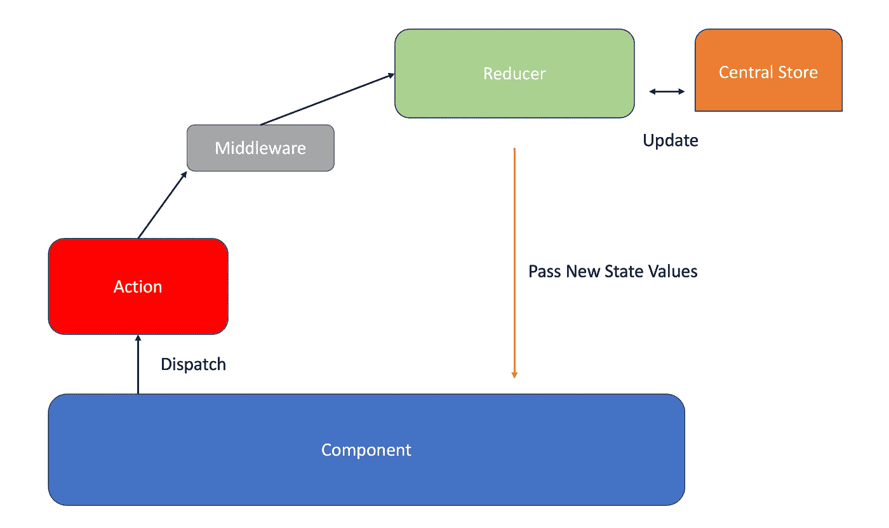
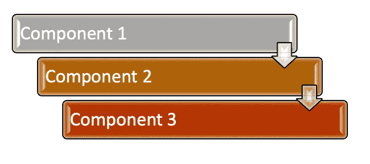

# 为什么我们需要 React Redux？

> 原文：<https://medium.com/geekculture/why-we-need-react-redux-3e5785bbd348?source=collection_archive---------0----------------------->

Javascript 框架带来了巨大的优势，比如开发时间和 web 应用程序的优化。

但是，有时我们可能会遇到通常没有任何问题的情况。

例如应用数据；

数据怎么会成为问题？问题是在页面之间移动数据。反应组件之间的移动状态信息。我们可以用 props 数据传输来克服移动状态的这个问题。但是随着应用程序的增长。这个解决方案会很复杂。

那么解决办法是什么呢？Redux！

我会在这个题目中解释 redux。我保证这是可以理解的。

我们来看 redux 生活图；



如图所示，我们在中间有一个中心商店。这会将更新发送到组件。有了调度，就有了行动。在中间件的帮助下动作之后，reducer 工作并更新中央存储器。那你看懂了吗？**不**！

我知道很难用简单的流程图来理解 redux。当我第一次看到的时候。我就说“那是什么？”但是过了一段时间我写了一些教育样本。现在我感觉很舒服。

让我们写一个小 app 然后我们一定会明白 Redux。

一个由两个组件组成的应用程序，一个用于按钮，另一个用于文本消息。它会看起来像；


我现在就不深入解释组件了。当主题出现时，文本组件将解释。我们需要一些包来获得 redux 的优势。

```
npm install --save redux
npm install --save react-redux
nmp install --save react-thunk
```

软件包安装后。现在我们可以考虑从哪里开始了！。这应该是在申请的开始。也就是 Index.js

如果你看了上面的代码。有一种奇怪形式的记录器。这是一个中间件功能。这个程序可以在没有中间件的情况下运行，但是如果你想运行一个异步任务，比如一个服务调用，你必须使用中间件。因为 js 是自上而下的。如果没有 thunk，就不能进行这样的异步调用。您可能不使用 logger，但是您需要中间件来使用 thunk。

第二件重要事情是创建一个存储函数。这是 redux 的关键点。我们创建一个带有 reducer 和中间件功能的商店。

这是一个减速器。它的任务是保存和更新状态信息。也是唯一改变状态的地方。这是火与行动让我们看看行动

操作正在从组件调用。和这些函数的类型信息和参数。有一个异步函数。为此感谢 redux-thunk。

你可以说它是一个普通的容器 js 文件。是的，这是一个普通的文件，但有一些额外的期待进口部分有一个连接定义从反应-redux。这将把该容器连接到中央存储。还有函数 mapStateToProps，mapDispatchToProps。

**MapStateToProps** :从 reducer 获取存储并连接到页面属性
**mapdispatctoprops**:获取调度方法并连接到页面属性。
**连接**:连接所有与 redux 相关的东西。

这是数字组件，如您所见，我们导入了 connect，这次我们只连接了 **mapStateToProps** 。对于徽章，我们从道具中获取文本。这是 redux 的结果。

现在我们来谈谈 redux 的用法。我们应该对项目的所有组件使用 redux 吗？Redux 很好，但是如果我们对所有组件都使用，可能会对性能产生影响。

假设您有这样的组件



如果我们的组件树如上图。那我们可以用 redux。因为如果没有，我们必须借助其他组件来承载所有数据。对于这些情况，Redux 是一个很好的解决方案。

Redux 解决我们的国家问题。有时这很难理解，但当我们写项目或样本时，它会放在你的技能中。

这里是完整解决方案的 GitHub 链接

[](https://github.com/barkinkizilkaya/ReduxBlogSample) [## barkinkizilkaya/redux blog sample

### 这个项目是用 Create React App 引导的。在项目目录中，您可以运行:在…中运行应用程序

github.com](https://github.com/barkinkizilkaya/ReduxBlogSample) 

感谢阅读，保重自己