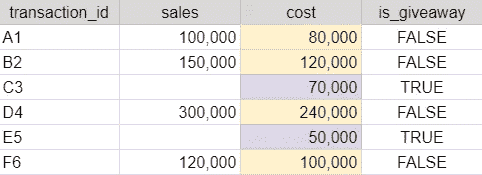
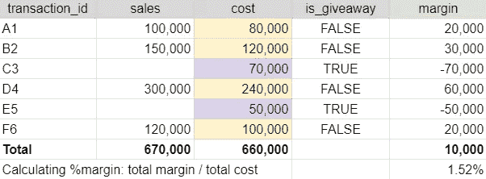
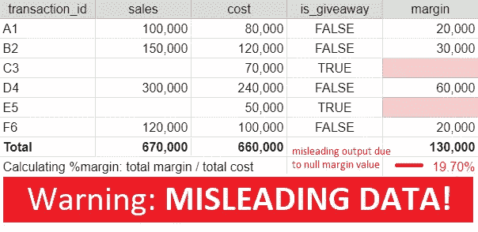
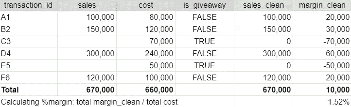
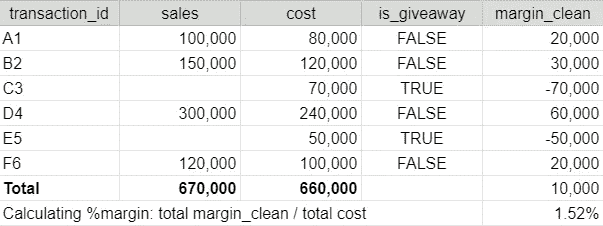
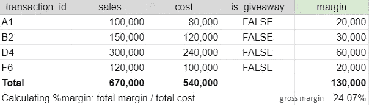

# 为什么我们不应该忽略空值以及如何对待它们

> 原文：<https://medium.com/geekculture/why-we-shouldnt-ignore-null-values-and-how-to-treat-them-22e0e7f9b7de?source=collection_archive---------34----------------------->

## 使用 Google BigQuery SQL 进行数据清理

D 处理数据聚合通常很棘手，尤其是当涉及到无法手动处理且包含空值的大数据时(是的，在现实中，没有 100%干净的数据)。此外，使用不同的工具进行数据清理可能需要不同的方法，因为不存在一刀切的做法。不清理空值而直接汇总数字可能会导致我们提供误导性的数据并得出错误的结论。

例如，我们想计算零售商店的**净利润率**是多少。我们将数据存储在名为*‘事务 _ 数据’*的表中，如下所示:



Raw data from *transactions_data table*

该零售店目前正在将赠品作为其向市场推出新产品的促销计划的一部分。每个赠品都记录在一个唯一的 *transaction_id* 中，但是由于每个产品都是免费赠送的，因此没有销售记录(空)。

如果我们使用 Excel/Google 电子表格手动计算净利润率，我们可以如下确定净利润率:



Net margin calculation using Excel/Google Spreadsheets

请注意，我们可以确定**的净利润率为 1.52%** ，这并不算高，因为我们花费的成本导致赠品交易的净利润率为负。但是，想象一下，如果有数百万笔交易需要处理，因此行数超过了 Excel/Google 电子表格的限制，我们需要利用更高级的工具来计算净利润率。对于这种情况，我将使用使用 Google BigQuery SQL 的例子。

## **注意事项**

如果我们直接计算净利润率，而不首先使用以下查询处理空值:

```
WITH
raw_data AS (
   SELECT *,
      sales - cost AS margin
   FROM transactions_data
)SELECT SUM(margin)/SUM(cost) AS net_margin
FROM raw_data
```

输出可能会产生如下误导:



交易 C3 和 E5 的利润计算将返回 null(不是-70，000 和-50，000)，因为一旦 Google BigQuery 在公式( *sales - cost* )中遇到 null 值，它也会将公式的结果返回为 null。在处理大数据的时候，我们并不是把所有的输出都逐行打印出来，而是直接用 SUM(*margin*)/SUM(*cost*)等数据进行汇总，会把净利润率的输出打印成 19.70%(完全误导！).看到如此高的净利润率，我们会得出零售商店足够盈利的结论，**而实际上我们正在为赠品烧钱，将净利润率拉低至接近于零**。

那么，我们应该如何对待空值呢？

## 该做的事

**选项#1:** 增加附加列 *sales_clean* 用 0 替换空值(当时使用 **CASE)，然后计算 *margin_clean* 。查询应该是这样的:**

```
WITH
add_sales_clean AS (
   SELECT *,
     ** CASE WHEN sales IS NULL
         THEN 0
         ELSE sales
         END
         AS sales_clean**
   FROM transactions_data
),add_margin_clean AS (
   SELECT *,
     ** sales_clean - cost AS margin_clean**
   FROM add_sales_clean
)SELECT SUM(margin_clean)/SUM(cost) AS net_margin
FROM add_margin_clean
```

在后端，该查询将在聚合之前返回另外两列:

1.  *sales_clean* :与 *sales* 列类似，但将空值替换为 0。
2.  *毛利 _ 清洁*:用*成本减去*销售 _ 清洁*。*

然后，数据聚合的输出将如下所示:



对数据进行清洗后，可以得到净利润率的正确结果:1.52%。

—

**选项#2** :使用语法时的 **CASE 直接计算 *margin_clean* (但是，一定要注意，如果公式很复杂，这种方法会很痛苦)。查询应该是这样的:**

```
WITH
add_margin_clean AS (
   SELECT *,
      **CASE WHEN sales IS NULL
         THEN 0 - cost
         ELSE sales - cost
         END
         AS margin_clean**
   FROM transactions_data
 )SELECT SUM(margin_clean)/SUM(cost) AS net_margin
FROM add_margin_clean
```

聚合后的输出如下所示:



该方法类似于选项#1，并返回相同的聚合结果。不同之处只是我们直接计算列 *margin_clean* 而不是先创建列 *sales_clean* 。

—

**选项#3** :使用**合并**或 **IFNULL** 函数替换空值。查询应该是这样的:

```
WITH
add_margin_clean AS (
   SELECT *,
      **COALESCE(sales, 0) - cost AS margin_clean**
   FROM transactions_data
)SELECT SUM(margin_clean)/SUM(cost) AS net_margin
FROM add_margin_clean
```

或者我们也可以用 IFNULL 替换 COALESCE 函数，它将返回相同的输出。这两个函数的区别在于 COALESCE 的逻辑可以用于两个以上的条件，而 IFNULL 只能包含两个条件。但是由于我们只有两个条件(return 0 或者 *sales* value)，所以两个函数都没问题。**输出将与选项#2 完全相同，并且查询要简单得多。**

—

**附加**:我们也可以通过使用 **WHERE** 语法过滤掉空值的交易来计算**毛利率**(不包括赠品交易)。查询应该是这样的:

```
WITH
filter_giveaway_transactions AS (
   SELECT *,
      sales - cost AS margin
   FROM transactions_data
 **WHERE sales IS NOT NULL**
)SELECT SUM(margin)/SUM(cost) AS gross_margin
FROM filter_giveaway_transactions
```

该查询将过滤掉交易 C3 和 E5，因为它们在*销售*列中有空值。因此，计算的输出将是这样的:



通过排除赠品交易，我们可以了解到最终**毛利润**几乎占到产品成本的四分之一( **24.07%** )。这表明我们可能在赠品计划上花费了太多成本，需要探索如何优化成本的方法，例如:

*   用更便宜的产品替代
*   减少赠品获奖者的数量
*   调整赠品交易相对于销售交易的比率
*   等等。

数据清理可能不是最令人兴奋的工作，但如果忽略了这一点，后果可能对业务至关重要——做出错误的结论和决策。因此，值得注意的是，数据分析不仅仅是从 Stackoverflow 修改一个语法(我知道我们都需要这个 gem)并运行它，我们还需要了解查询是如何工作的。快乐分析！