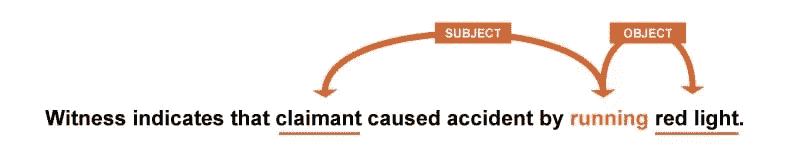
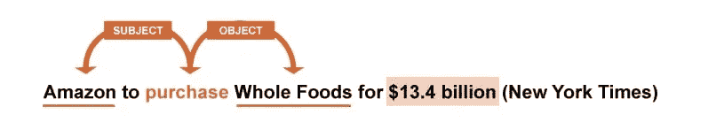
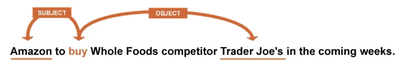

# 为什么我们使用依赖解析

> 原文：<https://medium.com/geekculture/why-we-use-dependency-parsing-98246ae4e0e4?source=collection_archive---------2----------------------->

## 对于那些知道如何使用它的人来说，这是一个非常强大的 NLP 工具

对于初学者，文本分析通常从简单的关键字搜索开始。分析师可以从搜索“伟大的服务”开始。然后，他们可能会开始添加其他搜索，如“服务很棒”或“服务太棒了”。当然，这是一种非常初级的方法，会错过很多相关的评论，所以希望快速获得更多结果的用户会进行邻近搜索。例如，他们可能会在“服务”三个字内搜索“伟大”。虽然有些人可能会使用单词列表(“棒极了”、“好的”或“优秀的”服务)或词类(“服务”旁边的形容词)来改善结果，但大多数文本分析系统都止步于此。

然而，对于高级文本搜索，您需要有关于单词关系的信息。例如，“被保险的司机撞了一辆公共汽车”和“一辆公共汽车撞了一个被保险的司机”是两个非常不同的事件，这两个事件可以帮助文本分析系统确定事故中谁是错的。一个基本的搜索可能会通过依次查找“被保险的司机”、“被撞”和“公共汽车”来尝试找到第一个事件，但是如果“被保险的司机被公共汽车撞了”呢？它匹配，但它与搜索认为它在寻找的东西相反。

当然，有一些方法可以尝试弥补计算机对单词关系知识的不足。例如，我们可以改变搜索来排除任何“被击中”的句子。但是还有许多其他因素需要考虑。例如，如果我们不限制距离，我们将正确地找到“被保险的司机，他开着一辆红色的 2008 年福特福克斯，撞了一辆公交车”。但是，我们也会发现“被保险司机报告一辆红色 2008 款福特福克斯撞上了一辆公交车。”随着人类语言如此丰富和复杂，如果没有更聪明地理解将单词组合在一起所涉及的结构和关系，几乎不可能准确地解释我们正在搜索的事件的所有可能表达。

依赖关系解析提供了这些信息。例如，依存解析可以告诉你一个动词的主语和宾语是什么，以及哪些单词是(描述)主语。这可以帮助您找到特定问题的精确答案，例如:

# 索赔人闯红灯了吗？

知道哪一方闯了红灯可以帮助我们确定事故中谁是错的。在这种情况下，“认领人”是“跑”的主语，跑的宾语是“红灯”。由此我们可以推断，“索赔人”是“闯红灯”行为的实施者，接下来发生的事情更有可能是索赔人的过错。

# 我的竞争对手正在收购哪些资产？

在这里，我们看到在亚马逊是主语的句子中，全食是被购买的对象。依存句法分析正确地识别了这个句子，并且准确地分析了下面的句子:

在这种情况下，同样的短语存在(“亚马逊购买全食”)，但宣布了不同的收购。在这种情况下，被收购的是全食超市的竞争对手乔氏超市。虽然这些重大事件(一个真实的，一个想象的)不可能不被注意到，但许多较小的竞争对手收购经常以这种方式在未阅读的出版物和新闻稿中公布。

# 我们的客服代表给人留下什么印象？

对于这个句子，依存解析正确地识别了关于客户服务的多条信息——客户服务是“杰出的”,以及所讨论的客户服务具体与“技术部门”相关。

有许多方法可以使用依赖解析来更准确地查询文本数据。当然，还有许多其他复杂的语言需要考虑，但这些都是改天的话题。

*原载于 2018 年 5 月 15 日*[*【https://www.megaputer.com】*](https://www.megaputer.com/why-we-use-dependency-parsing/)*。*