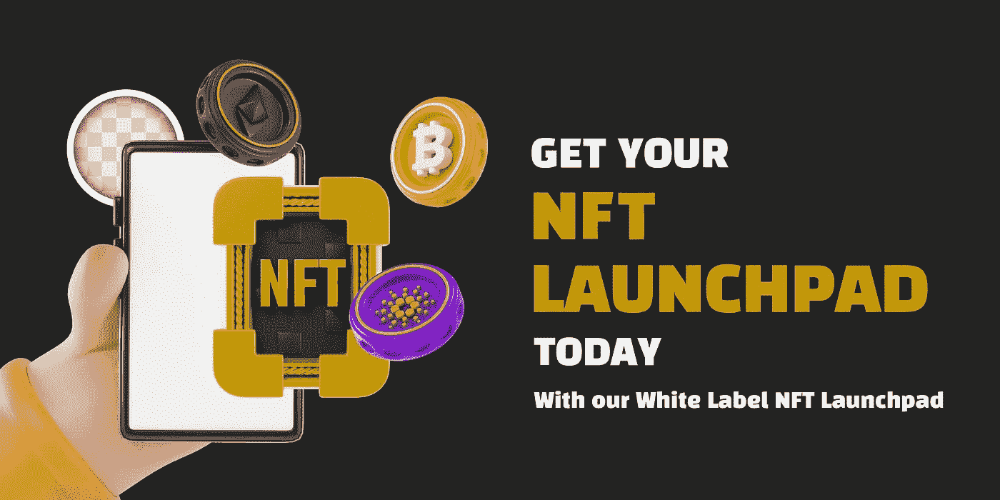

# 为什么是白色标签 NFT 发射台？

> 原文：<https://medium.com/geekculture/why-white-label-nft-launchpad-16fd4270cb7d?source=collection_archive---------15----------------------->

近年来，全球对非正规金融服务的兴趣一直在增加。可以肯定地说，NFTs 在全球范围内取得了巨大成功。随着数以百万计的 NFT 被制造和出售，NFT 迅速改变了加密空间的动态。NFT 涵盖不同的领域，如艺术、游戏资产、音乐、房地产等。NFT 的销售额已经占到了市场的数十亿美元。2021 年 3 月，仅 OpenSea 的交易量就达到 4000 万美元。这清楚地表明，NFT 是有利可图和赚钱的商业风险投资的基础。但是如何创建一个 NFT 发射台呢？ 要多少钱？每个企业家都买得起吗？

# **什么是白色标签 NFT 发射台？**

一个 [**白标 NFT 发射台**](https://www.blockchainappfactory.com/white-label-nft-launchpad?utm_source=Medium+GC&utm_medium=5%2F9%2F22&utm_campaign=senpagapandian) 是一个预先构建、预先测试、可定制的平台，具有内置的特性和功能。从头开始开发 NFT 发射台可能需要更多的时间、精力和金钱。白标解决方案可能是中小型企业家的理想选择。它为创业公司和小企业节省了大量的时间和金钱。

## **白标 NFT 发射台功能**

**原生令牌:**可以为 NFT 发射台创建唯一的原生令牌，用于平台上的交易。

**KYC:** 平台中的 KYC 规定确保只有真实的项目才能在启动台上列出。

**流动性池:**平台上 NFT 产品的巨大流动性池，确保代币流动性。投资者可以下注本地代币来获得回报。

**内置钱包:**集成钱包使用户能够持有和交易平台的本地代币和 NFT 资产产品。

**分类展示:**NFT 会被列在平台上的各种类别下，比如利基、价格和收藏。这使得 NFT 很容易接触到潜在客户。

**筹资模式:**一个预制的 NFT 发射台解决方案可以基于多个加密众筹机制。

**协作:**卖家可以添加协作者，并可以给予他们修改集合设置、创建新项目、交易以及进行其他更改的权限。

**区分的非功能表:**用于趋势非功能表、最近非功能表、最常查看的非功能表和即将出现的非功能表的标签和页面。

## 白色标签 NFT Launchpad 平台是如何工作的？

NFT launchpads 为 IDOs 上的 launchpads 执行类似的功能，在 IDOs 上，企业向投资者提供代币进行筹资。

**有了白色标签的 NFT 发射台创作者可以:**

*   在艺术品、体育收藏品、音乐、配件、游戏资产、房地产等各种领域打造和推广他们的非功能性广告
*   在没有任何第三方参与的情况下直接销售他们的 NFT。创作者还可以与他们的社区密切互动。
*   找到一个观众，为他们的作品建立一个社区。这对小时间创造者来说是非常有益的。
*   为他们的二次销售赚取版税

## **白标 NFT launchpad 开发怎么会是一个有利可图的商业项目？**

佣金:通过交易佣金，你可以从你的 NFT 发射台获得被动和持续的收入。您可以在 launchpad 上对铸造、销售和购买 NFT 征收费用。

**营销:**你可以在你的 launchpad 上赚钱推广项目。您可以在我们的 launchpad 中分配单独的广告空间。

**列表:**您可以对 launchpad 上列出的所有 NFT 收取列表费。你可以根据展出的 NFT 来决定刊登费。随着 NFT 发射台的成功，每天都有成千上万的 NFT 被铸造出来。

此外，创作者可以接触到更广泛的受众，并形成一个社区。创作者可以围绕这些社区构建他们的项目。你也可以提供版税给项目和创作者转售。这为你的平台增加了用户数量，你可以获得一笔被动收入。

正如我们前面提到的，NFTs 正在成为一个蓬勃发展的市场。数以百万计的人正在铸造和投资 NFT。预计到 2028 年，NFTs 的市场价值将达到 1280 亿美元。因此，许多公司和企业家带着他们自己的 NFT 发射台进入了 NFT 市场。但是，从零开始建立一个 NFT 发射台可能是乏味和耗时的。因此，许多公司已经开始选择 NFT launchpad 开发的白标解决方案，因为它消耗的时间和金钱更少。你也可以雇佣一个 [**白标 NFT 发射台**](https://www.blockchainappfactory.com/white-label-nft-launchpad?utm_source=Medium+GC&utm_medium=5%2F9%2F22&utm_campaign=senpagapandian) 解决方案，由一群熟练的开发人员提供最高质量的发射台。开发公司也可以提供上市后的营销服务和支持，这使他们成为你在 NFT 创业的理想选择。