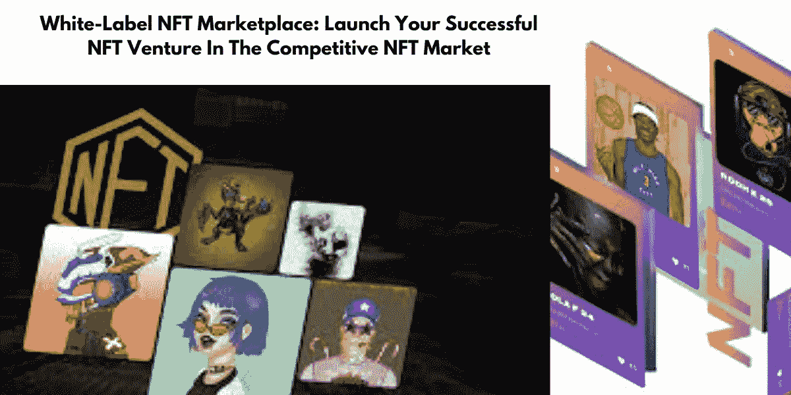

# 为什么白牌 NFT 市场开发是进入竞争激烈的 NFT 市场的正确选择？

> 原文：<https://medium.com/geekculture/why-white-label-nft-marketplace-development-is-the-right-choice-to-enter-the-competitive-nft-market-27ec34db0598?source=collection_archive---------21----------------------->

不可替代代币的兴盛已经成为了一段时间以来的热门话题。许多企业家希望沉浸在 NFT 的世界里，在创业的同时成为其增长的一部分。在这个动荡和竞争激烈的市场中，出现了无数成功的 NFT 市场，令我们震惊。该平台以其独特的特性和功能使不可替代代币的交易变得顺畅和容易。对于 NFT 市场的开发，大多数商业头脑选择[白标 NFT 市场解决方案](https://www.appdupe.com/whitelabel-nft-marketplace?utm_source=google&utm_medium=medium&utm_campaign=monika)，因为它们有助于快速启动这个 NFT 企业，为平台所有者带来多种商业利益。

在这篇博客中，介绍了 NFT 市场的概况及其特点，并列出了白标解决方案及其优势的详细视图。

## ↪️ **NFT 市场&其特色**

如今，NFT 市场提供的功能远不止是促进不可替代代币的交易。他们让用户参与创造他们的 NFT，让创作者为他们的作品赢得一个忠实的粉丝群，还有许多其他设施。NFT 市场可以基于任何利基市场，如艺术、音乐、体育等。此外，一些市场包括所有类型的非功能性交易，或者是排他性的，并促进特定类型的 NFT 的交易。有几个基本特征应该存在于任何利基市场，其中包括

➡️Storefront

➡️Filters

➡️Listings

➡️Search 期权

➡️Auction/购买

➡️Wallet

➡️Ratings/评论

## ↪️ **面向 NFT 市场的白标解决方案**

创建 NFT 市场有两种方式。一种是从零开始构建平台，另一种是使用**白标 NFT 交易平台解决方案**。许多商业头脑选择白标解决方案，因为与从零开始构建平台相比，白标解决方案具有成本效益且节省时间。这种预先设计的解决方案为 cryptopreneur 提供了定制选项，以根据他们的需求和要求定制平台。

## ↪️ **白标非功能性测试市场的宝贵优势**

🔓透明度、权力下放和安全性被认为是 NFT 平台的优势，因为它们是基于区块链技术的。NFT 市场消除了对平台上的数据进行任何解释的机会，并提供了多层次的安全系统。这一交易平台消除了任何第三方或中介，实现了没有他们参与的担保交易。

🔓智能合约是分散化平台的核心元素，它通过定义智能合约中加密的功能和属性来实现自动化交易。

🔓白标解决方案的重要特征是它们是可定制的。这种定制选项便于其用户根据他们的满意度定制平台的特征和功能。

 [## 白标 NFT 市场:壮观的 web3 之旅和 2022–2023 年的标志性趋势

### 飙升浩繁的市场趋势有助于每一个 NFT 收藏的比例，从科技小创业公司到科技…

medium.com](/coinmonks/white-label-nft-marketplace-a-spectacular-web3-journey-and-an-iconic-trend-of-2022-2023-7a26a692c1f4) 

## ↪️ **如何参与 NFT 市场开发**

🏷️ **选择合适的利基:**

一个 NFT 市场可以基于各种利基市场，你需要决定他们是想要建立一个包罗万象的平台还是一个独家市场，并决定他们想要在其平台上实现的 NFT 交易的类型。这有助于启动相应的商业计划。

🏷️ **选择合适的开发公司:**

为 NFT 市场的发展选择最好的白牌解决方案提供商至关重要。创业者可以根据客户、演示作品、定价、评论、评级等来选择公司。或者，他们可以基于搜索引擎与领先的开发公司预约一对一的会议，了解更多关于他们工作的信息，从而选择合适的公司。

🏷️ **提出你的想法:**

在选择了公司之后，cryptopreneur 应该为他们想要的 NFT 平台画一个清晰的轮廓，比如公司需要的特性、功能和设计。这有助于开发人员根据他们的需求定制解决方案。

🏷️ **开发，测试，&发布:**

一旦向公司提出了 NFT 市场的大纲，后端功能、前端功能和 UI/UX 设计就会根据加密创业者的要求进行定制。开发完成后，对平台进行多重测试，直到确认无误，准备上线。

## ↪️ **结论**

在这个动荡的 NFT 空间，创建一家 NFT 企业并让它在激烈的竞争中茁壮成长并不容易。一直蓬勃发展的 NFT 交易平台都有独特的方面，使它们因其宝贵的品质而脱颖而出。选择最合适的开发公司，提供卓越的 [**白标 NFT 市场**](https://www.appdupe.com/whitelabel-nft-marketplace?utm_source=google&utm_medium=medium&utm_campaign=monika) 解决方案，将有助于推出一个卓越的平台。因此，选择最好的公司，并设计一个战略商业计划，推出你的 NFT 市场量身定制的独特功能和有效的功能。