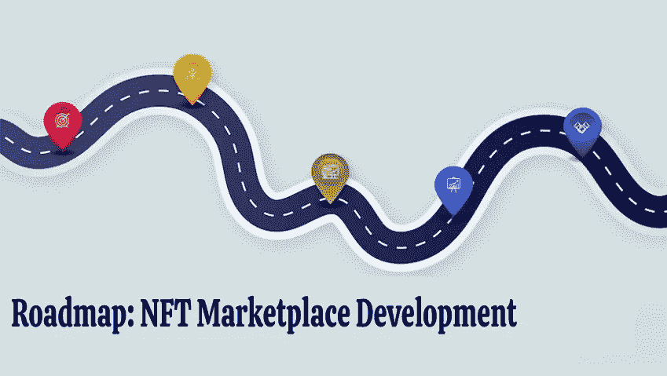

# 为什么白标 NFT 市场解决方案是您在 NFT 创业的最佳选择

> 原文：<https://medium.com/geekculture/why-white-label-nft-marketplace-solution-is-the-best-option-for-your-nft-venture-c9bd7d3a003c?source=collection_archive---------12----------------------->

White Label NFT Marketplace

白色标签的 NFT 市场是创作者和卖家交易数字资产的平台。NFT 市场白标解决方案为客户提供了一个预先构建、预先测试且随时可以启动的平台。他们可以根据自己的项目和定位定制白标解决方案。随着 NFTs 的市场价值已经超过 10 亿美元，它肯定会在未来增长。许多企业家和 NFT 爱好者已经开始 [***开发 NFT 市场***](https://bit.ly/3pvjRJB) 以满足 NFT 社区的需求。

## **白色标签解决方案**

从零开始开发 NFT 市场可能是一项单调乏味的任务。即使对 NFT 市场的发展有一个基本的了解，也需要对商业策略和编程知识有很强的掌握。这就是白标解决方案的用武之地。白标解决方案是指由一家公司制造并出售给另一家公司的产品或服务，后者根据其需求对其进行更名。

通过白标 NFT 解决方案，公司向愿意建立 NFT 业务的公司出售预先构建和测试的 NFT 市场。NFT 市场白标解决方案帮助个人 NFT 爱好者和小公司启动自己的 NFT 业务，不需要任何编程或技术技能。

## **为什么选择白色标签 NFT 市场？**

公司经常发现很难找到合适的开发团队来开始 NFT 市场的开发。NFT 白标开发团队帮助公司提供现成的解决方案，以便他们能够专注于项目的业务部分。

 [## 白标 NFT 市场开发|推出您自己的白标 NFT 加密收藏品…

### NFT 市场是加密领域的一个有利可图的商业机会。它惊人的增长和…

bit.ly](https://bit.ly/3pvjRJB) 

## **人们选择白色标签 NFT 市场的原因:**

● **安全性:**如果没有高端安全功能，NFT 市场的用户数据可能会被匿名人士伪造。从头开始构建这些安全特性可能是一项单调乏味的任务，需要花费大量时间。白标解决方案经过预先构建和测试，以确保安全性。

● **节省成本和时间:**从零开始建立一个 NFT 市场可能需要 6 个月以上的时间。如果市场有一些复杂的特征，那么时间甚至可以延长到 1 年。在此期间，建设 NFT 市场的成本将会上升。白标 NFT 市场已准备好推出预建功能。这可以为客户节省大量的时间和金钱。

● **轻松定制:**客户可以根据自己的项目需求轻松定制白标平台。一切，包括 UX/用户界面设计，都可以很容易地根据客户的需求进行修改。市场的每一个特征都可以被修改。

## **NFT 市场必须具备的特征**

● **透明:**平台上的所有交易都要公开透明。所有用户都可以访问这些数据，这意味着数据不能被篡改。

● **安全:**一个强大的多层安全系统是所有 NFT 市场的必需品。交易者应该远离欺诈活动和垃圾邮件发送者。

● **去中心化:**市场中的所有交易都是在没有中心实体的情况下进行的。数据也可以在多个区块链之间共享。

● **智能合约:**NFT 市场中的智能合约用于建立 NFT 的功能和属性。智能合约还有助于交易在 NFT 平台上进行，并消除对平台上任何第三方的需求。

● **货币化:**通过固定平台上的上架费、产品费等收费来获得收入。

## **NFT 市场的强制性特征:**

● **店面:**一个好的店面对于 NFT 市场来说是必不可少的。店面包含平台上列出的 NFT 的描述。

● **搜索选项:****搜索选项为用户提供了搜索 NFT 或系列的便捷体验。通过高级搜索选项，用户可以根据价格、定位等搜索特定的商品。**

**● **投标选项:**投标选项是所有 NFT 平台的必备选项。投标选项必须是无缝的，买方可以检查基价，时间，最高出价等。**

## ****您的 NFT 市场发展路线图****

****

**● **选择利基:**为你的 NFT 市场选择利基。选择合适的方式，让你的平台接触到更广泛的受众。**

**● **雇佣一家白标 NFT 开发公司:**咨询一家白标 NFT 解决方案开发商，为您的平台做进一步的开发。从 UI/UX 设计到开发，再到前端和后端开发，NFT 开发公司帮助您获得世界级的成品。**

**● **智能合约令牌生成器:**NFT 市场的后端工作不同于其他。由于 NFT 市场是一个分散的平台，数据应该使用区块链技术进行验证。**

**● **测试和启动:**在平台上运行测试，以确保它没有错误和错误。然后，可以启动 NFT 市场平台。**

**对 NFT 的需求与日俱增。NFT 已经发展成为一个全球十亿美元的市场。由于 NFTs 的成功，人们已经开始建立和启动 NFT 市场。你也可以通过开发一个白色标签 NFT 市场成为成功的 NFT 生态系统的一部分。市场上有很多公司提供 [***白标 NFT 市场解决方案***](https://bit.ly/3pvjRJB) 。您可以根据您的项目需求选择合适的公司，启动您的 NFT 项目。**