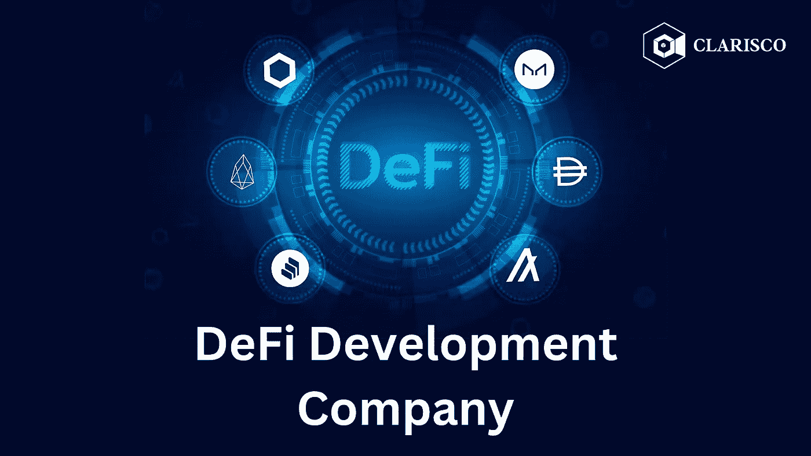

# 为什么 2023 年将由分散化金融(DeFi)主导？

> 原文：<https://medium.com/geekculture/why-will-2023-be-dominated-by-decentralized-finance-defi-d9c4759ed429?source=collection_archive---------5----------------------->

自区块链科技诞生以来，其他相关的发展也获得了动力。区块链已经成为几项倡议的发起国，包括 NFT、密码货币，最重要的是分散融资(DeFi)。技术进步有在全球经济中引发革命运动的历史。我们真正相信分散化金融(DeFi)确实具有巨大变革潜力的原因之一是，它促进了包容性和独创性。尽管对密码货币来说这是具有挑战性的一年，但开发仍然是最受欢迎的投资领域，甚至超过了生物技术。

# **您对 DeFi 应该了解些什么？**

纵观历史，金钱经常被用来支持以自我为中心的统治者。然而，鉴于不断增长的通货膨胀等持续挑战，分散式金融(DeFi)等解决方案已经发展起来，以恢复个人的独立性和控制权。简而言之，DeFi 是当今金融系统(完全集中的)的一个全球性的、开放的替代品。它以基于开源技术的产品和服务而著称，任何人都可以用这些产品和服务来借款、储蓄、投资、交易等等。

DeFi 使用公共区块链网络处理交易，而不是依赖像银行或托管代理这样的集中服务提供商。这些责任由智能合同承担。智能合同是基于代码的指令，保存在公共区块链，并根据系统的共识规则执行。随着 DeFi 越来越受欢迎，许多公司开始提供 **DeFi 开发服务**，其中也包括智能合同开发。

# **您为什么要投资 DeFi 开发服务？**

在传统的金融系统下，中间人(通常是银行或其他金融组织)处理交易并提供标准的金融服务。然而，这种中介被 DeFi 淘汰了。区块链不仅确保了 DeFi 的安全，还真正实现了分散化。随着中介的废除，权力被分散，银行机构收取的使用费被取消。任何有互联网连接的人都可以使用 DeFi 应用程序。数字钱包允许用户快速获取和转移资金。这些只是 DeFi 肯定会统治 2023 年和未来几年的几个原因。让我们看看为什么用户更喜欢 DeFi，以及为什么投资于 [**分散式金融开发服务**](https://www.clarisco.com/defi-development-company) 从长远来看将是有利可图的。

**1。安全**

分散化允许访问被分布到位于世界各地的多个节点或联系点。网络的安全性大概会随着连接到它的节点数量的增加而增加。恶意攻击者必须控制网络中 51%的链接节点，这是不太可能的。

**2。可用性**

因为网络通过用户的设备遍布全球，任何人都可以连接并利用他们想要的任何分散的网络。当连接到网络时，用户可以在传统银行业务的限制之外以各种方式转移资金和与网络互动。

**3。治理**

节点还可以完全控制 DeFi 网络的更新和调整。与传统系统不同，在传统系统中，集中的组织实施变更而不考虑用户的偏好和要求，用户可以在实施变更之前提出建议并进行投票。

**4。预算友好型**

基础设施、运输和劳动力成本降低，因为 DeFi 货币可以在几分钟内以更少的支出传输到全球任何地方。

DeFi 具有显著改善主流金融的潜力。它快速、便宜，并且对于点对点交易来说非常方便。有了所有这些优势，世界各地的企业家与 DeFi 发展公司合作以获得无尽的回报就不足为奇了。

# **去中心化金融是金融的未来吗？**

人类历史上首次出现了一个不需要中间人的大规模金融体系，即 DeFi。尽管在便利性方面，DeFi 应用程序无法与传统银行解决方案竞争，但目前，DeFi 已经创建了真正的、可操作的应用程序，并已吸引了数十亿美元的资金。这些资源正被用来创建更经济和用户友好的应用程序。随着越来越多的资金投入到 **DApp & DeFi 协议开发**中，DeFi 将变得更高效、更易于使用，并提供许多金融产品的迭代，这将在经济上惠及人民甚至国家。金融的未来是去中心化的，DeFi 只会越来越受欢迎。

# **DeFi 的惊人用例**

**分散交易所**

dex 是不需要中央机构的加密交换，使用户能够进行点对点交易，同时保持对其现金的控制。因为加密资产永远不会被交易所占有，所以 dex 减少了市场操纵以及黑客和盗窃的可能性。

**游戏**

Defi 的灵活性为产品开发人员提供了将 DeFi 协议无缝集成到各行各业平台的选择。由于其内置的经济和创造性的激励结构，基于以太坊的游戏已经成为分散金融的突出用例。

**借入&借出**

DeFi 生态系统中最受欢迎的应用之一是点对点借贷协议。例如，Compound 是一种算法化的自治利率协议，它连接并支持许多 DeFi 平台，包括 PoolTogether & Dharma。复利让个人通过在以太坊上创建利率市场，从他们贡献给贷款池的加密中赚取利息。

**预测市场**

基于区块链的预测市场通过允许用户投票和交换事件结果的价值，利用公众的集体知识。因此，市场价格成为一个事件可能性的众包指标。一个受欢迎的 DeFi 博彩平台，包括投票结果、体育游戏、经济事件和其他主题的预测市场。

**Stablecoins**

任何与稳定资产或资产组合相关的加密货币，如法定货币、黄金或其他加密货币，都被称为稳定货币。Stablecoins 的创建是为了减少加密货币价值的波动性，并使区块链成为一种可行的支付选择。

**交易**

DeFi 部门的交易包括各种活动，从期货交易到保证金交易到代币掉期，并通过不断增长和互联的交易所、流动性池和市场网络进行。分散的交易所为加密货币交易者提供了降低的交易成本、快速的处理和对其资产的单独保管。

**打桩**

一旦以太坊网络通过以太坊 2.0 转换为利益一致过程的证明，用户将能够作为验证者或通过利益提供者对其 ETH 进行赌注并获得奖励。在 Eth2 上下注类似于投资有息储蓄账户:用户通过在以太坊网络上验证区块获得利息(奖励)。

**市场**

DeFi 协议使用户能够在国际和点对点之间交换项目和服务，范围从自由编码任务到数字收藏品到现实世界的珠宝和服装。

# **DeFi 为全球数字资产采用奠定基础&创新**

智能合约区块链上的 DeFi DApps 的功能在传统上适应缓慢的传统金融部门(如贷款和支付、保险和投资等)中具有巨大的变革力量。DeFi 的范围远远超出了金融排斥和银行服务不足。我们预计，随着现有金融系统参与者认识到 DeFi 的积极优势，DeFi 的采用将继续在强劲的经济体中获得牵引力。例如，DeFi 可以提供更好的贷款利率，因为它缺少一个对这种服务收费的中央机构。它可以为海外汇款提供更快的结算时间。

# **2023 年将由分散金融(DeFi)主导**

DeFi 市场已经显著增长，并将继续扩大。随着市场价值的增长，其参与者的数量和多样性也在增长，其对个人、公司以及最终对经济的实际和潜在影响——包括直接和间接的影响。用户可以根据给定的资本以不同的利率获得即时抵押贷款，并且他们可以获得令牌化资产的更多流动性。随着 DeFi 扩大其覆盖范围，人们接受其分散、包容的方面，它将促进更大的加密接受和采用全球经济。企业家和密码爱好者是时候投资DeFi 开发服务了。他们所需要的只是一个可靠的 [**DeFi 发展公司**](https://www.clarisco.com/defi-development-company) 的支持来征服 2023 年。