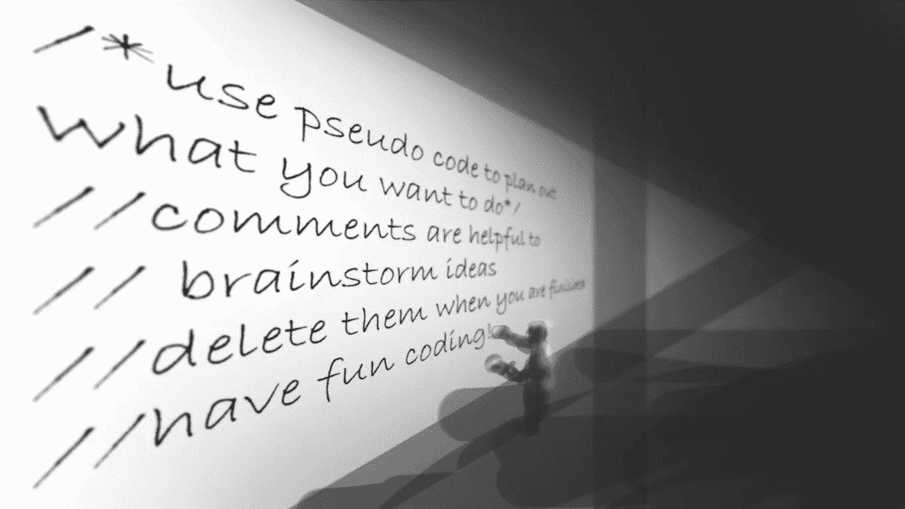

# 为什么编写伪代码是最佳实践

> 原文：<https://medium.com/geekculture/why-writing-pseudo-code-is-a-best-practice-5b0f29acf700?source=collection_archive---------34----------------------->

使用伪代码是编码者工具箱中的一个有价值的工具。我把它想象成一块干擦板，可以用来头脑风暴，然后在任务完成时擦干净。当通过一头扎进代码来解决问题时，很容易陷入困境或迷失方向。使用伪代码是一种很好的方式，可以用你自己的话来完成你想做的事情，而不必担心正确的语法和…