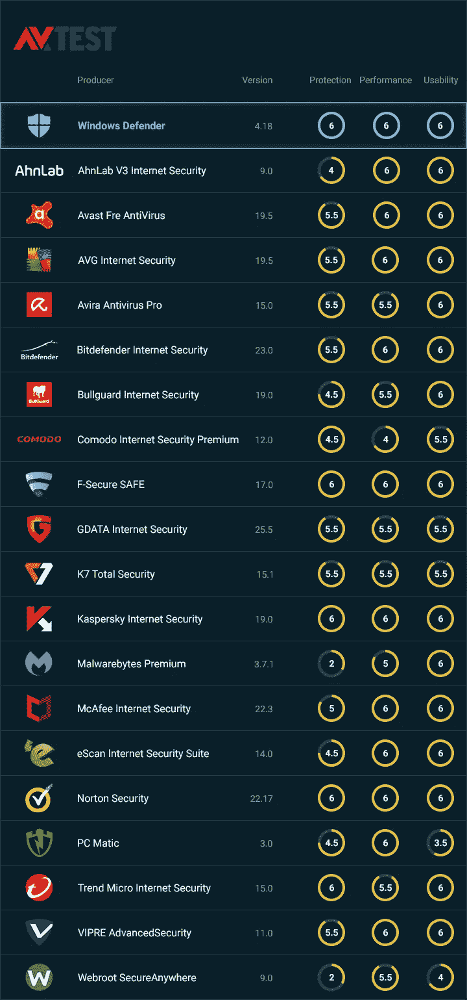
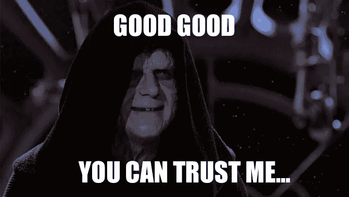

# 为什么你不需要另一个杀毒软件

> 原文：<https://medium.com/geekculture/why-you-dont-need-another-antivirus-54cfc36cdc28?source=collection_archive---------21----------------------->

## 如果它没坏，就不要修理它

任何个人电脑用户都已经习惯了为杀毒软件付费，而且有一个很好的理由，微软的杀毒软件提供了最低限度的保护，而免费的第三方替代软件无法胜任这项任务。早在 2013 年，微软 Defender 是如此糟糕，以至于反病毒测试机构[将其作为垃圾级性能的基线](https://www.av-test.org/en/antivirus/home-windows/windows-8/december-2013/)。

但在过去的几年里，微软加大了在终端安全方面的努力，2019 年 Windows Defender 内置于 Windows 10 中。从那时起，Windows Defender 就成了反病毒程序的黄金标准，其表现经常超过付费服务。

# 他们如何比较？

最大的两家测试公司 [AV-comparatives](https://www.av-comparatives.org) 和 [AV-tests](https://www.av-test.org) 将 Windows Defender 列为两家实验室测试过的最佳产品之一。在所有 16 款测试产品中，微软 Defender 是在其系统中阻止所有恶意软件的四家供应商之一。

在这次[2019 年 6 月反病毒组测试](https://www.av-test.org/en/antivirus/home-windows/windows-10/june-2019/microsoft-windows-defender-4.18-192315/)中，AV-test 将 Windows Defender 列为顶级产品。Defender 在 6 项中排名第 6，捕获了该机构测试的所有恶意软件，同时报告了零误报。

AV-test 2019 年 6 月综述的快照:

Windows Defender 在性能上也是满分；这一点很重要，因为许多防病毒程序在寻找威胁时会降低计算机的速度。由于 Defender 内置于 Windows 10 中，其性能优于第三方防病毒解决方案。

# 免费杀毒软件的问题

## 防病毒程序具有管理员权限

防病毒程序总是以高访问权限运行。这意味着要找到病毒，他们需要能够访问计算机上的一切，就像计算机管理员一样。这就是当它们没有按预期运行时，它们特别危险的原因，编码错误可能导致计算机无法运行，甚至为黑客打开大门。

## 免费杀毒想让你害怕

大多数免费的反病毒程序都是基于同样的原理运行的；恐惧。一旦安装，该程序将不断用新威胁的弹出窗口来烦用户，试图让用户安装额外的工具或为他们的高级保护付费。

## 免费杀毒软件的资金来自广告

为了提供免费服务，许多免费的杀毒工具都附带了广告。他们中的一些人在你的浏览器中安装第三方应用程序，如工具栏或“互联网安全”插件，在你浏览时为你提供广告。他们中的一些人甚至改变你的默认搜索引擎或主屏幕来提供广告。

## 免费杀毒软件可以窃取你的数据

Avast 的免费防病毒解决方案最近被抓到[未经同意窃取客户数据](https://www.pcmag.com/news/the-cost-of-avasts-free-antivirus-companies-can-spy-on-your-clicks)并出售牟利。自新闻报道 [Avast 终止 Jumpshot 数据收集业务以来，超过 1 亿台设备的浏览历史记录通过一家名为 Jumpshot 的子公司出售。](https://www.zdnet.com/article/avast-winds-down-jumpshot-with-immediate-effect-cites-user-data-sales-and-privacy-concerns/)

## 免费杀毒软件没有那么有效

所有反病毒解决方案都依赖于频繁更新的恶意软件/病毒签名文件；正是这些文件告诉程序要查找什么。免费防病毒解决方案的特征码文件更新频率往往低于付费解决方案。在扫描病毒时，免费版本的性能也稍有下降。

## 免费杀毒软件可能会为黑客大开方便之门

由于缺乏良好的安全措施，一个编程糟糕的反病毒软件可以在数百万台计算机上打开巨大的安全漏洞。谷歌零项目安全研究小组披露了赛门铁克安全产品中的一个[重大漏洞](https://googleprojectzero.blogspot.com/2016/06/how-to-compromise-enterprise-endpoint.html)。

熊猫最近在它的免费和付费杀毒软件中遭遇了一次不幸，这使得该程序从用户的电脑中删除了重要的系统文件，使得它在重启后无法运行。

# 但是我仍然“觉得”使用另一种防病毒软件更安全

在你的系统中添加另一个反病毒程序应该不是必要的，但是理论上，它会给你一些额外的保护，并且可能会让你感觉更安全。

运行两个防病毒程序在历史上被认为是一个坏主意，但有了 Windows 10，这不再是一个问题。您可以配置 Defender 与您选择的第三方解决方案一起运行:

*(进入设置>更新&安全> Windows 安全，然后单击病毒和威胁防护。向下滚动到 Windows Defender 防病毒选项，并确保定期扫描已打开。)*

至于你应该选择什么样的第三方杀毒软件，我们会推荐 [Bitdefender](https://www.bitdefender.com/solutions/free.html) ，因为它非常不显眼，而且在 AV 测试中排名第一。一旦你安装了它，你会忘记它的存在，因为你应该有一个好的杀毒软件。

# 那我该怎么办呢？

1.卸载所有其他防病毒和互联网安全应用程序(尤其是 Avast)。
*( 1.2。可选)安装* [*Bitdefender。*](https://www.bitdefender.com/solutions/free.html)2。重新启动计算机。
**3。不要太担心。**

原文可以在 Bitidentify 的博客上找到:[https://www . bit identify . com/Blog/why-you-dont-need-another-anti virus/](https://www.bitidentify.com/blog/why-you-dont-need-another-antivirus/)