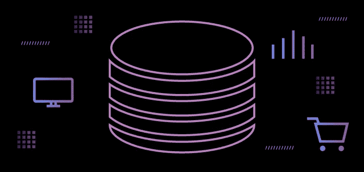

# 为什么你不想要为营销人员制作 CDP

> 原文：<https://medium.com/geekculture/why-you-dont-want-a-customer-data-platform-b40153e121db?source=collection_archive---------19----------------------->

自 Segment 和他们的一群合作伙伴宣称 [CRM 还不够](https://segment.com/crm-is-not-enough/)以来，已经过去了将近一年。我们同意他们的评估，即您必须超越 CRM，将销售、支持、营销和产品吸引客户的不同渠道连接起来。

我们也同意推动其宣言的三种市场力量:

1.  客户工具互操作性的需求；
2.  抵制供应商锁定；和
3.  对能够带来更好客户体验的软件的偏好。

我们不同意的是，除了 CRM 之外，您还需要一个客户数据平台(CDP)。

你实际上并不想要 CDP 原因如下…

# 什么是 CDP？

CDP 承诺做几乎所有的事情，这取决于供应商和他们夸大其词的倾向。然而，这些夸张和作为现实出售的“可能的艺术”并没有定义 CDP 实际上做什么。

最广为接受的 CDP 定义来自 [CDP 研究所](https://www.cdpinstitute.org/)。客户数据平台是一个打包的软件，可创建其他系统可访问的持久、统一的客户数据库这一定义的三个基石是:

*   **CDP 必须是打包的软件。**它们是预构建的系统，与独立的数据仓库项目相比，部署和维护它们需要较少的技术专业知识。
*   **CDP 必须创建持久、统一的客户数据库。**从多个系统中获取客户数据并进行链接，以创建每个客户的综合视图，该视图将被存储并可随时间推移进行分析。
*   **CDP 必须可被其他系统访问。**存储在 CDP 中的客户数据需要被其他系统访问以进行分析和激活。

CDP 协会的定义主要涉及 CDP 的技术方面。在使用中，CDP 是营销工具，一个不太专业的定义可以告诉我们更多关于 CDP 应该做什么。在这方面， [Gartner](https://www.gartner.com/smarterwithgartner/marketers-to-guide-customer-data-platforms/) 给出了 CDP 的一个很好的定义:

"*CDP 是一个营销系统，它将来自营销和其他渠道的公司客户数据统一起来*"

Gartner 还指出，正如我们在简介中看到的，CDP 与许多其他相关技术重叠。它与 CRM 有重叠，而且与数据基础设施技术(如数据仓库)的重叠越来越多。

说了这么多，CDP 是什么*不是*是平台。这可能是这些产品的术语和价值混淆的原因之一。

根据[定义](https://en.wikipedia.org/wiki/Platform_as_a_service)，平台是一种允许客户开发、运行和管理应用程序的技术。

根据上述定义，CDP 更像是一个软件——特别是营销软件——而不是一个平台。这完全没问题，但是使用术语平台增加了这些工具用途的混乱。

# CDP 解决什么问题？

CDP 的[主要功能](https://www.gartner.com/smarterwithgartner/marketers-to-guide-customer-data-platforms/)是支持客户建模，优化信息传递和优惠的时机和目标。

为了实现这一点，CDP 必须能够将客户数据整合到一个地方，创建客户档案，并最终围绕客户创建某种持久的身份概念。

要做到以上几点，CDP 解决的首要技术问题就是身份解析。您可能已经看到了许多这样的名称——它们根据 CDP 的不同而不同。它经常会涉及术语“客户 360”，这个术语被过度使用和加载，以至于只要看到它就会对我们的软件效用发出危险信号。

一旦你通过了所有的命名诡计，身份解析是一个非常简单的想法，但执行起来却非常困难。CDP 从多个不同的客户工具中获取数据，将其转换为标准化的形式，并根据它构建身份图。这个身份图使您的应用程序能够实时识别客户，并根据客户属性进行激活，这些属性可以是由您的 CDP 收集的，也可以是通过某种形式的分析产生的。

这听起来很简单，除了构建身份图非常困难。构建身份图的方法和算法有很多，每种方法的有效性都高度依赖于它的实现和它所应用的数据的上下文。CDP 掩盖了这个困难，这对用户来说是好事，但是它也掩盖了他们的身份解析的有效性。CDP 的身份解析方法好吗？很难知道。

几乎所有其他 CDP 用例都源自身份解析。细分、个性化、推荐、活动优化等。—这些都依赖于身份解析。拥有一个您的客户工具可以访问的统一的客户档案，让您有能力解决许多问题。有些用例不一定涉及身份解析，比如会话化和客户旅程映射，但是大多数 CDP 不支持它们。

# 这听起来真的很棒。所以…为什么我不想要 CDP？

如果 CDP 解决了您的客户身份，统一了您的客户数据，并帮助解决了一系列重要、困难的客户体验问题，看起来您会想要一个。CDP 做出的所有这些承诺是它们成为热门商品的原因。

然而……CDP 面临着各种各样的问题，其中许多问题是[数据基础设施行业](http://cidrdb.org/cidr2021/papers/cidr2021_paper17.pdf)中的任何人都熟悉的。这是有意义的，因为最终 CDP 必须解决许多与数据仓库传统上试图解决的问题相同的问题。整合数据、提供分析、与其他技术互操作，所有这些都是两者之间共享的功能。所以，他们也有一些共同的问题也就不足为奇了。

# 产品成本

对 CDP 的一个经常性抱怨是它们太贵了。它们如此昂贵，以至于公司经常不得不评估是否应该构建自己的解决方案，而不是从供应商那里购买解决方案。这个决定根本就不应该摆在桌面上。你上次听说有人因为没有合理的替代方案而考虑建立自己的 CRM 是什么时候？营销自动化软件怎么样？这种情况不会发生，因为构建自己的 CRM 或营销自动化解决方案的难度和费用将远远超过向供应商支付解决方案的费用。CDP 的情况并非如此，原因很简单，因为 CDP 太贵了。

# 总拥有成本

除了产品本身的成本，CDP 用户还必须加倍存储成本，因为数据必须复制到 CDP。这可能包含在 CDP 的价格中；但是，保留相同数据的多个副本会增加不必要的成本。包括构建和运行 ETL 流程以将数据接收到 CDP 中的成本，总拥有成本甚至会增加更多。

# 数据锁定

数据所有权定义了谁可以控制数据安全、数据访问和数据隐私。使用 CDP 在几个方面减少了您的所有权，但在数据安全方面最明显。由于 CDP 在其基础架构中构建和存储您的客户数据仓库，您无法了解和控制对您数据的所有访问，这意味着您无法确保数据安全。可以说，第三方供应商是公司面临的最大数据安全风险。如果您的供应商存储了您的客户数据，并且他们有安全漏洞，那么您也有安全漏洞。你对此无能为力。您的数据是您最大的资产之一，因此您应该对其拥有完全的控制权和所有权。

# 数据陈旧性和可靠性

CDP 中的数据是否准确和最新？多久可以将数据同步到 CDP 中？在不同系统之间准确地维护状态是一个难题。将另一个数据消费者(CDP)添加到您的整体数据基础架构中，只会使事情变得更加复杂。因此，您要么牺牲数据质量(这会影响营销活动的有效性)，要么投资资金以确保您的数据基础架构能够可靠地提供您的营销团队所需的 SLA。在这两种情况下，总拥有成本都会增加。

# 仅限于供应商定义的问题

一些较老的传统 CDP 提供工具来执行营销和销售活动，如电子邮件活动和数字个性化。这些解决方案仅限于解决他们为之构建功能的问题。如果你走出他们的职能范围，有效利用你的客户数据将是一个挑战。

像 Segment 一样，现代 CDP 不提供执行营销和销售活动的工具。相反，它们提供了与最佳执行工具的连接。与传统 CDP 相比，这些解决方案在功能上受到的限制较少，但它们仍然受限于哪些洞察是派生的，以及哪些洞察是可以激活的。你不能仅仅在你的客户数据上建立一个模型，你受限于他们提供的模型，并在你的黑盒数据上运行。因此，虽然像细分市场的人物角色这样的功能提供了有用的、强大的、易于使用的受众，但你不能超越它太多。如果不是基于受众来激活，而是基于会话化的数据或客户旅程图来激活，那么你就不走运了。

# 缺乏高级分析

CDP 的宗旨是提供基于行为特征的客户细分方法。从数据分析的角度来看，这些方法和查询非常简单。因此，也可以提供非常直观的用户界面来定义用户群。虽然我们生活在一个人工智能和人工智能的时代。简单查询和直观界面的价值虽然对人类用户来说非常高，但对这些技术来说却非常低。如何将这些新技术整合到您的 CDP 中？同样，这不是 CDP 独有的问题。像雪花和谷歌这样的供应商正在用 ML 算法扩充他们的数据仓库解决方案，这些算法可以在你的数据集上执行，并丰富数据仓库中的数据。

# CDP 应该是构建在您现有数据基础架构之上的应用程序。

CDP 不是一个平台，但实现它的最佳方式是在您现有的数据基础架构或数据平台上构建它，作为一个数据应用程序。

CDP 所面临的问题，以及 CDP 用户经常遇到的其他几个问题，都是由 CDP 试图重新实施完整的数据基础架构来实现其价值所导致的。如果 CDP 不存储您的客户数据，您的成本会更低；您不必将供应商的安全性添加到您的安全问题列表中，您也不会仅限于解决供应商定义的问题。

鉴于当今现代云数据仓库的强大功能，解决方案显而易见。您的客户数据仓库和身份图应该构建并存储在您的数据仓库中，而不是 CDP 供应商。然后，您可以控制您的成本，提高您的数据安全性，并扩展您的数据科学家可以解决的问题集。

# 您需要更智能的客户数据管道，而不是 CDP。

您需要一个工具来轻松获取客户数据，将数据路由到下游客户工具，并在您的数据仓库上构建您的客户数据仓库和身份图。你不需要平台。您需要一个管道——一个为客户数据设计的管道，它可以自动构建您的客户数据仓库和身份图。

[方向舵堆栈](https://rudderstack.com/)是智能客户数据管道。这是仓库优先。它在您的数据仓库中构建您的客户数据仓库和您的身份图，让您能够完全控制您的客户数据。借助 RudderStack，您可以轻松构建连接整个客户数据堆栈的管道，然后通过从您的仓库获取和激活丰富的数据来使它们更加智能。

仓库优先的方法消除了 CDP 用户经常面临的问题。它解决了与 CDP 相关的使用案例，并实现了 CDP 无法解决的更多问题，同时显著提高了成本效益、安全性以及其他工具的可访问性。仓库优先是一种简单的方法，但它是一种很好的方法，我们认为它将推动客户数据工具和分析的未来。

# 今天试试方向舵堆栈

开始构建更智能的客户数据管道。使用你所有的客户数据。回答更难的问题。向您的整个客户数据堆栈发送见解。今天就报名参加[舵栈云免费](https://app.rudderlabs.com/signup?type=freetrial)。

加入我们的 [Slack](https://resources.rudderstack.com/join-rudderstack-slack) 与我们的团队聊天，查看我们在 [GitHub](https://github.com/rudderlabs) 上的开源报告，订阅[我们的博客](https://rudderstack.com/blog/)，在社交上关注我们: [Twitter](https://twitter.com/RudderStack) 、 [LinkedIn](https://www.linkedin.com/company/rudderlabs/) 、 [dev.to](https://dev.to/rudderstack) 、 [Medium](https://rudderstack.medium.com/) 、 [YouTube](https://www.youtube.com/channel/UCgV-B77bV_-LOmKYHw8jvBw) 。不要错过任何更新。[立即订阅](https://rudderstack.com/blog/)我们的博客！

这篇博客最初发表在新栈[这里](https://thenewstack.io/why-you-dont-want-a-customer-data-platform)。