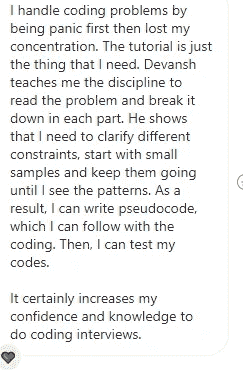
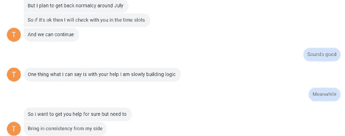

# 为什么你需要简单的问题来赢得 FAANG 面试

> 原文：<https://medium.com/geekculture/why-you-need-easy-questions-to-ace-your-faang-interviews-ba0b6fc144ef?source=collection_archive---------9----------------------->

## 以及如何更好地使用它们

为了帮助我了解您[请填写此调查(匿名)](https://forms.gle/7MfQmKhEhyBTMDUD7)

在这一点上，我已经辅导了很多人在编码面试中取得好成绩。结果已经说明了一切。几天前，我收到了一名学生的推荐，这是她在脸书大学最后一轮高级软件开发职位的推荐。



这个学生，罗斯(显然是假名)，已经有了很大的进步。就像她提到的，她看到问题会经常慌。她的倾向是立刻开始立刻看所有的东西，这会让她不知所措。因此，罗斯会陷入她的头脑中，无法在这个问题上取得进展，因为她会质疑她所做的一切。结果，尽管她练习了 5 年，她还是被简单的问题难住了。

> "*当我在中等/困难的问题上需要帮助时，你为什么坚持要我做简单的问题？*“是我经常被问到的问题。

这在很多向我求助的学生中非常普遍。他们告诉我，在他们看来，即使是中等问题也是不可能的。我的回答总是一样，“回到简单的问题。”他们总是很困惑。"*当我在中等/困难的问题上需要帮助时，你为什么坚持要我做简单的问题？*”是一个常见的问题。在这篇文章中，我将解释为什么简单的问题在你的 FAANG 准备中发挥着独特的作用。以及如何使用它们来最大化你的练习收获。怀疑？这是我收到的一个前学生的公开推荐，他在谷歌面试中表现完美。


Feel free to check out this recommendation on my LinkedIn Profile

既然你相信了，那我们就开始吧。在这篇文章的结尾，你会有一个想法，为什么你需要简单的问题，以及如何以正确的方式练习它们，以充分利用你的输入。

# 赞美简单的问题

许多人忽略简单的问题，理由如下:“面试会问我中等或困难的问题。所以简单的问题就是浪费时间。”其他人会做简单的问题，但只是为了继续做更难的问题。如果你读过我的文章“我如何帮助一个非计算机科学专业的学生获得一份 FAANG 软件开发工作”，我提到我让她每周做的 10 个问题中，有 5 个很简单。我现在就来解释一下它们的基本原理。


This was the result of that approach

有效的练习由两部分组成，你做的问题的数量和每个问题教会你的量。每个问题还有另一个重要的维度——你需要多长时间完全融入。问题需要一段时间才能很好地整合，但教会了很多。简单的题不需要太长时间学习，也不会教你很多。够简单吗？但是很多人都忽略了这个。

简单的问题教会你基础知识。以合并两个二叉树问题中的合并二叉树问题为例。这是个简单的问题。解决方案并不那么难理解。但是问题的方法，可以帮助你解决大部分的树问题。它们都可以细分如下:

```
def treeFunc(root, **other params):
    if(root==null):
        return baseCase/other relevant params
    val=operation(treeFunc(root.left), treeFunc(root.right))
    return val
```

下面的线程包含了很多例子。在合并树的上下文中，这表现为:

```
def merge(t1, t2):     
    if not t1 and not t2:         
       return None      
    elif not t1:         
       return t2      
    elif not t2:         
       return t1      
    else:         
       node = Node(t1.data + t2.data)         
       node.left = merge(t1.left, t2.left)         
       node.right = merge(t1.right, t2.right)         
       return node
```

看到相似之处了吗？想想树的遍历，计算二叉树的深度，以及许多其他操作。他们倾向于依赖一个非常相似的结构。这适用于许多种问题。简单的问题是向你介绍不同想法和概念的好方法。他们可以教你第一步，这对解开更难的概念/想法至关重要。并且他们以一种时间有效的方式这样做。由于简单题不需要很长时间来完全整合和学习，所以可以多做一些。更多的问题→你接触到更多的想法→你能够在面试中处理更多不同的问题。

# 为什么我不能用中/难题来学习/熟悉这些概念？

奇妙的问题。如果简单的问题能教会你这些东西，那么中等难度的问题肯定也能。是的，他们可以。毫无疑问。他们会教你更多。**但是这些问题包含了更多的活动部分**。在一个小时/一个半小时内，你将**最多**能够完成这些问题中的 1-2 个。同时，你将能够完成 2-3 个简单的问题。

所以现在你可能会想:

# 为什么我不能多花点时间练习？网上人们每天花 5 个多小时在 Leetcode 上？

你也可以。但是你有那样的时间吗？我辅导的人有面试准备之外的生活(全职工作、家庭、社会义务等)。你将不得不在你的工作/学校之外面试 prep。你不能在睡觉的时候做。假设工作 8 小时，睡眠 7-8 小时(请至少睡这么多，事实证明这对你的健康最重要)。这给你留下了大约 8 个小时的空闲时间。如果在这个时候，你决定花 3-5 个小时练习难题，你会精疲力尽。任何健康专家都会告诉你，休息和恢复是身体变好的关键部分。一整天后 3-5 个小时的高强度练习会让你精疲力尽。


Sleeping enough will help you ace your interviews. Same applies for rest between work. Look it up.

另一种选择是你会投入大量的“垃圾练习”。你会因为工作而感到疲劳，所以你会草草练习，走过场而学不到多少东西。如果你已经练习了一个问题，但是当你后来回到这个问题的时候没有解决，你可能做了垃圾练习。

在“[我的学生用来最大化 Leetcode 问题并赢得 FAANG 面试的 4 步法](/geekculture/the-4-step-method-my-students-use-to-maximize-leetcode-problems-and-ace-their-faang-interviews-2d5e0a6b1538)中，我谈到了你可以从练习的每个问题中受益的步骤。但是你会注意到，这些步骤需要专注和集中，并且需要从反馈中反复学习。如果你累了，你就不能这样做。试图在一整天后休息 3-5 个小时会让你**非常疲劳**。**你最好进行 1-1.5 小时的高质量练习，其余时间休息。**



The results of learning effectively from every question are staggering.

出于类似的原因，在周末加班会适得其反。你的生产力会有递减的回报。5 小时的周末可能不适合你。

# 那么你应该如何着手呢？

这可能是你的想法。我说了很多不该做的事，但没说该做什么。这一部分将会给你一个很好的指导，告诉你如何设计你的星期来最大限度地利用你的时间并完成面试。遵循这个指导方针，你也会看到这样的结果


Another conversation with another successful student.

我们希望确保在做大量问题和高质量问题之间取得良好的平衡。20 个简单的问题和 3 个困难的每周问题对你都没有帮助。因为我们只会做高强度的练习，我们假设平均每天 1-1.5 小时。我们还需要确保你每周至少有一次模拟面试。这提高了你在计时器下工作的能力，也给了你一些关于你沟通能力的提示。

所以把这些东西放在一起，我们得到:

1.  周一-周二:这两天你有 3 个小时的工作时间。你将用它来复习 5 个简单的问题。确保你理解了问题的每一个细节。这几天会让我们保持敏锐，并允许我们得到各种各样的问题。非常适合培养和保持熟练程度。
2.  周三-周六:我们用这几天来解决中等难度的问题。我们想在这段时间内完成至少 4 个中等难度和 1 个难度的问题。由于周六是周末，我们可以额外增加几个小时(最多 1-1.5 小时)来满足我们的需求。这些日子会提高我们解决问题的能力。
3.  周日:周日是模拟面试+复习。这是为了让我们对面试环境变得不敏感，并让我们确保能够将我们的学习转化到面试中。你也可以用这一天来回顾你的一周，看看是否有什么问题突然出现在你面前。

这个计划会让你两全其美。你可以提出大量的问题。但是你也花了很多时间在更难的问题上(从时间上来说，我们一周的大部分时间都在这里)。你有一个面试来跟踪你的进展。关于如何在模拟面试中给出最佳答案的更多细节，请查看“[如何设计模拟面试答案以在 FAANG 面试中胜出](/geekculture/how-to-design-your-mock-interview-answers-to-nail-your-faang-interviews-23f6b9f401cf)”。运用这个计划的原则，你会看到巨大的成果。

# 关闭

我写这篇文章，是因为我有很多人在修行中无法突破到更高的境界。我分享了我教学生取得巨大成功的方法。我有很多学生从这些方法中受益，所以我分享了它们。如果其他事情对你有所帮助，请直接在评论中与我分享你的经历。互联网的好处是我们可以互相学习。

要想免费接触各大顶级公司提出的精选问题，请查看我的子堆栈，“[编码面试变得简单](https://codinginterviewsmadesimple.substack.com/)”。我个人选择我遇到的有趣的问题。到目前为止，它对使用过它的学生很有帮助。如果你对机器学习或人工智能研究感兴趣，一定要看看我在 Medium 上的其他文章和我在 YouTube 上的视频。[在这里可以找到我制作的关于非常重要的乙状结肠功能的视频示例](https://www.youtube.com/watch?v=aqgo5opwd7g&t=380s)。

# 向我伸出手

如果那篇文章(或建议)让你有兴趣联系我，那么这一部分就是为你准备的。你可以在任何平台上联系我，或者查看我的其他内容。如果你想讨论家教，发短信给我。如果你想支持我的工作，使用我的免费罗宾汉推荐链接。我们都有免费的股票，对你没有风险。所以不使用它只是失去了免费的钱。

查看我在 Medium 上的其他文章。:[https://rb.gy/zn1aiu](https://rb.gy/oaojch)

我的 YouTube:[https://rb.gy/88iwdd](https://rb.gy/88iwdd)

在 LinkedIn 上联系我。我们来连线:[https://rb.gy/m5ok2y](https://rb.gy/f7ltuj)

我的 insta gram:[https://rb.gy/gmvuy9](https://rb.gy/gmvuy9)

我的推特:[https://twitter.com/Machine01776819](https://twitter.com/Machine01776819)

我的子任务:[https://codinginterviewsmadesimple.substack.com/](https://codinginterviewsmadesimple.substack.com/)

这里是 twitch 的现场对话:【https://rb.gy/zlhk9y 

获得罗宾汉的免费股票:【https://join.robinhood.com/fnud75 