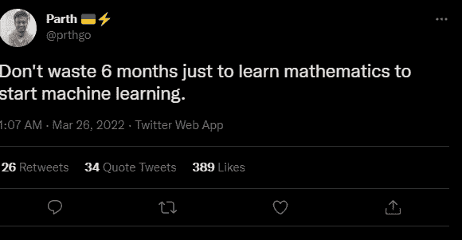
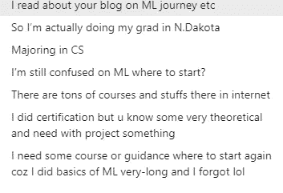
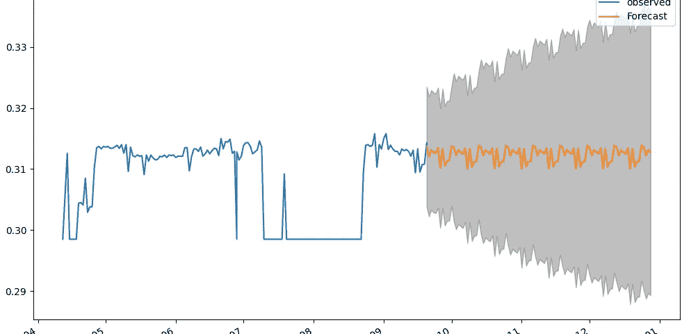
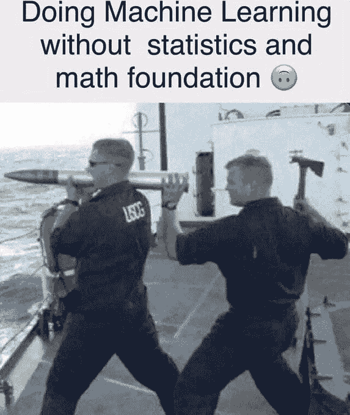
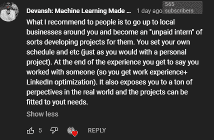
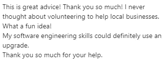
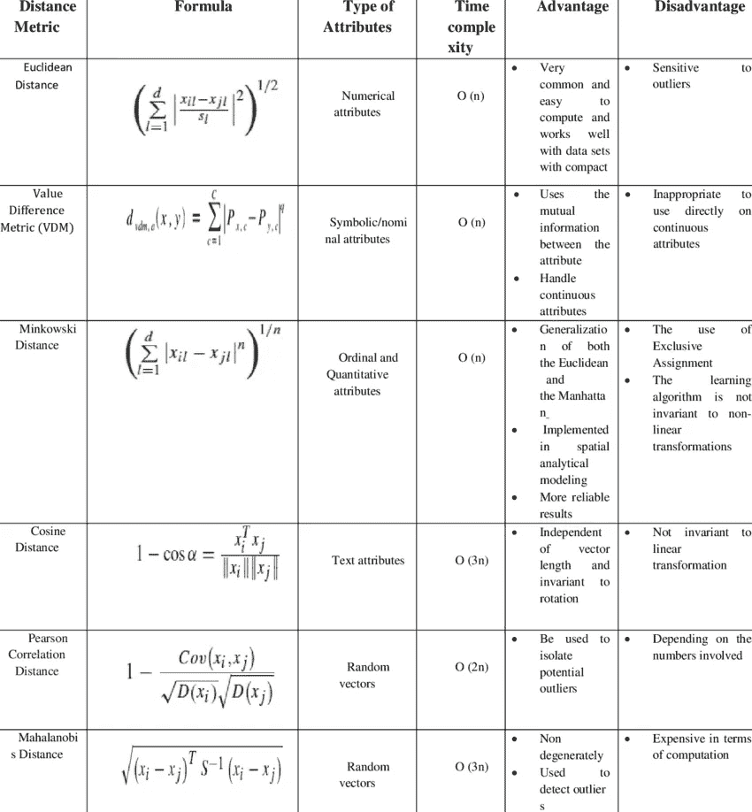

# 为什么机器学习需要数学

> 原文：<https://medium.com/geekculture/why-you-need-math-for-machine-learning-d9aca2437ee8?source=collection_archive---------0----------------------->

## 以及你需要多少才能做好机器学习

为了帮助我了解您[请填写此调查(匿名)](https://forms.gle/7MfQmKhEhyBTMDUD7)

不久前，我在推特上看到了以下推特上的例外情况。这是一个在网上非常流行的想法，我本打算早点写下来。但是，由于所有的疯狂发生在 ML 研究领域，我得到了侧道。

There are a lot of Deep Learning Gurus on Twitter that make claims like this. Hopefully, this adds some balance to the discourse. Parth [Twitter Profile](https://twitter.com/prthgo)

然而，现在我有时间，我终于可以深入讨论这个问题了。在这篇文章中，我将讨论“为什么机器学习绝对需要数学”即使你从来没有像我一样投入到更数学化的 AI 研究工作中。

机器学习不仅需要数学，而且在进入 ML 之前不学习至少一些数学**会主动伤害你。我们将从不同的角度来探讨这个问题，同时也涵盖了在进入 ML 之前你应该掌握多少数学知识。**

# 理解论点

为了理解为什么这种观点是不好的，让我们首先来理解这个观点是什么。这种说法的变体从“没有数学也可以开始机器学习”一直到“数学是无用的，我们不需要它来进行机器学习”。两者都是错的，但前者比后者可原谅得多。为了支持这一论点，我将在本文中讨论前一个问题。一旦我们理解了这一点，你就会明白为什么这个说法的其他变体也是错误的。

As someone who has actually worked with beginners, I can assure you that ignoring Math is one of the biggest mistakes you can make.

这一主张基于以下支持论点。如果你认为我漏掉了什么，告诉我，我可以跟进-

1.  您可以在没有任何数学/理论基础的情况下训练、测试、评估、部署甚至交叉验证模型。复制 Jax，Keras，TF，PyTorch，或者其他任何框架就可以了。有了 AutoML 解决方案(包括我已经构建的)，这个过程变得更加容易。
2.  网上有足够多的教程供你复制粘贴。只要搜索你的问题，你就会找到它。
3.  几乎没有深度学习工程师会定期使用傅立叶级数、数字变换、微积分或任何花哨的东西。人工智能研究者是唯一这样做的人。如果你不是其中之一，你不需要担心。
4.  你总是可以先开始，然后再学数学。当你开始时，你不需要成为专家。当你变得有经验时，你可以学习数学。这样你也会知道什么更重要。

这些想法有一些优点。许多人纠结于数学，所以如果可能的话避免它是有意义的。尤其是如果你能继续赚 ML 的钱并建立自己的事业。

我现在将解决这些问题，向你展示为什么沿着这些思路思考会损害你的职业生涯。会给你带来很多痛苦。

If you keep learning the basics of ML but then forget after a little bit of time, then you didn’t actually learn the basics. Once you develop your foundations, they don’t go away easily.

# 模型训练+部署不需要数学

网上有很多优秀的框架。他们使得 ML 模型的实现变得更加容易。我们现在不再需要担心恼人的小细节，如反向传播、[激活函数](/codex/learnings-from-googles-comprehensive-research-into-activation-functions-4a9d6566ba2c)和[批量大小](/geekculture/how-does-batch-size-impact-your-model-learning-2dd34d9fb1fa)。尤其是如果我们抄袭已经提到的教程和博客。把所有东西都扔向墙，看看有什么粘在墙上。不幸的是，许多和我一起工作过的人都认为这是一种有效的方法。

不幸的是，现实并非如此美好。你的大部分机器学习不会在你的模型上工作。您首先需要评估数据集，并计算出分布情况，以查看要素之间的相互关系。在应用机器学习之前，你首先需要评估机器学习对于你的问题是否有效。

The reason my content appeals to a lot of people is that I can focus on the right things. This comes from hours on the mat. I’ve been into ML since 2017\. Even now, I come across ideas that blow my mind.

[你的数据是否违反了 IID 原则](https://www.youtube.com/watch?v=twUMmVqm-2Y&ab_channel=Devansh%3AMachineLearningMadeSimple)？如果你从未研究过这个概念，你甚至不知道该问这个问题。你将继续应用 ML，因为所有的博客、教程和论文都隐含了这一假设，所以你从未见过这种质疑。我曾经采访过一个在 Kaggle 上排名很高的人。他们非常擅长清理数据集和有明确前进路线的区域任务。但是因为他们不太了解数学(以及不同框架背后的假设)，他们无法回答这个基本问题-

> 为什么开发人员可以在我们预测未来 100 个时间点时用 ARIMA 建立置信区间，却不能用 LSTMs 这样更“先进”的想法？

The implementation for LSTMs doesn’t have these error bars around forecasts. Why?

这个问题的答案取决于 ARIMA 和神经网络之间的根本区别。如果你想尝试解决这个问题，请便。很想知道你的答案(提示:不是开发人员懒)。

The example is a good example of this amazing meme. As they say, A lot of Truth is said in Jest.

事实是，在 ML 这样的领域，你永远成不了专家。会遇到让你的想法过时的事情。发生在牛顿物理学上。发生在欧几里德几何上。ML 论文总是在改变现状，挑战我们视为真理的东西([比如这篇论文向我们展示了许多在基准测试中完成的 ML 测试有很大的随机性来源](/mlearning-ai/why-you-need-to-spend-more-time-evaluating-your-machine-learning-models-e1e3258fe7d))。为了确保你能继续学习，你必须知道基础。这需要数学。

好吧，但是边工作边学习呢？当然，当你开始学习时，你可以学习机器学习吗？参加个人项目，并从中学习。毫无疑问，这是一种让你不用数学就能先进入 ML 的方法。数学可以以后按需学习。

# 在工作中学习

在工作中学习是一件非凡的事情。我已经做到了。我甚至推荐给别人。然而，要在工作中学习，你必须满足这份工作的基本条件。

让我们假设您从 Kaggle 获得了一个不错的初学者数据集。无需担心特性相关性、数据依赖性和其他烦人的问题。只是一个漂亮干净的分析。Sklearn go brrrr！！！

在这样的情况下，**你到底学到了什么**？你取得了哪些实实在在的成就？你实现了哪些学习目标？运行几行代码并没有真正的意义。在你真正做一些有一点点用处的事情之前，你还要做多久？我这样做不是为了贬低任何人。我只是指出这种方法是低效的。

This was a comment of mine on [Ken Jee](https://medium.com/u/6ee1f7466557?source=post_page-----d9aca2437ee8--------------------------------)’s [recent video on Data Science Projects](https://youtu.be/QMP858aZcow). More people should try this.

如果你真的想一头扎进去，在工作中学习，最好是进入一个有很多可能的改变途径的项目，并尝试一次测试一个。这将帮助你了解更多。快多了。

然而，如前所述，messier 项目将带有更多的活动部件。甚至识别这些运动部件也需要基本的数学知识。你可以花时间运行琐碎的代码，直到你足够理解这些小事，然后继续前进。或者你可以学习一些基本的想法，然后追求更大的目标。选择权在你。

Helping local businesses will be good for multiple reasons- you will learn about some challenges, understand why SOPs exist, have a chance to make an actual impact, and network with people. All valuable things.

现在来解决最后一个大问题。“没有人真正每天都在使用数学(除了少数研究人员)。因此，你可以在不懂数学的情况下从 ML 开始。”现在让我们来解释一下为什么这是不真实的。

# 数学无处不在

如果你是一名 ML 工程师(不是一名研究员)，你将主要有以下责任-

1.  **评估+清理数据集，提出清理策略，特征工程等** -大部分都是数学。从现有要素创建新要素需要分析要素的统计分布。评估数据集的纯度和异常值也需要对数学有基本的了解。知道用什么指标来评估你的表现(非常重要但总是被忽视)需要你理解这些指标。这也需要(敲鼓)……**数学。**
2.  数据管道维护、检查泄漏等 -许多较小的组织也会让你处理这一部分。我个人从未在这个领域工作过，但根据我与在这个领域工作过的人的交谈，这个领域需要比机器学习更多的软件工程。在这里你可以不知道太多的数学知识。然而，要过渡到 ML，你需要数学。
3.  **模型测试、创建训练策略等-** 这是人们在想到机器学习时通常会想到的。与网上兜售的相反，模型的创建和训练是容易的部分。您需要能够阅读培训日志和输出(您将必须创建 FYI ),以确定可能有效的不同协议。通常，你必须根据自定义的绩效指标(基于客户/雇主的价值观)来评估绩效。您需要创建、修改和理解的指标。你要怎么做?

These are just some possible distance metrics you can use. [To understand how to self-study Math, check this post out.](https://codinginterviewsmadesimple.substack.com/p/math-is-a-language-this-is-how-you)

从雇主的角度来看。如果你只知道如何复制粘贴别人的模型，他们为什么要雇佣你？当然，你可以尝试从数据工程过渡到 ML。很多人都这么做。但这个过程是缓慢的。你将不得不与有实际 ML 经验的人竞争。你只是让自己的日子更难过。技术面试已经够难的了。

If you are looking to prepare for your interviews, check out my free daily newsletter, Coding Interviews Made Simple. [The premium version comes with 2 months free, if you use this link](https://codinginterviewsmadesimple.substack.com/subscribe?coupon=3593a664)

很明显，从长远来看，在进入 ML 之前学习数学将会节省你很多时间。那么在机器学习之前应该学什么数学呢？多少钱？现在让我们来讨论这个问题。

# 机器学习的数学先决条件

为了进入正题，学习这些概念会对你有很大的帮助-

1.  **预科+微积分**——你至少要把积分和泰勒级数打通。这将让你理解概率的东西，反向传播，和其他基本概念。
2.  **先证者与统计**——了解协方差，了解不同的分布，对贝叶斯思维有一个基本的理解是很重要的。牢记中心极限定理。
3.  **线性代数-** 了解矩阵乘法和基的变换。这就足够作为一个基数了。

要获得更全面、循序渐进的学习机器学习指南， [**请查看我的文章 2022 年如何学习机器学习**](/geekculture/how-to-learn-machine-learning-in-2022-9ef2ea904986) 。这将分享关于这些主题的更多细节，并指向您可以用来学习这些主题的免费资源。

最后，我建议观看 3Blue1Brown 的以下视频。跟机器学习没太大关系。然而，这是一个完美的例子，说明是什么让数学变得如此美丽(和困难)。我不会破坏你的视频。不要错过它。

Math concepts allow you to connect ideas from different domains. [This is what makes ML powerful in the first place](/mlearning-ai/why-you-will-struggle-with-machine-learning-677403d04c7c)

我要在这里结束文章了。让我知道你对这件事的想法。你和数学、机器学习是什么关系？你在努力自学更高层次的数学思想吗？如果是这样的话，请务必跟随我，因为我将很快讲述我自学数学的方法。

对于机器学习来说，软件工程、数学和计算机科学的基础至关重要。它将帮助你概念化，建立和优化你的 ML。我的每日时事通讯，[Coding interview make simpled](https://codinginterviewsmadesimple.substack.com/)涵盖了算法设计、数学、最近的技术事件、软件工程等主题，让你成为更好的开发人员。 [**我目前正在进行全年八折优惠，所以一定要去看看。**](https://codinginterviewsmadesimple.substack.com/subscribe?coupon=1e0532f2)

我创建了[编码面试，使用通过指导多人进入顶级科技公司而发现的新技术，使面试变得简单](https://codinginterviewsmadesimple.substack.com/p/faqs-and-about-this-newsletter?r=4tnbw&s=w&utm_campaign=post&utm_medium=web)。时事通讯旨在帮助你成功，避免你在 Leetcode 上浪费时间。我有一个 100%满意的政策，所以你可以尝试一下，没有任何风险。[您可以阅读常见问题解答，并在此了解更多信息](https://codinginterviewsmadesimple.substack.com/p/faqs-and-about-this-newsletter?r=4tnbw&s=w&utm_campaign=post&utm_medium=web)

如果你也有任何有趣的工作/项目/想法给我，请随时联系我。总是很乐意听你说完。

以下是我的 Venmo 和 Paypal 对我工作的金钱支持。任何数额都值得赞赏，并有很大帮助。捐赠解锁独家内容，如论文分析、特殊代码、咨询和特定辅导:

https://account.venmo.com/u/FNU-Devansh

贝宝:[paypal.me/ISeeThings](https://www.paypal.com/paypalme/ISeeThings)

# 向我伸出手

使用下面的链接查看我的其他内容，了解更多关于辅导的信息，或者只是打个招呼。另外，查看免费的罗宾汉推荐链接。我们都得到一个免费的股票(你不用放任何钱)，对你没有任何风险。**所以不使用它只是损失免费的钱。**

查看我在 Medium 上的其他文章。https://rb.gy/zn1aiu

我的 YouTube:[https://rb.gy/88iwdd](https://rb.gy/88iwdd)

在 LinkedIn 上联系我。我们来连线:[https://rb.gy/m5ok2y](https://rb.gy/f7ltuj)

我的 insta gram:[https://rb.gy/gmvuy9](https://rb.gy/gmvuy9)

我的推特:【https://twitter.com/Machine01776819 

如果你正在准备编码/技术面试:【https://codinginterviewsmadesimple.substack.com/ 

获得罗宾汉的免费股票:[https://join.robinhood.com/fnud75](https://join.robinhood.com/fnud75/)