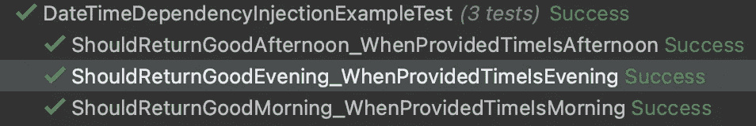

# 为什么应该抽象对日期时间的访问

> 原文：<https://medium.com/geekculture/why-you-should-abstract-your-access-to-datetime-f9fd3b3e2426?source=collection_archive---------8----------------------->

## 依赖注入的抽象日期时间访问

## 使测试在数据访问方面具有确定性的简单方法

Photo by [Aron Visuals](https://unsplash.com/@aronvisuals?utm_source=medium&utm_medium=referral) on [Unsplash](https://unsplash.com?utm_source=medium&utm_medium=referral)

大家好！

依赖性反转的概念是一个广为人知的概念，它表明一个人应该依赖于一个接口而不是一个特定的实现，因为它允许我们的测试更具确定性并且更易于维护。但是，对于日期和时间，这很容易被忽略，因为它们是简单的值，没有复杂的逻辑。

## 示例代码

让我们看一下这个函数的例子

如您所见，代码相当简单。它会根据当天的当前时间返回正确的问候语。

现在让我们试着测试这段代码并运行这些测试:

运行之后，我们得到的结果如下:

因为我在下午运行这些测试，所以只有与“下午好”相关的测试会通过。这导致我们的测试依赖于它们运行的时间，使它们不具有确定性

## 解决办法

对此的一个解决方案是将对日期时间的访问抽象到一个接口中。以下是该界面的一个示例:

然后，您可以通过依赖注入将此提供程序传递到您的类中

测试现在看起来像这样:

如您所见，现在每个测试都能够通过一天中的特定时间。现在，即使我下午仍在运行这些测试，我也会得到以下结果:

这确保了无论您什么时候运行测试，结果总是相同的，并且您将不会有在不同的测试执行结果中运行结果的不同时间的问题

## 结论

在本文中，我想展示我在过去的许多代码库中看到的一个常见缺陷，以及为什么像这样一个简单的解决方案不仅可以确保您的测试是确定性的，而且您可以在代码中找到一个使用日期和时间的参考点

完整的库代码可以在[这里](https://github.com/nadais/Medium-abstract-datetime)找到

尽管代码片段是用 C#编写的，但这里展示的概念在任何其他语言中都非常适用。不同之处在于所使用的库以及如何注入接口

希望你喜欢，下次再见！