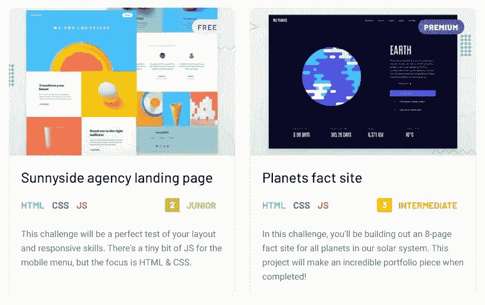
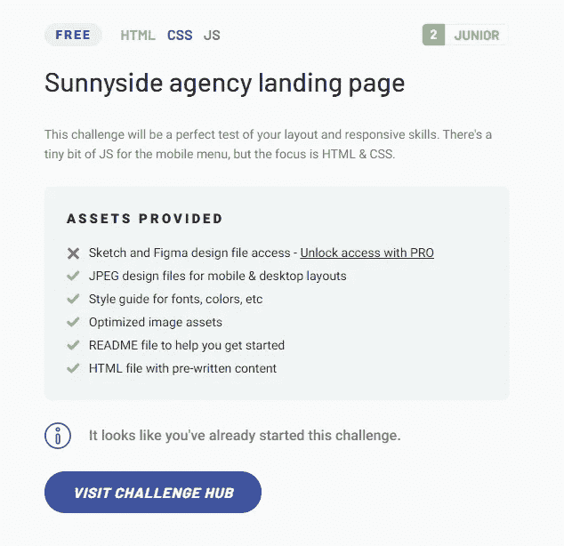

# 为什么你应该使用前端导师

> 原文：<https://medium.com/geekculture/why-you-should-be-using-frontend-mentor-e0d84029c0d2?source=collection_archive---------22----------------------->

## 如何提升自己的前端开发技能

Photo by [Clément Hélardot](https://unsplash.com/@clemhlrdt?utm_source=medium&utm_medium=referral) on [Unsplash](https://unsplash.com?utm_source=medium&utm_medium=referral)

# 快速公告📣

在我们开始今天的话题之前，我想给大家一个快速更新。

我已经在我的 LinkedIn 上宣布了这一点，但以防你不知道，我很高兴地宣布，今年夏天我将在 Western 担任 web 开发人员！

实践我的前端开发技能是我的一个夏季目标，我相信这个机会是实现这一目标的完美方式。

谈到提高你的前端开发技能，这就是这篇文章的主题— [前端导师](https://www.frontendmentor.io/)！

# 什么是前端 Mentor❓

根据他们在 LinkedIn 上的描述，Frontend Mentor“提供设计，以便你可以使用现实生活中的工作流程来练习你的前端技能。”

这到底是什么意思？

我将前端导师描述为一个为有抱负的前端开发人员提供挑战(定义如下)、资源、帮助和反馈的平台。

一个**挑战**基本上就是**一个测试你应用前端开发技能的能力的项目。**

有五个挑战难度级别——新手、初级、中级、高级和大师，因此它对任何人都是完美的，无论你在你的旅程中处于什么位置。

虽然可以选择订阅 Frontend Mentor，让您获得优质挑战和 Sketch/Figma 设计文件，但他们的大多数挑战都是免费的。

Example challenges from Frontend Mentor

现在就来看一个吧！

# 前端导师的先决条件

在我们深入讨论一个示例挑战之前，先简单说明一下你需要做些什么:对 HTML、CSS、JavaScript 感兴趣，一个 [Github](https://github.com/) 帐户，和一个文本编辑器(我推荐 [Visual Studio 代码](https://code.visualstudio.com/))。

就是这样！

如果你想开始你的前端开发之旅，我建议坚持到最后，在那里我会分享我学习这类东西的资源。

# 挑战示例📝

Sunnyside agency landing page challenge

挑战为你提供了以下东西:

*   草图和 Figman 设计文件访问**(带 pro 账户)**
*   用于移动和桌面布局的 JPEG 设计文件
*   字体、颜色等的样式指南
*   优化的图像资产
*   帮助您入门的自述文件
*   带有预写内容的 HTML 文件

请注意，挑战将突出你将学习的技能、难度以及是否适合高级用户。

# 你为什么要用它？🤔

关于 Frontend Mentor 有很多很棒的东西，但我认为有三个特点让我很突出。

1.  **用行业内找到的相关技能进行练习**

我申请了许多前端开发人员的职位，并看到了同样的技能被要求。

**其中包括:**

*   使用 HTML、CSS 和 JavaScript 构建网站或 web 应用程序
*   响应式 web 开发
*   使用现代 JavaScript 框架(如 React、Vue 或 Angular)设计和开发应用程序
*   根据草图或 Figma 设计文件实现用户界面

Frontend Mentor 提供的挑战可以让你在所有这些事情上获得经验，同时建立你的投资组合。

因为你被赋予了使用任何你想要的东西来完成挑战的灵活性，所以你可以选择你想要做的特定事情。

很难独自思考项目，Frontend Mentor 使您可以轻松地开始实践，而不会被其他任何事情所束缚。

**2。学习他人的方法**

一旦你完成了挑战，或者遇到了困难，你可以查看其他解决方案。

这很好，因为你可以看到相同挑战的不同方法，这可能会教你一些你以前不知道的新东西。

我通常会在提交后返回并审查其他提交的内容，我可以告诉你，我从这样做中学到了很多！您可以在现场查看他们的源代码和解决方案。

Solutions dashboard on Frontend Mentor

**3。设计对比工具**

这可能是我最喜欢的前端导师功能。提交解决方案后，此滑块可让您并排查看设计文件和解决方案。

Design comparison on Frontend Mentor

这很重要，因为它展示了你对细节的关注和你实现用户界面的能力。

# 资源📑

这些年来，我发现了许多有用的 youtube 频道、文章、开发人员和在线资源，它们促进了我的前端开发学习。

我想我会和你分享其中的一些！

*   [**凯文·鲍威尔**](https://www.kevinpowell.co/) — CSS 布道者。伟大的 CSS 资源，并在多个平台上。
*   [**基律巴。**](https://www.kirupa.com/) 在微软实习时的前同事——一个与网络开发相关的绝佳资源。
*   [**Mozilla**](https://developer.mozilla.org/en-US/) **。他们的文档清晰简洁。当我在我的 web 项目中发现意外行为时，我总是来这里。**
*   [**Udemy**](https://www.udemy.com/) **—具体来说就是**[**Jonas Schmedtmann**](https://www.udemy.com/user/jonasschmedtmann/)**。**完成了他的 JavaScript 和高级 CSS 课程。
*   [**Udacity 的 React 纳米学位程序**](https://www.udacity.com/course/react-nanodegree--nd019) **。**对于那些喜欢让自己的学习更有条理并且有预算的人，我推荐这个项目，它教会了我 React 的复杂性。

如果您看不到您的首选资源，**请告诉我！我可能会错过一些超级酷的东西，否则我是不会发现的。**

# ➡️之旅

希望我已经说服你使用前端导师，如果没有，那也没关系。对我来说更多的挑战！这是一个伟大的资源，让我在我喜欢做的事情上做得更好。

如果你完成了一项挑战，一定要让我知道——我很想谈谈我们各自采取的方法。

下次见！✌️