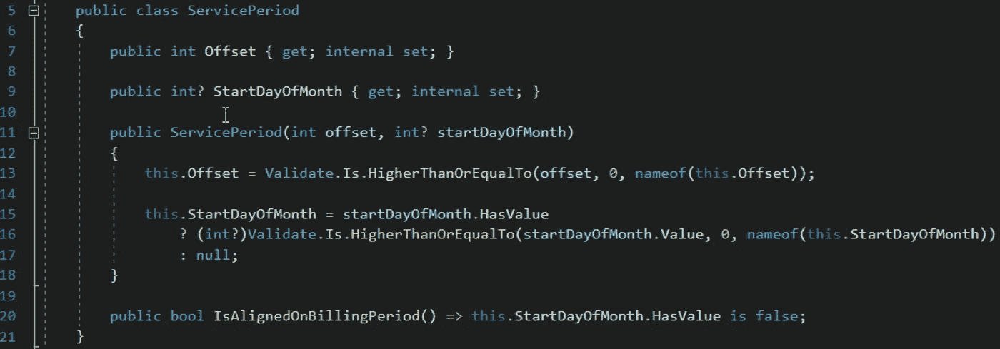
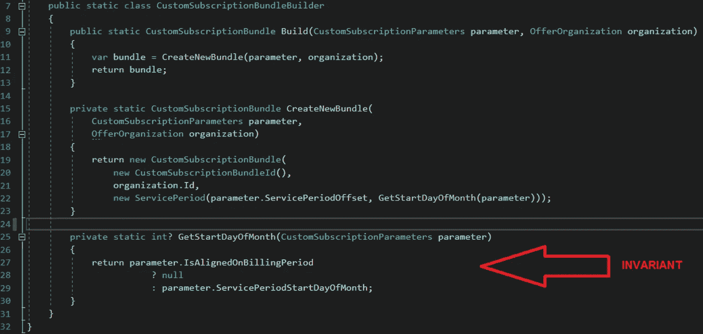
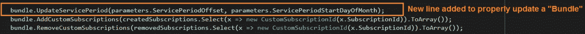
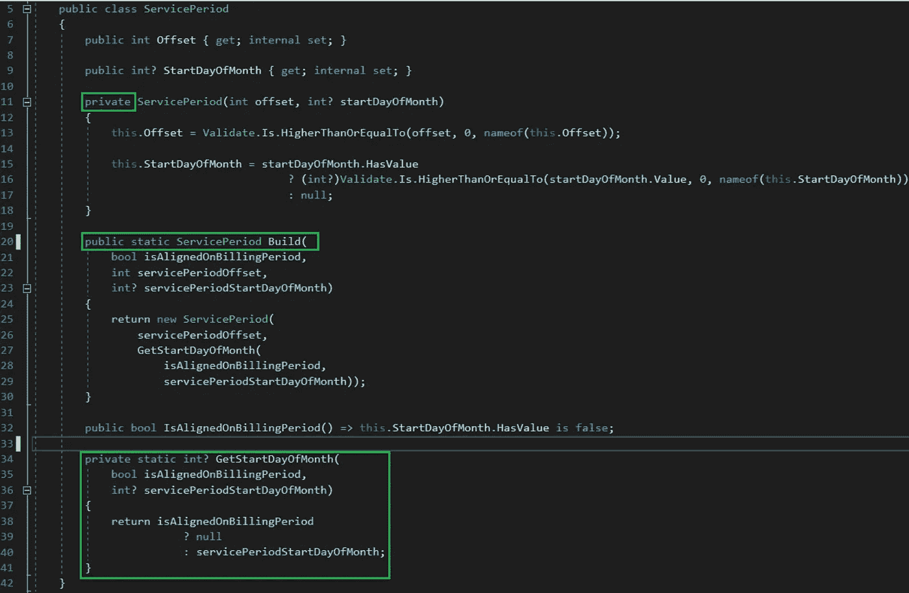
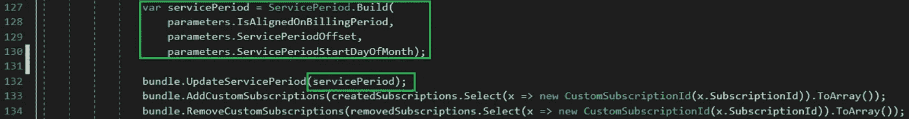

# 为什么不应该将不变量放在域服务中

> 原文：<https://medium.com/geekculture/why-you-should-not-place-your-invariants-inside-domain-services-365b9f0cc6a4?source=collection_archive---------33----------------------->

*(非常感谢谭震森给儿子的同行评议！)*

在我进行的 DDD 培训中，我总是建议人们把不变量放在值对象中。如果不可行，那么就使用实体，然后使用聚合根，作为最后的手段，把它放在域服务中(当然，永远不要放在应用程序服务中)。

然而，当您查看生产代码时，在域服务中看到不变量并不少见。这是为什么呢？遗留代码有时很难处理。我可以接受。但是最近编写并经过良好测试的代码呢？那么没有任何其他依赖的全新领域代码呢？

即使面向对象编程(更具体地说是封装原则)已经存在了 40 多年，但该原则并不总是得到很好的应用。在过程式服务的一系列步骤中间放置不变量仍然是人们使用的一种方法。

防止心怀不轨的人在代码库中做坏事是不可能的。但是如果你适当地组织你的代码，防止好心人犯诚实的错误是可能的。

在域服务中放置不变量的主要问题是人们不会被迫应用这些不变量。当然，熟记代码库和领域的人不会忘记这一点。但所有其他人都将落入陷阱。上周是我的案子。

给你看一个我误引入的 bug。首先，我将向您展示几个我在引入 bug 时正在处理的代码示例。然后，我将向您展示一个简单的重构是如何让您不可能再犯同样的错误的。

**服役期**类。如您所见，您可以向构造函数提供一个偏移量和一个可空的 StartDayOfMonth。有趣的部分在第 20 行。看起来有一个 IsAlignedOnBillingPeriod 的概念(不管那是什么意思)，它依赖于 StartDayOfMonth 属性的存在(或不存在)。

**CustomSubscriptionBundleBuilder**类。当你看着这个生成器时，你很快意识到它为你做的唯一一件事就是应用一个不变量来知道如何将 StartDayOfMonth(第 27 行)赋值给我在上一节课中展示的 **ServicePeriod** (第 22 行)。现在它解释了 **ServicePeriod** 类的 IsAlignedOnBillingPeriod 属性(第 20 行)。

最后，这是我犯的错误。在某些时候，我需要添加一个步骤来更新包的 **ServicePeriod** 。问题是捆绑包更新方法(当您第一次需要创建它时，与**CustomerSubscriptionBundlerBuilder**负责构建的类相同)接受实例化新的 **ServicePeriod** 所需的两个参数。

那么，我犯了什么错误？我没有应用**CustomerSubscriptionBundlerBuilder**类的不变量(第 27 行)。为什么？因为代码中没有任何东西给我暗示存在这样的规则！即使对于创建过程，人们也可以通过直接调用 **CustomSubscriptionBundle** 构造函数来轻松绕过构建器，因为构建器/工厂并不抽象创建复杂性，它只是业务规则应用程序的抽象！最后，代码中没有任何东西通过强制应用不变量来强制域总是有效的。

找出问题花了我 35 分钟。
修复漏洞和重构代码花了我 15 分钟。
代码审查我的工作花了 5 分钟。在测试环境中部署和验证代码需要 15 分钟。
总共 70 分钟。

更好的结构化代码如何能够避免我的错误？这是我重新设计这一切的方式。

首先，我将 **ServicePeriod** 构造函数设为私有(第 11 行)。
然后我将 builder 类的不变量移到了 **ServicePeriod** value 对象内部(第 34 行)。
最后，我添加了一个静态工厂方法来帮助人们实例化一个 **ServicePeriod** (第 20 行)。

我做的另一个更改是修改 UpdateServicePeriod 方法，以直接接受一个 **ServicePeriod** 。这个包对一个 **ServicePeriod** 的内部细节以及如何实例化它完全没有兴趣。这是基本的封装。如果有一天一个 **ServicePeriod** 的内部细节发生了变化，没有理由在 bundle 类中产生连锁反应。更重要的是，捆绑包不再负责构建 **ServicePeriod** 。也不再有原始的痴迷！

老实说，我的重构非常简单。没有什么值得骄傲的。然而，这个小的重构现在可以防止整个系统以错误的方式实例化一个 **ServicePeriod** 。这真的是一个巨大的进步。有时，构建始终有效的域是复杂的，因为根据聚合根边界的当前状态，业务规则可能很难应用。但在那种情况下，它可以像最初那样实施，而不需要额外的成本，我也不会损失 70 分钟。

很多事情会减慢开发人员的速度，并影响团队的整体速度。作为一名开发人员，我一直在努力改进我们的工作方式，以加速我们的开发。总会有我们无法控制的外部因素和原因。但是作为专业人员，当涉及到代码库中的小细节时，在我们控制的事情中，我们必须保持警惕。为这样的事情浪费 70 分钟是一个很好的例子，说明了在我们学会如何系鞋带之前就存在的良好编程实践的重要性。我本可以节省 14 分钟，只需修复我的错误，而无需重构代码库来防止其他人陷入同样的陷阱。但是作为专业人员，这是我们的另一个责任，让代码保持比你发现时更好的状态。让这个世界变得更好。