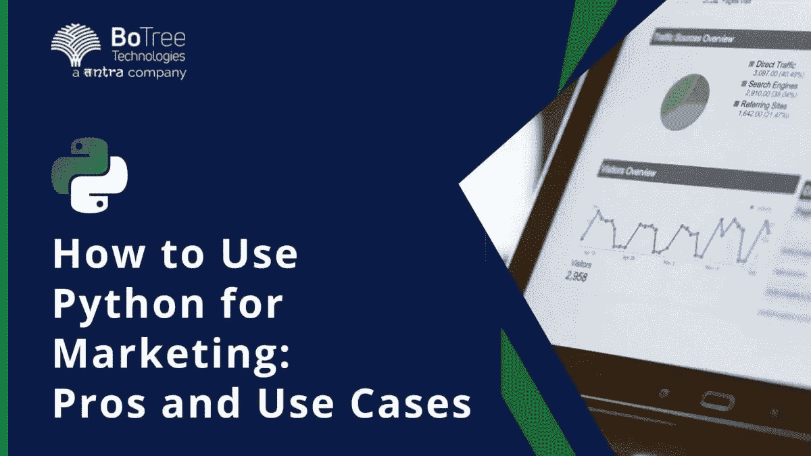
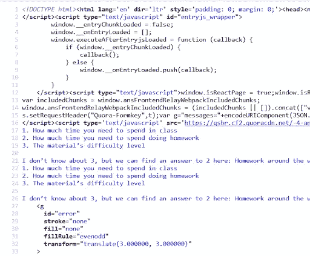
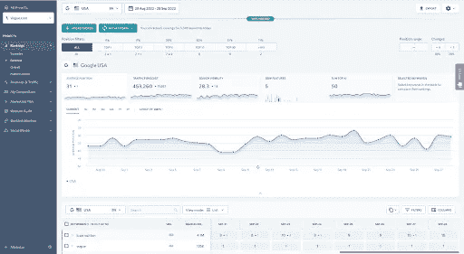
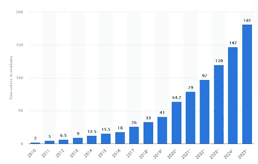
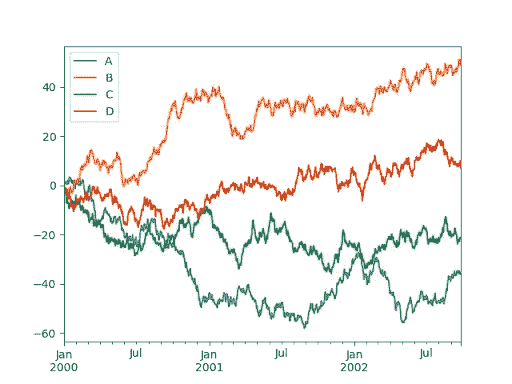

# 为什么你应该使用 Python 进行营销:优势和例子

> 原文：<https://medium.com/geekculture/why-you-should-use-python-for-marketing-advantages-and-examples-f2dbd4419d8?source=collection_archive---------17----------------------->

我们生活在数字革命的时代，信息就像新的石油。随着数据的大规模增长，我们比以往任何时候都更需要工具来查找和处理信息，以便在任何领域取得成功。营销也不例外:数据驱动的方法是做生意最有效的方式。

说到有效性，流程优化是提高营销效果的另一种方式。幸运的是，有一个简单而敏捷的工具可以为这些问题编写解决方案——它叫做 Python。让我们来学习如何利用 [Python 来开发软件解决方案](https://www.tntra.io/blog/python-for-software-solutions/)。

# 为什么 Python 对营销很有帮助

Python 已经成为最流行的编程语言，这不是没有原因的。

有三个主要原因让你选择 Python 而不是其他语言来改进你的营销。

*   **易学易用**

与 C#、C++和 Java 相比，Python 要容易学得多。此外，用 Python 编写的程序通常比用上面提到的语言开发要少 3 到 5 倍的时间。

这主要是由于其人性化的函数名(例如，“查找”、“追加”等)。)，这使得新手学习起来简单多了。

不仅新手，有经验的用户也能从中受益。你不需要记住大量的语法来使事情发生，你只需要简单地写下需要做的事情，它就能工作！

*   **巨大的战力**

直观的语法是有代价的:与 C#/C++和 Java 相比，Python 程序的运行速度稍慢。这几乎没有影响，因为您不需要为您的营销脚本过度优化的解决方案，因为大多数营销脚本不需要很多硬件资源。

因此，与具有类似学习曲线的其他语言(如 JavaScript、PHP)相比，Python 对您可以完成的任务限制较少，而且您会有更好的性能。用于后端和前端开发的 Python 用例是无穷无尽的——看看这种语言有多通用。

*   **图书馆和社区**

没有必要重新发明轮子——有很多用于任何目的的 Python 库。缺点是您不能保证所有库中的函数都得到完美的优化。但是，正如我们上面提到的，出于营销目的，您不需要 Python 程序的速度。

此外，由于这些库是由 Python 开发人员创建的，它们将随着更多使用 Python 的人创建更多的库而增长。

> **阅读更多:** [**为什么选择 Python 进行网站开发**](https://www.botreetechnologies.com/blog/why-choose-python-for-website-development/)

# Python 在营销中的 5 种用途

# 1.工作流自动化

首先，确保你在有效地工作。如果例行任务占据了你 80%的时间，你将无法享受使用 Python 的[好处。](https://www.botreetechnologies.com/blog/pros-and-cons-of-python/)

Python 热爱 API！最受欢迎的任务管理器，如观念、Asana、ClickUp、吉拉等。，提供 API 与其他应用程序通信。

它也适用于其他营销软件，如客户关系管理系统和电子表格，唯一的限制是你的幻想。例如，您可以设置以下场景:当您发布一个新的 YouTube 视频时，Python 脚本将向您所有的社交媒体帐户发布一个公告，并在 video(或类似的应用程序)中更改任务的状态。这里有一个类似过程的[示例](https://www.youtube.com/watch?v=OsKQw3qTMMk)。

您可以尝试 Zapier 的无代码自动化，但有时它们还不够——这正是 Python 的亮点。

# 2.网页抓取

解析是 Python 最受欢迎的用途之一，因为它使得抓取任何网站变得极其简单。无论您需要从 Google 的 SERP 获得排名位置，存储最近的 Twitter 帖子，还是在 Reddit 上查找相关主题，Python 都可以做到。

但是在抓取 JavaScript 站点方面，没有什么能打败 Python。由于许多流行的平台使用 JavaScript 来显示内容，所以不渲染就抓取页面是不可能的。以下是 Quora 源代码的样子:

如果仔细观察，页面的内容在“script”标记内，因此要正确访问它，需要呈现 JS。为此，您可以安装“Selenium”库，甚至运行一个由 Python 脚本控制的 Chromium 窗口。但是要小心，尽量不要太深入定制脚本。正如我们前面提到的，有很多带有 API 的工具可以让你受益。例如，SE Ranking 提供了一个带有内置流量预测和 SERP 功能的[关键词位置监视器](https://seranking.com/position-tracking.html?sou1=botreetechnologies&gr1=article&tg1=botreetechnologies&kw1=com_guest_article&utm_source=article&utm_medium=referral&utm_campaign=com_guest_article_botreetechnologies)，并且 reference . io 可以为您抓取社交网站——从第三方来源获取数据可能是一个好主意。

# 3.文本分析

人类编写的文本可能很难被计算机理解，尤其是当它包含一些情感语调、俚语、错误等时。但有时，处理大量文本是至关重要的。一个常见的例子是对来自支持聊天的消息进行分段。使用 Python，您可以标记收件箱消息，按部门对请求进行分类，或者分析历史数据，以确定您的用户在哪些方面最困难。

许多 Python 的自然语言处理(NLP)库(例如， [NLTK](https://www.nltk.org/) )都有内置的语法、停用词、音调检测等等。

# 4.机器学习

数据量呈指数级增长，人脑越来越难以处理。

机器学习是答案。证实这一点的一个强有力的迹象是[谷歌分析洞察](https://support.google.com/analytics/answer/9443595?hl=en)——它使用机器学习来分析用户行为，以做出结论和预测。

机器学习很难开发，但是 Python 让它变得容易多了。不仅仅是因为语法，还因为 ML 友好的库。

机器学习能力是无穷无尽的，所以今天开始用 Python 学习 ML 和人工智能是一个明智的投资。

# 5.商业智能

数据分析是我们在简介中讨论的数据驱动方法的基础。它将我们之前描述的所有技术结合到简单的图表和图形中。在这一步中，您需要大量使用数据库，以便您可以进行计算来形成简单的结论。 [Pandas](https://pandas.pydata.org/) 是一个著名的 Python 数据分析框架。它不仅可以方便地操作数据集，还提供了可视化工具。

请记住，如果您需要更灵活的报告工具集，您可以使用 API 将数据导入您使用的 BI 系统(例如，Microsoft BI、Google Data Studio)。

> **阅读更多:** [**机器学习和深度学习的 11 大 Python 框架**](https://www.botreetechnologies.com/blog/top-11-python-frameworks-for-machine-learning-and-deep-learning/)

# 学习 Python 的最佳课程

*   【W3Schools 的 Python 教程

你可能对学习 HTML 和 CSS 的 W3Schools 比较熟悉。Python 课程有相同的结构:你有一个简短的理论和一个实际的任务。学习过程简单明了:阅读、学习和编写代码来完成每一课。

令人高兴的是，它是免费的，并且包括一些流行模块的教程，比如 NumPy、Pandas、SciPy 和 Django。不仅如此，它还教你一些高级主题，比如如何将 Python 与 SQL 数据库和机器学习结合使用。毫无疑问，这是最好的球场！

*   **Udemy Python Bootcamp 从零到英雄**

本课程最适合学习 Python 的一般原理。它教你什么是面向对象编程以及如何使用它，用实际的任务巩固你的知识。

*   **来自 DataCamp 的 Python 中的网页抓取**

你会在某个时候爬行。这个课程将教会你这一点！在使用它之前，您需要对 HTML 和 XPath/CSSpath 以及 HTTP 请求和 JS 有信心。

该课程相对较短(4 个小时)且相当简单，因此在编写 scraper 脚本之前学习它以避免初学者的错误是值得的。

*   **用来自 Simplilearn 的 Python 进行机器学习**

这是一个 10 小时的 YouTube 视频，使用 Python 深入研究了机器学习。建议等你习惯 Python 的时候再看。该课程包括大量的 ML 理论和用 Python 实现的例子。

还有更多的课程，包括图书馆特有的课程，所以如果这里没有列出，你一定会找到适合你需要的课程。此外，社区支持是惊人的:软件开发公司面临的任何问题都有 99%的可能在 StackExchange 上得到解决。

# 包扎

人类无法跟上需要处理的大量数据。如今，网络营销有大量的信息需要收集和处理。因此，营销人员需要软件来帮助他们解决问题。

那些想要创建应用程序的人正在寻找一种简单易学、功能强大的语言。雇佣一家 Python 开发公司就是答案:它不仅有直观的语法和巨大的社区支持，而且它的应用程序实际上是无穷无尽的。从后端和前端到网页抓取和机器学习，Python 都可以处理。没有一个理由不应该使用 Python 进行营销，所以现在就开始做吧！

*原载于 2022 年 9 月 28 日 https://www.botreetechnologies.com***。**