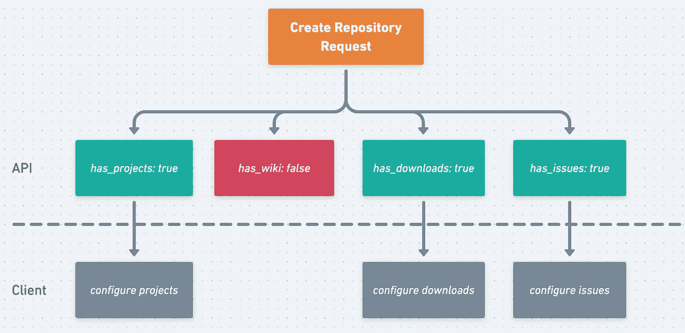

# 为什么不应该在 REST APIs 中使用布尔值

> 原文：<https://medium.com/geekculture/why-you-shouldnt-use-booleans-in-rest-apis-2747b187876c?source=collection_archive---------0----------------------->

当设计 REST APIs 时，方便的决定会对我们工作的发展产生负面影响。这方面的一个例子是在 API 契约中使用布尔值。如果不仔细考虑，布尔值可以:

*   阻碍 **API** **扩展性**
*   屏蔽和混淆**域清晰度**
*   防碍**代码** **可读性和可维护性**

让我们深入研究这些领域，并审核如何在 REST APIs 中普遍使用布尔值。

# **API 扩展性**

一个可扩展的 API *应该*让未来的改变变得显而易见并易于实施。It *不应该*引入复杂性或不必要的重复或打破现有的消费者。

***示例:*** *Github API —创建新的资源库*

考虑一下 Github 的 REST API。为了[创建一个新的存储库](https://docs.github.com/en/rest/reference/repos#create-a-repository-for-the-authenticated-user)，开发者通过设置一个布尔字段(默认:`false`)来指定该存储库是否为`private`。这是布尔的一种常见用法 HTTP 资源(`repos`)的单个**状态指示器**。

```
**HTTP Request:** **POST** /user/repos{
  "name": "Hello-World",
  "description": "This is your first repository",
 **"private": false,
  ...** }
```

这个示例 POST 请求乍一看似乎很简单。但是当 Github 后来引入组织库时，他们需要限制只能由组织成员访问。在这种情况下，布尔字段`private`不再足够。因此，他们添加了一个新的`visibility`枚举，具有以下选项:

*   `internal` —仅限于组织成员
*   `public` —可从互联网上公开访问
*   `private` —仅限于存储库创建者和协作者

随着这一改变，文档说明当两者都被使用时,`visibility`优先于`private`。如果 Github 最初使用带有两种可能性`['public', 'private']`的`visibility`枚举，那么在不引入新字段的情况下添加第三种(`internal`)可能会更明显。虽然这种变化没有破坏现有的消费者，但它导致了文档的混乱和 API 中领域概念的重复。

现在让我们看看 API 中布尔的另一个常见用法 HTTP 资源的**功能配置**。在这种情况下，一组布尔值一起工作来提供一组打开或关闭的功能。使用 Github 端点创建一个存储库，请求如下所示:

```
**HTTP Request:** **POST** /user/repos{
  "name": "Hello-World",
  "description": "This is your first repository",
  "private": false, **"has_issues": true,
  "has_projects": true,
  "has_wiki": false,
  "has_downloads": true**
}
```

这里，布尔值`has_issues, has_projects, has_wiki, has_downloads`表示一旦创建了存储库，用户将看到的功能。在这个例子中，客户机代码将为每个真实的布尔值有一个单独的执行流。下面是表示这一流程的图表:



Capability Configuration booleans

这里的问题是，***4 个布尔值*** 产生了 ***16 种不同的排列*** 来测试客户端代码。这是用一个指数复杂度函数*来描述的，其中 ***n*** 是布尔数， ***2*** 是二进制值`true`或`false`。假设有条件地需要一个新的、相关的用户特性。添加一个新的布尔将产生 32 种不同的排列*来测试。**

**这种指数级的复杂性违反了前面介绍的可扩展性定义。更好的设计是将这种配置转换成一种相互包含的数据结构，比如数组`repository_capabilities: ["has_issues", "has_projects", "has_downloads"]`。这减少了不同的路径，因为 API 消费者可以使用能力到执行流的映射来动态构建用户功能。**

# **领域清晰度**

**一个明确的领域*应该*有指导意义。它的组件*应该*可以通过一种无处不在的语言被发现。It *应该*通过清晰的边界封装逻辑，以避免下游的错误。最后，它*应该*很难误用它的任何组件。**

*****示例:*** *付款 API —发送新付款***

**让我们考虑一个金融服务行业的例子。大多数支付网关 API 会用一个布尔字段`isApproved`来响应支付请求。这是 HTTP 资源(`/payments`)的单个**状态指示器**。**

```
****HTTP Request: POST** /payments{
  "transactionId": "uniqueId",
  "paymentDetails": {...}
  "chargeAmount": 15.00, **...** }**HTTP Response:**{
 **"****isApproved": true,**
  "approvedAmount": 15.00, **...** }**
```

**乍一看，这个 API 契约是有意义的。客户发送付款，然后付款被批准或拒绝。但是随着您的深入挖掘，您会发现除了二元结果`isApproved`之外，不同批准结果的隐藏概念。**

**为了详细说明这一点，假设您使用一张余额为 10 美元的借记卡来支付 15 美元的交易金额。根据商家的配置，交易可能被批准支付$10 的余额。这是一种*部分批准*，商家欣然接受你的 10 美元，并要求通过现金或另一张卡支付剩余部分。下面是这个场景的一个 API 契约示例:**

```
****HTTP Request: POST** /payments/{
  "transactionId": "uniqueId",
  "paymentDetails": {...}
  **"****chargeAmount": 15.00,
  ...** }**HTTP Response:**{
 **"****isApproved": true,**
  **"****approvedAmount": 10.00,
  ...** }**
```

**在这个 API 中，“部分批准”的概念是隐含的。API 消费者必须检查 1)支付`**isApproved**`和 2)支付`**approvedAmount**`是否小于初始`**chargeAmount**`。这里的隐含性质是领域逻辑泄露给消费者的症状。换句话说，这迫使消费者弄清楚“部分认可”的逻辑是什么，而不是我们直接告诉他们。领域边界的不清晰也将消费者与领域逻辑联系在一起。**

**现在让我们看看这个例子如何影响代码的可读性和可维护性。**

# ****代码可读性和可维护性****

**代码可读性不仅仅是阅读代码做了什么。揭示代码的意图才是最重要的——为什么代码会这样做。**

**在前面的例子中，API 中“*部分批准*”的隐含性质促使 API 消费者编写以下代码:**

**Here, “Partial Approvals” for payments are **implicit****

**然而，有一个更好的方法。如果我们在 API 中明确引入“部分批准”,我们可以编写反映该领域普遍语言的代码——清楚揭示我们意图的代码。以下是推荐的 API:**

```
****HTTP Request: POST** /payments/{
  "transactionId": "uniqueId",
  "paymentDetails": {...},
  "**chargeAmount": 15.00,
  ...** }**HTTP Response:**{
  **"****paymentStatus": "PARTIALLY_APPROVED"
  "****approvedAmount": 10.00,
  "remainingAmount": 5.00,
  ...** }**
```

**现在我们的 API 有了一个值为`PARTIALLY_APPROVED`的枚举`paymentStatus`。API 中这种有意的清晰性促使开发人员编写反映 API 语言的代码:**

**Here, “Partial Approvals” for payments are **explicit****

**通过使用 enum，我们允许 API 消费者 1)通过 API 本身发现不同的值，从而了解更多关于域的信息，2)从它的强类型值中受益，这反过来减少了错误(即:舍入错误)。**

**让我们考虑 API 中布尔用法的最后一个例子 HTTP 资源上的**策略执行**。这和**功能配置**布尔的区别在于客户端可能不太关心排列。相反，客户可能只关心什么是允许的，而忽略除此之外的任何事情。执行流程大致保持不变。让我们看一个例子。**

**当非接触式支付(Google Pay、Apple Pay 等)被引入时，商家需要调整他们的配置来接受它们。这种配置变化可能通过 API 发生——通常通过布尔值不正确地发生。下面是这个配置的 GET 请求示例。**

```
****HTTP Request:** **GET** /store/{id}/configuration
{
   "allow_apple_pay": true,
   "allow_google_pay": true,
   "allow_samsung_pay": false,
   ...
}**
```

**您将在此看到商店配置允许的付款方式列表。然而最终结果是一样的——用允许的方法处理支付，如果不支持，就拒绝支付。下面是这个**策略执行**布尔示例的示意图:**

****

**Policy Execution booleans**

**这个 API 响应促使开发人员编写如下所示的代码:**

**这些不同的排列不仅影响代码的可维护性，还会使代码测试变得更加笨拙和不必要的重复。现在让我们更改 API 响应，返回一个数组`allowedPaymentMethods`,如下所示:**

```
****HTTP Request:** **GET** /store/{id}/configuration
{
   "allowedPaymentMethods": [
      "GOOGLE_PAY", 
      "APPLE_PAY"
   ],
   ...
}**
```

**这一简单的更改将比代码具有巨大的可维护性优势。我们的代码现在看起来会像这样:**

**如果新的支付方式被引入并被某个商店允许，这段代码不需要修改。**

# **何时在 API 中使用布尔值**

**在某些情况下，我们可以从 REST APIs 中布尔的严格特性中获益。但是，这些情况应该由域本身的约束来指导。**

*****举例:*** *钱包 API —* 添加支付选项。**

**为了说明，让我们考虑一个数字钱包 API。钱包包括不同的卡支付选项(如:信用卡、借记卡、礼品卡)或支付方式(如:Google Pay)。钱包应用编程接口负责`**default**`支付，因此用户不必每次交易都选择同一张卡。这里有一个例子:**

```
****HTTP Request: POST** /wallet/payment-options
{
   "maskedNumber": "*******4433"
   "cardNetwork": "VISA",
   "nickname": "*My Preferred Card",* **"default": true,
   ...** }**
```

**因为同时用多张卡在线支付一笔交易是不可能的，所以最好使用一个类似于域限制的布尔值。**

**现在，让我们想象一下，从两个独立的支付选项中为交易融资成为可能。随着这种变化，`default`的概念仍然有效吗？事实证明，现在依然如此。在这种情况下，用户可能不得不在他们的`default`上选择另一张卡。**

**所以我们的设计意图通过布尔的严格性质得到了最好的传达。使用布尔值 1)不会阻碍我们扩展 API 功能，2)不会混淆领域，因此，3)不会影响我们代码的可读性。**

# **结束语**

*   **API 需要在严格性和灵活性之间取得平衡。根据定义，布尔是限制性的。**
*   **API 应该是指导性的。领域语言应该贯穿他们的合同。合同中每个字段的可能值应该很容易被发现。**
*   **布尔值不仅仅给 REST APIs 带来问题。这里有一篇关于[标志参数](https://martinfowler.com/bliki/FlagArgument.html)问题的好文章，作者是[马丁·福勒](http://martinfowler.com)。**
*   **枚举和数组在 API 设计中比布尔提供了更多的灵活性。查看 Google 的 [API 设计模式，布尔 vs 枚举 vs 字符串](https://cloud.google.com/apis/design/design_patterns#bool_vs_enum_vs_string)。**

# **感谢**

**非常感谢 Megan Lusher 和 Smitha Ajay 阅读本文草稿并提供改进反馈。**

**这主要发生在当面/店内交易(又名:出示卡交易)。如果交易发生在网上，信用卡可能会被直接拒绝。根据客户和银行的不同，还可能出现其他情况，如过度起草。**

**在极少数情况下，商家允许顾客使用信用卡/借记卡和他们自己发行的礼品卡的组合。这当然是一个例外，不是一个常见的流程。**