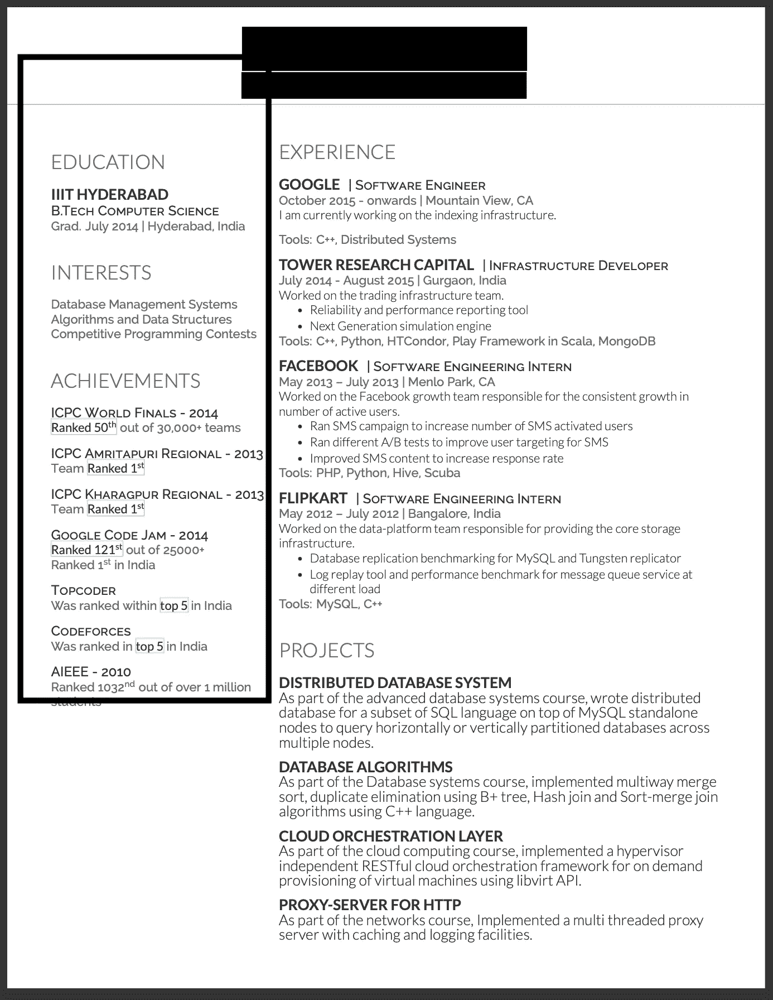
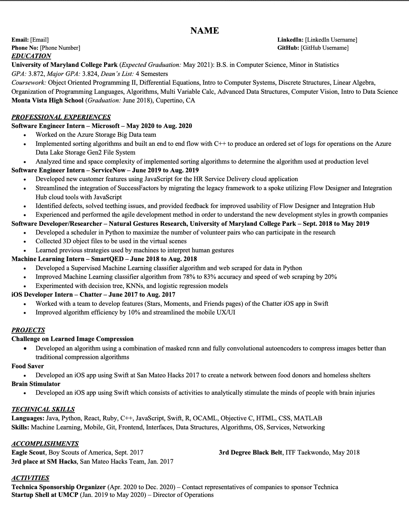

# 为什么你的简历没有入围优质公司？|简历入围的技巧和窍门

> 原文：<https://medium.com/geekculture/why-your-resume-is-not-shortlisting-in-premium-company-tips-and-tricks-of-resume-shortlisting-d652e9ecd98e?source=collection_archive---------3----------------------->

人们经常在 LinkedIn、Medium 和 Youtube 上问我:“Vasanth，我可以参加任何一家顶级公司的面试，但我的简历没有入围！！我该怎么办😭？什么是合适的简历模板？? "如果你也想进入一家顶级公司，但你的简历没有被列入候选名单，遵循下面的技巧。

如果你懒得看我的文章，你可以在这里快速观看我的 20 分钟视频，或者你也可以继续看我的文章。

Fig: Resume that will shortlist for MAANG

> **带一些前置的大一/中/大四简历**

我将强调下面每个类别的细微差别，但大部分内容保持不变。

1.  **非技术性:**这将包含一切与你的技能没有直接关系的东西。
2.  **技术:**突出你的技术技能。

> ***非技术性***

1.  不要让你的简历太有活力。普通、黑白简历更受优质公司青睐。
2.  试着把你所有的简历内容都放在一页纸里。高端公司的招聘人员每天可能会收到 100 份简历，他们可能没有时间浏览多页。
3.  在简历顶部提及你的个人信息，如姓名、电子邮件、联系方式。有些人把它放在底部，招聘人员有时没有耐心去检查它。

> ***技术***

1.  高端公司希望你的简历中有一些亮点。可能是你以前工作过的其他高端公司，或者是一所高端大学等等。如果有任何这样的前提，就突出出来。(在下面的简历左侧突出显示—图 1。)
2.  在你的排名中突出显示所有的编码竞赛或任何其他你参加过的竞赛。如果你没有参加过，至少现在就参加，获得一些排名。这表明候选人喜欢竞争。(简历图 1 下方左侧高亮显示。)
3.  列出所有你工作过的顶级公司，一个接一个，保持最新的排名。不要解释你在那家公司工作的一切，尽量保持在 2-3 行之间。(简历图 1 下方右侧突出显示。)
4.  最后一部分是你的项目，提及你参与过的重要项目，并用 2-3 点来解释。
5.  如果你是大一/大三学生，你可以坚持使用上面的模板，突出你的实习经历。图 2 中的简历示例。

/

图 1:中级/高级简历

Figure 2: Junior/fresher resume

> **无前提的大一/中/大四简历**

有许多人在简历中没有任何简历，例如:他们不是来自名牌大学或名牌公司等。在这种情况下，我会解释，你如何才能入围一个优质公司。

1.  至少在印度，所有的工程/BCA/MCA 学院都隶属于大型大学。如果你来自二、三级学院，那么在简历中不要提及你的学院名称，而要提及你的大学名称。
2.  尝试参加一些**在线编码/任何其他相关的比赛**，获得一个好的排名，并在你的简历中突出它。
3.  如果你有经验，但你在一家服务公司工作，那么**突出你在这个项目中的影响。**

例如:

*   我的应用程序每分钟处理 1M 的请求。
*   我的应用程序为公司带来了将近 2M+的销售额。
*   我工作的医疗设备去年挽救了 10000 多人的生命。

4.**积极贡献开源。挑选那些在你申请的领域中受欢迎的开源库。**

有了 4 分以上的分数，没有一家顶级公司或大学，你可以增加你的简历被一家顶级公司选中的几率。

感谢您在下一篇文章中阅读 catch you。如果你还没有在媒体上关注我，那么请关注我，你可以在链接的[这里](https://www.linkedin.com/in/vasanth-bhat-4180909b/)上关注我。别忘了订阅我的 Youtube 频道[。](https://www.youtube.com/channel/UCSCNvSCk_Z9mBvUM-FJexRg/videos)

欢迎在评论区添加您的反馈。

如果你想亲自和我讨论模拟面试，面试或简历审核的技巧和诀窍，你可以在这里预约:

[https://topmate.io/vasanth_bhat](https://topmate.io/vasanth_bhat)

如果你正在准备前端开发者面试，请观看我的以下系列:

如果你是 reactJS 开发人员，正在寻找面试准备，请点击这里观看我的完整面试准备指南: