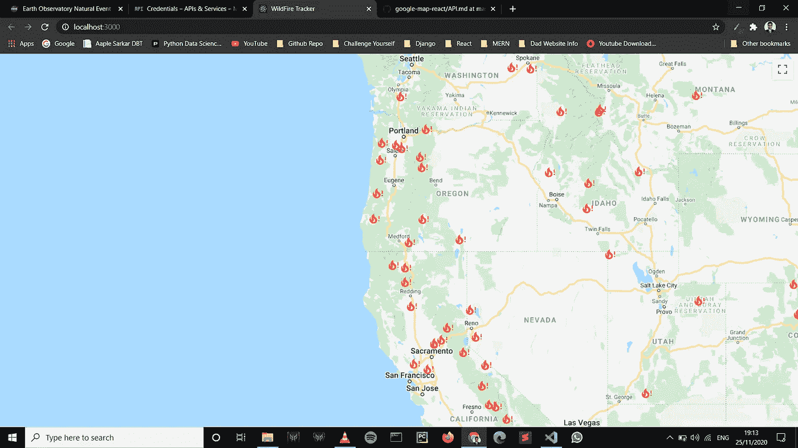
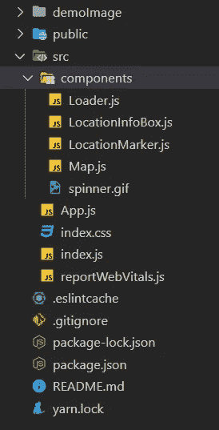

# 野火跟踪器— ReactJS 应用

> 原文：<https://medium.com/geekculture/wildfire-tracker-reactjs-application-2613687b57cc?source=collection_archive---------8----------------------->

Demo — ReactJS App — Wildfire Tracker

我最近使用 [create-react-app](https://github.com/facebookincubator/create-react-app) *构建了一个野火追踪器应用。*我将向你介绍我是如何做到这一点的。

我被能够帮助容易发生野火的地方的想法所吸引，我正在使用来自[地球天文台自然事件跟踪器(EONET)](https://eonet.sci.gsfc.nasa.gov/) 的 API 来获取关于此类事件的最新更新。

如果你感到不耐烦，你可以直接进去看看我的代码。这是我的应用程序的 GitHub repo。

# 反应

React 是脸书的 JavaScript 视图框架。

 [## react——用于构建用户界面的 JavaScript 库

### React 使得创建交互式 ui 变得不那么痛苦。为应用程序中的每个状态设计简单的视图，并反应…

facebook.github.io](https://facebook.github.io/react/) 

提到了应用程序的文件夹结构:

*   `components`文件夹包含所有经常使用的文件
*   `App.js`文件用于调用 api，并将接收到的数据转发给`./components/Map.js`
*   `LocationInfoBox.js`点击特定位置时显示详细信息。
*   `LocationMarker.js`用来显示火焰图标。

## App.js

App.js

上面代码的几点:

*   我使用了`useEffect()`钩子([点击获取更多信息](https://reactjs.org/docs/hooks-effect.html))来获取信息，使用`fetch()`调用 api 并接收数据。
*   接收数据时，使用钩子`useState()`将 loading 设置为 false，并使用 props 将数据发送到`Map.js`，作为“ **eventData** ”。

## Map.js

Map.js

> 请务必使用您自己的谷歌地图 API 密钥( **const API_KEY** )！！

上述代码的关键注释:

*   我已经为谷歌地图安装了“ [**谷歌地图-反应**](https://github.com/google-map-react/google-map-react) ”这个包。
*   我们从 API 接收数据，并获得**纬度**和**经度，**我们使用这些值在地图上绘制坐标。
*   `LocationMarker.js`用于处理 onClick 事件触发并显示信息。

## LocationMarker.js

该文件专门用于处理 onClick 事件并在地图上显示信息。