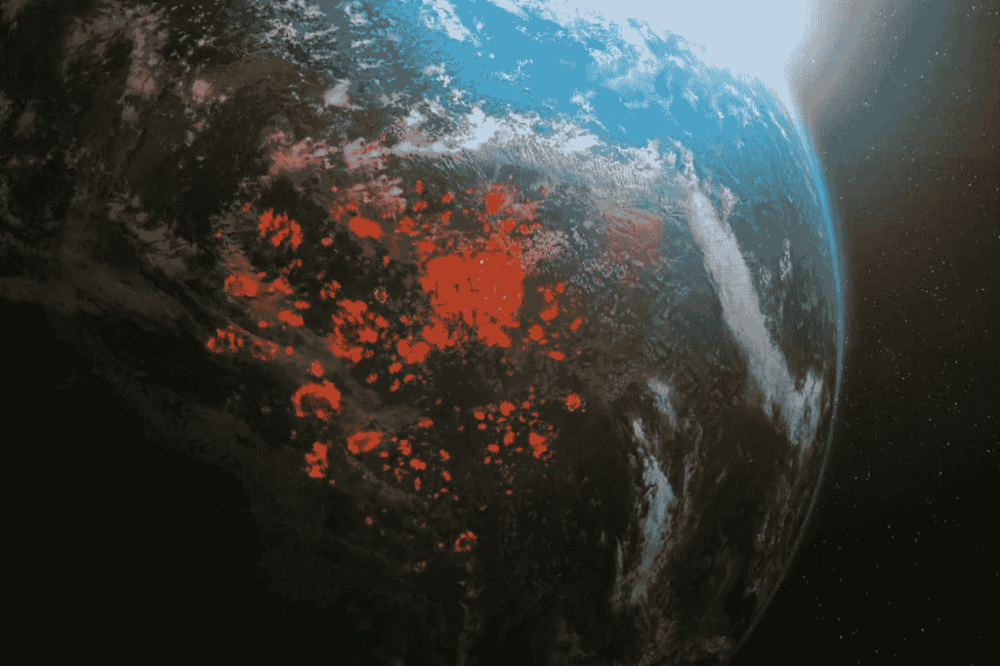
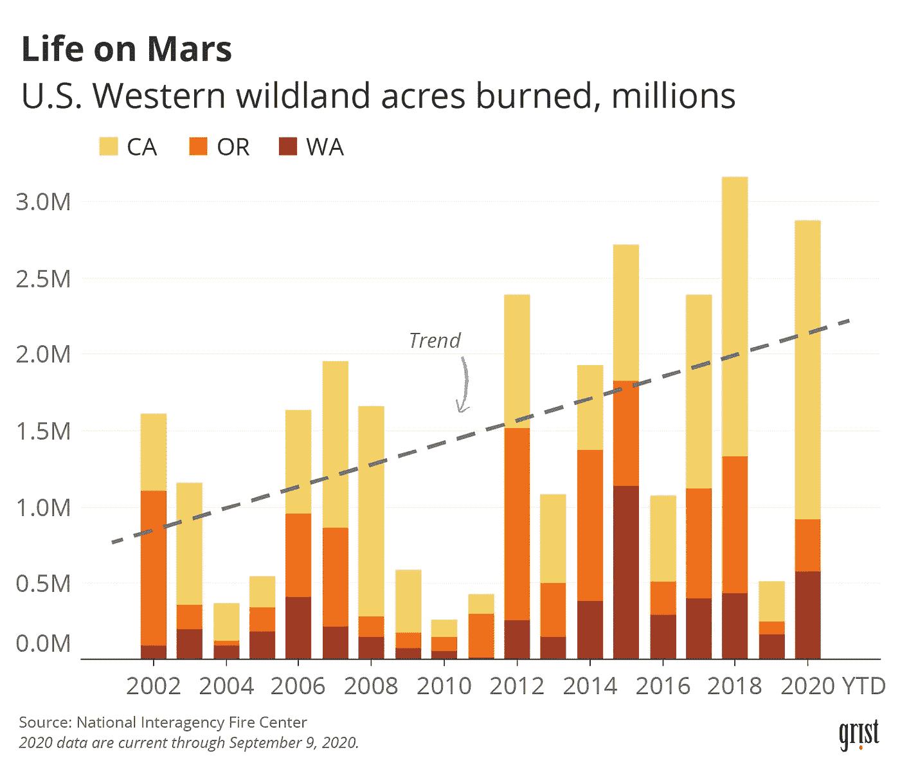
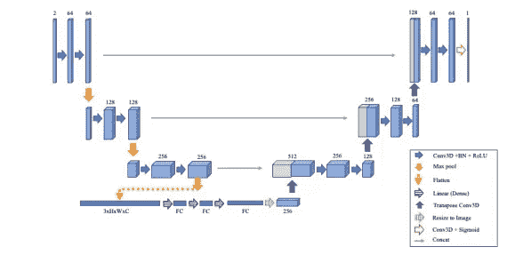
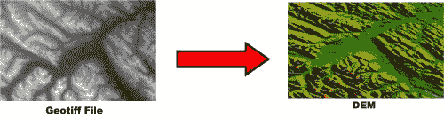
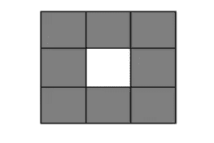
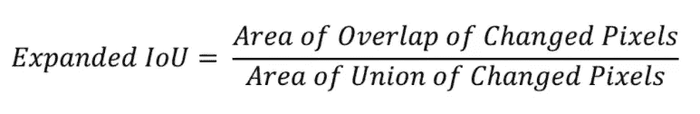
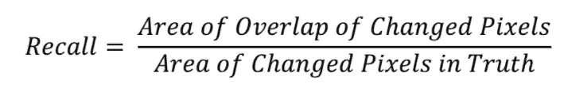
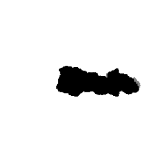
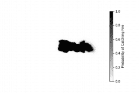
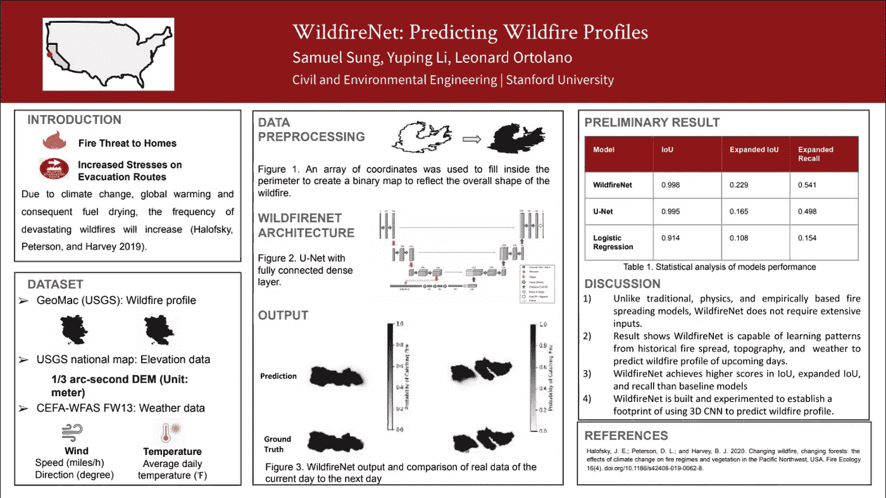

# 利用深度学习预测野火概况

> 原文：<https://medium.com/geekculture/wildfirenet-predicting-wildfire-profiles-8404b6d91d97?source=collection_archive---------32----------------------->

Source: Four Twenty Seven (427)

> 这一节选是基于我们在第 35 届 AAAI 学生摘要和海报项目上提交的论文[7]。

**近年来**，野火已经成为一种不可避免的自然灾害，持续威胁着火灾多发社区。由于持续的气候变化、全球变暖和燃料干燥，毁灭性野火的频率每年都在增加[1]。大规模野火的后果是残酷的。例如，2003 年，圣地亚哥县发生的野火烧毁了 376，000 英亩土地和 3，241 户家庭。总经济成本总计约为 24.5 亿美元[2]。传统的、基于物理和经验的野火蔓延模型已经被不断地研究，以减轻野火造成的损失。然而，这些模型通常需要大量的输入。因此，我们提出了一种深度学习方法来确定具有基本输入数据的动态野火概况:历史野火概况、天气和海拔数据。

Figure 1\. A positive trend of areas burned due to wildfire.

## 模型和实现

最初引入 U-Net 仅仅是为了在生物医学图像上进行图像分割。该模型有两条主要路径。它首先从收缩开始，收缩由卷积和最大池组成，以提取图像的特征。接下来，该模型经历扩展，其中图像的大小调整回原始输入，以实现精确的定位。

我们决定利用 U-Net 的架构，因为 **1)该模型允许我们输入图像并输出精确分割的图像，2)它在小数据集上工作良好，3)它能够在一秒钟内预测野火概况。**

**野火网络架构**

对 U-Net 模型进行了调整，使其更适用于我们的研究。与 U 网类似，野火网由两条主要路径组成:收缩和扩张。在最后一层使用 sigmoid 激活函数来输出图像中火灾的概率分布。对图像的每个像素进行二元分类，以确定是否有火灾。因此，使用二进制交叉熵作为损失函数来训练模型。为了创建预测的二元图，设置最佳阈值来标记有火或无火的像素。

与 U-Net 相比，WildfireNet 由体系结构底部的完全连接的层组成。在最后一次缩减像素采样之后，3D 图像被展平为 1D 阵列，并且添加了天气数据。用密集层进一步训练该模型，以学习天气变量在其预测中的影响。此外，过去的野火概况可能在野火的未来形状中起主导作用。因此，3D CNN 被用来代替 2D。在 3D CNN 中，模型进一步从时间和空间维度提取特征，而在 2D CNN 中，模型仅关注空间特征[6]。在这项研究中，将前 3 天的野火概况相结合，将输入图像从 2D 转换为 3D 图像。这使得模型能够更好地了解历史火灾与第二天火灾的关系。

Figure 2\. Architecture of WildfireNet

## 数据集和预处理

**动态野火周界**

共检索了 302 个每日火灾周界。与其他深度学习研究相比，数据的规模有限。然而，衍生自 U-Net 的 WildfireNet 被证明在小数据集上表现良好[5]。Wildfire 参数是从 NIFC FTP 服务器 1 获得的。周界在。kmz 文件，它包含一个边界坐标数组。本文只考虑了 2013 年至 2019 年发生在加州的火灾。

对于每个野火的周界，如图 3 所示，使用坐标数组填充周界内部，以创建二进制地图来反映野火的整体形状。换句话说，如果给定像素在周界内，则该像素被标记为 1 以指示火灾。然而，如果像素在边界线之外，则该像素被标记为 0 以指示没有火灾。在创建二进制地图时做了一个重要的假设。在某些情况下，边界内的某些区域没有着火。这些点被认为是一个风险区，也进行了填充。

总的来说，预处理的二进制地图被用作表示野火概况的输入。该二进制地图在纬度和经度上都具有 0.5 度的分辨率。对每场火灾保持相同的分辨率对于区分火灾的大小非常重要。

Figure 3\. An array of wildfire coordinates are filled in to represent fire profile

**海拔**

海拔可以暗示火灾位置的重要特征，如植被组成、火势蔓延速度和温度变化[4]。

1/3 弧秒数字高程模型(DEM)从 USGS 国家地图 2 中检索，以反映火灾位置的高程。由于 DEM 包含每个像素的高程值，因此它为模型提供了一个关于高程如何影响火势蔓延的概念。对于每个 wildfire 事件，检索二进制地图角落的坐标，并用于形成裁剪框以提取 DEM。通过这种方式，DEM 相对于火灾位置被正确定位。此外，高程值被归一化，以使这些值与其他数据保持在相同的范围内。逐像素高程数据将添加到纵断面旁边。因此，每个输入图像由两个通道组成:二进制地图和高程。

DEM is converted to a grayscale elevation map to reflect altitude for each pixel. Source: Carleton University Macodrum Library

**天气**

天气在火势蔓延中扮演着重要的角色。气象数据从 CEFA-WFAS FW13 火灾气象数据文件接口 3 中检索。每个野火事件都选择了最近的现场气象站。日平均温度、相对湿度、风速、风向、阵风速度和阵风方向被认为是天气变量。这些被添加到模型中，以告知野火期间的大气状况。

天气数据被标准化为围绕原点的零中心数据，并且每个维度通过其标准偏差来缩放。这种预处理允许每个变量对模型具有相等的学习权重。

## 基线模型

为了比较 WildfireNet 的性能，建立了一个简单的逻辑回归模型作为基线模型。输入包括历史二进制地图、高程数据、风速、风向和周围像素的状态。

周围像素的状态是至关重要的，因为如果一个相邻像素已经着火，则该像素将来着火的概率会更高。事实上，总共有 8 个相邻像素对像素的状态有贡献，如图 4 所示。

Figure 4\. Blank pixel indicates current pixel and shaded pixels indicate surrounding pixels that contribute to the state of the current pixel.

## **指标**

通过计算交集(IoU)和召回率来评估模型在预测野火分布方面的性能。

IoU 是分段掩码中使用的常用指标。一旦定义了预测图像和地面真实图像，度量就非常简单了。在这项研究中，两个图像都是二值图，重叠区域就是两个图像中具有相同值的像素的数量，联合是两个图像包含的区域。换句话说，与地面真实情况完全匹配的预测图像的 IoU 得分为 1。

WildfireNet 在测试集中实现了 0.997 的 IoU，而基线模型的得分为 0.913。结果表明 WildfireNet 在精确标记每个像素是否有火方面表现出色。

然而，在测试集中，二值图中只有 5%的标签被标记为 fire。IoU 不是在这种不平衡数据集中评估的最佳指标，因为该模型可以通过简单地预测每个像素为非火灾来获得高 IoU 分数。

因此，只提取和评估在第二天被标记为着火而在当天没有被标记为着火的像素，反之亦然。我们将这样的像素定义为 ***变化像素*** 。仅考虑变化的像素将测量模型在预测 wildfire 轮廓变化方面的性能。

## 初步结果

WildfireNet 的输出显示了每个像素发生火灾的概率分布，如图 5 所示。如果模型确信在某个像素中有火灾，它将对该像素分配低的分数。该模型还预测了未来火势将如何蔓延。例如，在图 5 中，模型预测火会在边界的右侧扩大，而在左侧不会扩大太多。事实上，当天和第二天的比较表明，第二天的实际火灾除了在它的右边之外没有在其他地方蔓延。这验证了模型预测野火增长模式的能力。

Figure 5\. Left) Comparison between the current day (solid black) and the next day (light gray). Right) WildfireNet predicts the fire will continue to expand at the right most of the boundary.

在测试集上，WildfireNet 在扩展 IoU 和召回率方面的表现都优于基线模型。这两个模型在扩展 IoU 中得分最低，因为当预测的火灾在实际火灾中不存在时，该指标进一步惩罚。WildfireNet 的召回率为 0.517，而基线模型的召回率为 0.152。这意味着 WildfireNet 在一半的时间内正确预测了火灾在实际火灾蔓延中的增长方式，而基线模型仅在大约 15%的时间内正确。此外，当独立检查每场火灾时，WildfireNet 对缓慢增长的火灾的召回率约为 0.75。

> 我们确实认为，目前将天气变量与火灾概况结合在一起的方法有局限性。此外，一个小的数据集可能不足以让模型理解火灾概况和天气信息之间的关系。我们希望找到一种更好的方法将非结构化变量注入到模型中

与传统的基于物理和经验的传播模型不同，野火网络不需要大量的输入。结果表明 WildfireNet 能够从历史火灾蔓延、地形和天气中学习模式，以预测未来几天的野火概况。**总的来说，WildfireNet 是一种新颖的野火蔓延模型，有可能成为帮助消防队员决策的工具。**

如果你对临时制作野火网有任何想法/主意，请发表评论！

感谢大家阅读这篇文章，:D

Poster for the 35th AAAI Student Abstract and Poster Program

参考

[1]迪亚兹，法学硕士，2012 年。野火的经济影响。*南方火力交易所。*

[2]哈洛夫斯基，J. E 彼得森博士；还有哈维，B. J. 2020。变化中的野火，变化中的森林:气候变化对美国西北太平洋地区火灾状况和植被的影响。*火生态学* 16(4)。doi.org/10.1186/s42408–019–0062–8

[3]拉德克，d；赫斯勒公司；和埃尔斯沃思，D. 2019。FireCast:利用深度学习预测野火蔓延。在第二十八届国际人工智能联合会议的会议录主轨道:4575–4581 . doi . org/10.24963/ij Cai . 2019/636

[4]埃斯蒂斯，B. L 纳普公司；斯金纳；法学博士米勒；以及 2017 年香港 Preis ler。美国北加利福尼亚克拉马斯山脉中等燃烧条件下影响火灾严重程度的因素。*生态圈* 8(5)。doi.org/10.1002/ecs2.1794.

[5]Ronneberger，o；菲舍尔，p。还有 Brox，T. 2015。生物医学图像分割的卷积网络。arXiv 预印本。arXiv:1505.04597 [cs。简历】。纽约伊萨卡:康奈尔大学图书馆。

[6]Tran，d；布尔德夫湖；弗格斯河；托雷萨尼湖；还有 2015 年 m .帕鲁利。用 3D 卷积网络学习时空特征。arXiv 预印本。arXiv:1412.0767v4 [cs。简历】。纽约伊萨卡:康奈尔大学图书馆。

[7]宋，s，李，y .，&奥托拉诺，L. (2021)。野火网:预测野火概况(学生摘要)。*AAAI 人工智能会议论文集*， *35* (18)，15905–15906。