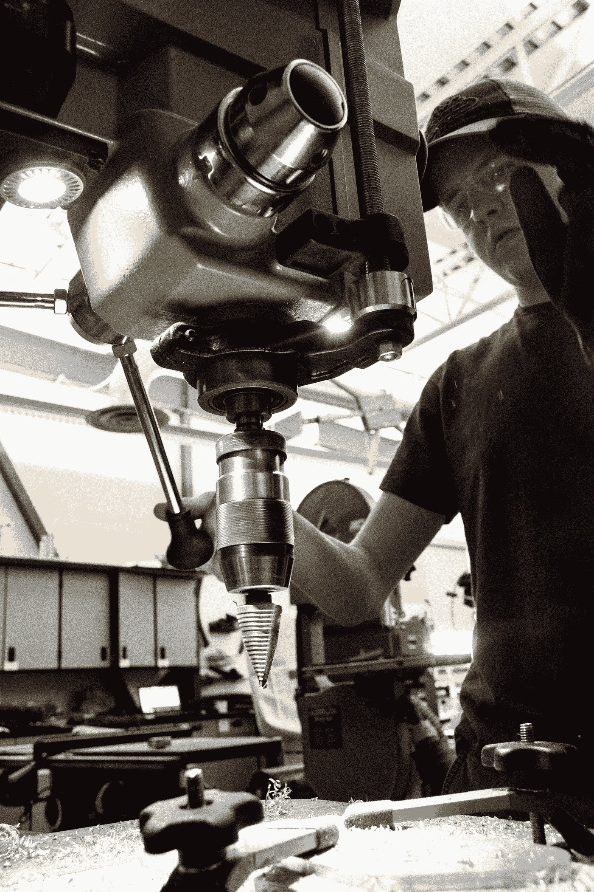
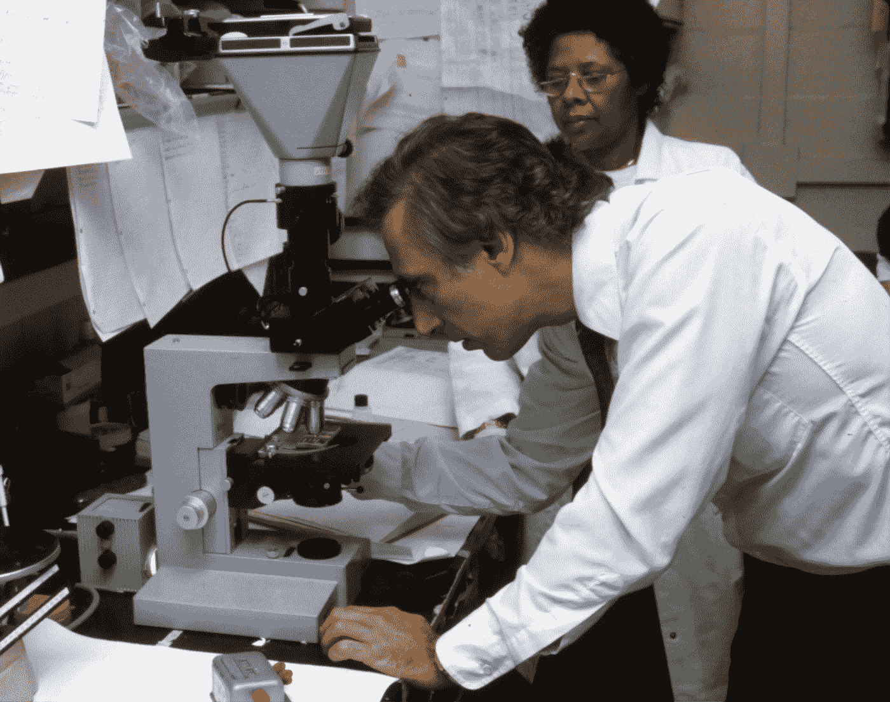

# 无人驾驶 AI 会扼杀数据科学就业市场吗？

> 原文：<https://medium.com/geekculture/will-driverless-ai-kill-the-data-science-job-market-2c321c9f7f37?source=collection_archive---------13----------------------->

## 无人驾驶汽车不需要司机；无人驾驶 AI 会不需要数据科学家吗？

Photo by [Victoriano Izquierdo](https://unsplash.com/@victoriano?utm_source=medium&utm_medium=referral) on [Unsplash](https://unsplash.com?utm_source=medium&utm_medium=referral)

答案不是非黑即白的。

但这篇文章可能会让有经验、有抱负的数据科学家或机器学习工程师大开眼界。

这个行业正朝着把人工智能交给新手的方向发展。

一个没有机器学习背景的人也可以建立和分析模型。

Photo by [Jamie Haughton](https://unsplash.com/@haughters?utm_source=medium&utm_medium=referral) on [Unsplash](https://unsplash.com?utm_source=medium&utm_medium=referral)

# 这怎么可能呢？

这就像如今在制造业中，日常琐事都是由机器人来完成的。

Photo by [Nima Sarram](https://unsplash.com/@nima_sarram?utm_source=medium&utm_medium=referral) on [Unsplash](https://unsplash.com?utm_source=medium&utm_medium=referral)

这就产生了自动化！

Photo by [ThisisEngineering RAEng](https://unsplash.com/@thisisengineering?utm_source=medium&utm_medium=referral) on [Unsplash](https://unsplash.com?utm_source=medium&utm_medium=referral)

类似地，在日常机器学习模型创建中，也有几个始终遵循的步骤，例如:

1.  数据预处理
2.  数据可视化
3.  交叉验证
4.  模特培训
5.  超参数调谐
6.  模型检验

以上这些都是数据科学家或者 ML 工程师花了很多时间的步骤，对吗？

如果我说以上所有的步骤都可以通过点击几下鼠标和一个非常友好的用户界面来完成呢？

Photo by [Nathan Dumlao](https://unsplash.com/@nate_dumlao?utm_source=medium&utm_medium=referral) on [Unsplash](https://unsplash.com?utm_source=medium&utm_medium=referral)

感谢像 [H2O 无人驾驶 AI](https://www.h2o.ai/products/h2o-driverless-ai/) 、[大台库](https://www.dataiku.com/)或 [ThoughtSpot](https://www.thoughtspot.com/) 等众多产品。

这些产品使得机器学习模型的构建变得轻而易举。

# 那数据科学家会怎么样？

显然，现在对于这些步骤，一家公司将不再需要过多的 ML 工程师或数据科学家在 jupyter 笔记本上写几十行 python 代码。

公司现在在建立庞大的数据科学团队之前可以三思。

像 H2O 无人驾驶人工智能这样的工具可以大幅减少开发时间，并可以立即完成这些步骤。是的，没时间了！

Photo by [Yuvraj Singh](https://unsplash.com/@yxvi?utm_source=medium&utm_medium=referral) on [Unsplash](https://unsplash.com?utm_source=medium&utm_medium=referral)

它甚至可以准备文档、最先进的可视化技术，以及用于模型构建或超参数调整的大量其他自定义参数。如此无缝的体验，即使是一个几乎没有任何机器学习背景的人也能轻松建立模型。

那么就像无人驾驶汽车不需要司机一样，无人驾驶 AI 会不会不需要数据科学家呢？

对于单调的任务显然不行，但对于研究来说绝对可以！

Photo by [MARK ADRIANE](https://unsplash.com/@markadriane?utm_source=medium&utm_medium=referral) on [Unsplash](https://unsplash.com?utm_source=medium&utm_medium=referral)

研究就像制造一种新疫苗。

Photo by [National Cancer Institute](https://unsplash.com/@nci?utm_source=medium&utm_medium=referral) on [Unsplash](https://unsplash.com?utm_source=medium&utm_medium=referral)

比方说，你为计算机视觉开发了自己的 api 或模型，成为某些模型的贡献者，增强了模型的内部统计参数，比如开发了一个新的内核，以提高特定数据集的准确性等。

另一个方面是增强智能。

你比任何人都了解你的数据和领域。

Photo by [Adam Nowakowski](https://unsplash.com/@adamaszczos?utm_source=medium&utm_medium=referral) on [Unsplash](https://unsplash.com?utm_source=medium&utm_medium=referral)

因此，所有数据科学前的 ETL 都可以做得更好，即挑选和整理数据源、数据收集、数据管道流等。

# 未来准备

企业广泛采用人工智能是一种趋势，但作为一名数据科学家或 ML 工程师，你需要研究驱动或数学驱动，机智地思考并打破单调。