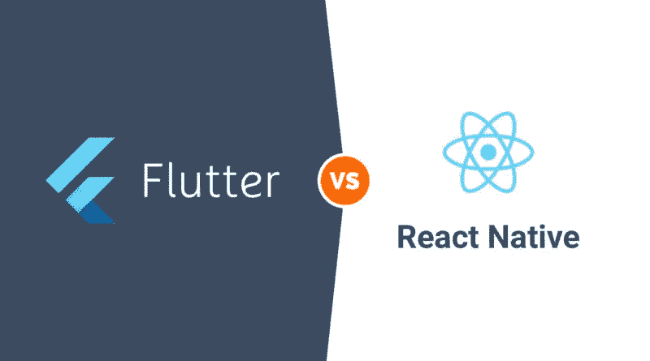
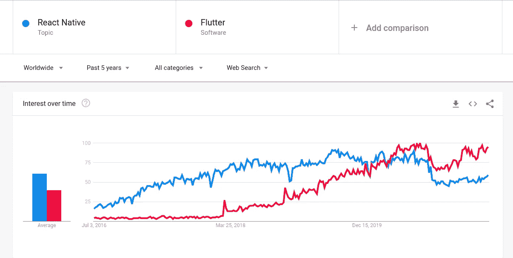

# Flutter beat 会反应原生吗？

> 原文：<https://medium.com/geekculture/will-flutter-beat-react-native-2828fd2664bf?source=collection_archive---------12----------------------->

## 原生应用开发技术

## 反应自然 vs 颤动

大家好😃今天，我们将探讨两种顶级的移动开发技术。我们将对这两者进行比较和对比。

Photo by [Magnet.me](https://unsplash.com/@magnetme?utm_source=medium&utm_medium=referral) on [Unsplash](https://unsplash.com?utm_source=medium&utm_medium=referral)

通过这篇文章，我将比较 React Native 和 Flutter，然后在最后，我将给出我的公正意见，告诉你 2021 年你应该从移动开发中学习哪一个。让我们找出答案。

Image Source: [https://techidology.com/flutter-vs-react-native/](https://techidology.com/flutter-vs-react-native/)

React Native 和 Flutter 是构建 iOS 和 Android 移动应用的两个顶级框架。React Native 由脸书创建，自 2015 年以来一直存在。

这里有五个用 React Native 构建的应用

*   脸谱网
*   照片墙
*   拼趣
*   网络电话
*   优步吃饭

还有很多很多。

Flutter 是谷歌创造的。是 2018 年出来的最新框架。

这里有三个用 Flutter 构建的应用程序

*   谷歌广告
*   Alibaba.com
*   谷歌邮箱

当然还有更多。

Image Source: [https://trends.google.com/trends/explore?date=today%205-y&q=%2Fg%2F11h03gfxy9,%2Fg%2F11f03_rzbg](https://trends.google.com/trends/explore?date=today%205-y&q=%2Fg%2F11h03gfxy9,%2Fg%2F11f03_rzbg)

正如你在 Google trends 上看到的，Flutter 最近很受欢迎，已经超过了 React Native。那是因为很多人对 Flutter 很好奇，我想学习它。

在写这篇文章的时候，Flutter 开发者的工作机会并没有那么多。如果你在 indeed.com 或者你最喜欢的求职网站上快速搜索一下，你可以自己验证一下。Indeed.com，他们目前为加州的 React 本地开发者提供了 250 个工作岗位，而为 Flutter 开发者提供了 42 个工作岗位。这是因为 React Native 比 Flutter 存在的时间更长，尽管谷歌在开发和改进 Flutter 方面投入了大量资金，但 React Native 更加成熟和稳定，因此它现在的采用率更高。在你居住的地方，这些数字可能会有所不同，对于 Flutter 开发者来说可能会有更多的工作机会。所以不要只和我告诉你的有关，自己做研究，看看现在哪个框架有更好的就业市场。

在编程语言方面，React Native 使用 JavaScript。因此，如果你是一名 web 开发人员并且了解 JavaScript，React Native 是你进入移动开发的最直接的途径。另一方面颤动。它使用 dart，这是一种新的面向对象的编程语言，由 Google 创建。在语法上和 Java、JavaScript 非常相似。所以如果你懂 Java，JavaScript 或者 C sharp，用 Dart 就能快速上手。我认为 dart 是一种美丽的语言，它从不同的编程语言中吸取了最好的思想。

然而，它在开发者社区中仍然是新事物，而 javascript 已经存在了很长时间，并且有一个庞大的社区。有许多书籍、课程、文章、开发者和数百万行 JavaScript 代码。我们可以在应用程序中使用它。飞镖仍然是新的，现在正在扩大其社区。

Flutter 的卖点之一是它附带了一个全面的漂亮 UI 小部件库。因此，对于你想要构建的任何类型的应用程序，都有许多现成的漂亮的小部件。React Native 就不是这样了，你必须求助于第三方库。

所以用 Flutter 构建和发布应用程序会更快。但当然，这真的取决于开发人员的技能。

总的来说，我认为反应原生和颤动在这里都很棒。

现在，你应该投入你的时间和精力，自然地做出反应，还是做得更好。以下是我的指导方针，首先问问自己，为什么要学反应原生或扑动。想想你的目标。你想学习移动开发来找工作吗？或者你有一个应用程序的想法，并想把这个想法变成现实？你的目标将决定你需要学习的框架。如果你的目标是找到一份高薪的好工作，那么就业市场决定了你应该学会自然反应还是随波逐流。

Photo by [Clem Onojeghuo](https://unsplash.com/@clemono?utm_source=medium&utm_medium=referral) on [Unsplash](https://unsplash.com?utm_source=medium&utm_medium=referral)

所以看看你所居住的地方登广告的工作数量，不要听别人告诉你。你应该学习这个或那个，自己做研究，根据数据做决定。另一方面，如果你的目标是建立一个应用程序，那么就业市场就不再重要了。重要的是上市时间能够快速构建和塑造你的应用。如果你很了解 JavaScript，并且碰巧知道如何 React Native，React Native 是进入移动开发的最快方式。React Native 基于 React。所以你所知道的关于 React 的一切也适用于 React Native。另一方面，你只需要学习一些额外的东西。如果你不知道 JavaScript，那么你可能要考虑一下 Flutter。因为入门要学的就是镖语和扑。它本身比学习 JavaScript 更快。

我相信你已经理解了今天讨论的主题。如果您有任何问题或任何澄清，不要犹豫，通过回复部分与我联系。感谢您花费宝贵的时间阅读这篇博客，我相信这将有助于并激励您了解 React Native 和 Flutter 并使用它们。

***欣赏文章？成为*** [***中等会员***](https://sthenusan.medium.com/membership) ***继续无限制学习。如果你使用上面的链接，我会收到你的一部分会员费，不需要你额外付费。***

Photo by [Alexas_Fotos](https://unsplash.com/@alexas_fotos?utm_source=medium&utm_medium=referral) on [Unsplash](https://unsplash.com?utm_source=medium&utm_medium=referral)