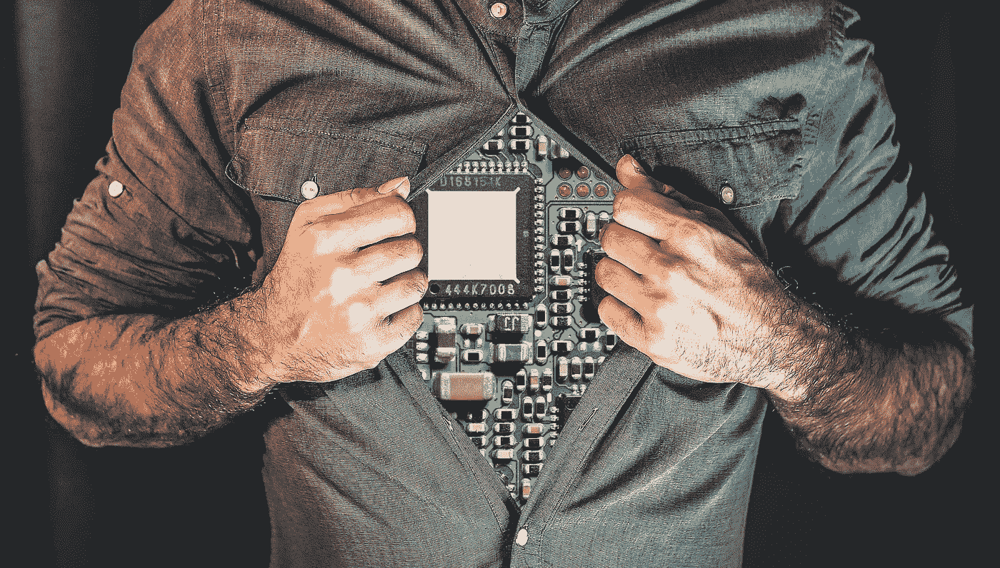

# 我会被人工智能取代吗？

> 原文：<https://medium.com/geekculture/will-i-be-replaced-by-artificial-intelligence-f68af326f44a?source=collection_archive---------44----------------------->

## 我有那么容易被忘记吗！

Image from [Pixabay.com](https://pixabay.com/photos/android-robot-humanoid-cyborg-5242149/)

如果你一直关注我的内容，你会发现我对人工智能这个话题越来越感兴趣。我认为这是自神经科学，更具体地说，神经可塑性出现以来，我们看到的最肥沃的哲学创新土壤之一。