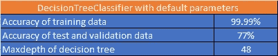
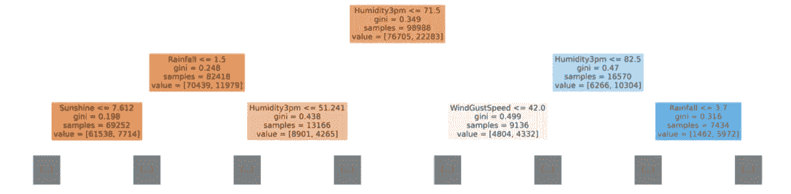
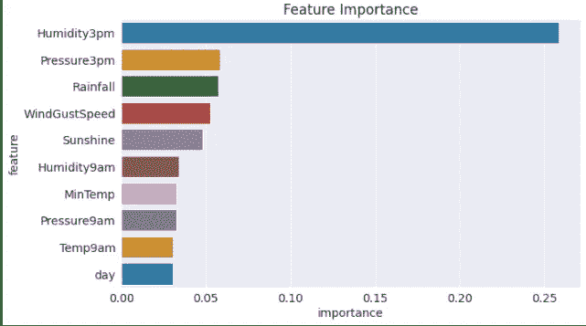
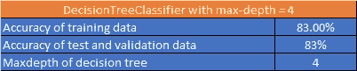
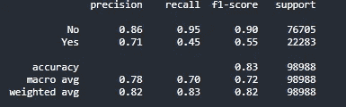

# 澳大利亚明天会下雨吗？:决策树和随机森林的端到端和新手实现

> 原文：<https://medium.com/geekculture/will-it-rain-tomorrow-in-australia-65d0eb1ab42?source=collection_archive---------12----------------------->

# 概观

决策树和随机森林是机器学习实现领域中最常用的算法。此外，它们在分类和回归问题上做得最好。这篇博文是这两种算法的端到端实现，但是是新手实现。

# 目标

假设澳大利亚气象部门希望根据历史数据预测明天是否会下雨。这个预测要么是肯定的——会下雨，要么是否定的——不会下雨。

通常，即使不是这方面的专家，我们也知道如果

*   这是一个雨季
*   当我们看到天空中的乌云时
*   当我们有高温时
*   位置
*   蒸发

等等。

我们将使用这些特性来解决这个分类问题。

# 资料组

我们使用了公开可用的 [Kaggle 数据集](https://www.kaggle.com/jsphyg/weather-dataset-rattle-package)，它拥有从 2008 年到 2017 年 10 年的天气数据的近 15 万条记录。我们数据集包含以下字段—

*   *日期* —不言自明
*   *位置* —我们有数据的城市
*   *最小温度和最大温度* —一天中的最低和最高温度
*   *降雨量* —当天记录的降雨量
*   *蒸发量*——24 小时至上午 9 点的所谓 A 级蒸发皿蒸发量(毫米)
*   *日照* —一天中日照充足的小时数。
*   *wind gustdir*——24 小时至午夜最强阵风的方向
*   *风速*——24 小时至午夜最强阵风的速度(km/h)
*   *上午 9 点风*——上午 9 点的风向
*   *下午 3 点风向*——下午 3 点的风向
*   *风速上午 9 点*——上午 9 点前 10 分钟的平均风速(千米/小时)
*   *风速上午 3 点*——下午 3 点前 10 分钟内的平均风速(千米/小时)
*   *上午 9 点的湿度* —上午 9 点的湿度(百分比)
*   *下午 3 点的湿度* —下午 3 点的湿度(百分比)
*   *压力上午 9 点* —大气压力(hpa)在上午 9 点降低到平均海平面
*   *压力下午 3 点*——大气压力(hpa)在下午 3 点降低到平均海平面
*   *上午 9 点的云*——上午 9 点被云遮住的天空部分。这是用“奥克塔”来衡量的，奥克塔是八分之一的单位。它记录了天空的八分之几被云遮住了。0 表示天空完全晴朗，而 8 表示天完全阴沉。
*   *下午 3 点的云*——下午 3 点被云遮住的天空比例(单位为“八分之一”)。有关这些值的描述，请参见 Cload9am
*   上午 9 点—上午 9 点的温度(摄氏度)
*   *下午三点* —下午三点的温度(摄氏度)
*   *RainToday* -Boolean: 1 如果 24 小时到上午 9 点的降雨量(mm)超过 1mm，否则为 0
*   *RainTomorrow* —下一天的降雨量，单位为毫米，用于创建响应变量 RainTomorrow。一种对“风险”的衡量。

# 功能方法

作为一名数据科学家，首先必须了解数据集中所有可用的特征，它们是如何影响明天降雨的预测的。此外，当数据科学家投身于问题实现时，他/她必须—

*   对数据执行描述性分析，以了解数据集中可用的各种要素
*   执行数据清理以处理数据集中缺失的值
*   分析现有数据/特征的模式和对目标列的影响，即 RainTomorrow
*   执行标签编码
*   使用默认参数训练决策树分类器算法，并针对训练、测试和验证数据评估模型性能
*   使用超参数调整提高模型性能
*   使用默认参数训练 RandomForestClassifier 算法并评估模型性能
*   使用超参数调整提高模型性能

# 步伐

作为实施的一部分，必须遵循以下步骤—

*   设置开发环境，安装并导入所需的库
*   下载数据集
*   执行探索性数据分析
*   为培训准备数据—处理缺失值、标签编码、标准化等。
*   为培训、测试和验证拆分数据
*   训练决策树分类器并评估模型性能
*   训练 RandomForestClassifier 并评估模型性能

# 使用的技术和库

*   ***编程语言*** — Python3
*   ***数据科学库*** — pandas、numpy、matplotlib、seaborn
*   ***机器学习库*** — sklearn
*   ***运行环境*** — Google Colab 和 Kaggle 笔记本
*   ***训练算法*** —决策树分类器和随机森林分类器

# 笔记本—完成逐步执行

我的 [Kaggle 笔记本](https://www.kaggle.com/aashaymaheshwari/predict-rain-tomorrow-in-australia/notebook)上有完整的分步执行。

# **总结**

## **带有默认参数的决策树分类器**

Performance of DecisionTreeClassifier with default parameters

上述案例是一个**过度拟合案例，因为采油树使用了最大深度并记忆了数值，未能以 77 %的低精度预测测试和验证数据集**

The decision tree we got

Feature importance

## 最大深度为 **=** 4 的决策树分类器

Performance of model with hyperparameter tuning

对于新的预测，上述性能明显更好，因为训练数据、测试数据和验证数据的准确性几乎相同

Confusion matrix

# 结论

使用决策树，我们能够以 83%的准确率进行预测。这个笔记本还有一个 RandomForest 的实现，我想请你看一下。

sklearn 最了解超参数的价值，但它有时在特定用例中失败，并让数据科学家来调整超参数。决策树和随机森林总是有过度拟合的风险。

# 更新

我会尽量更新笔记本的版本，增加更多的型号评测细节。