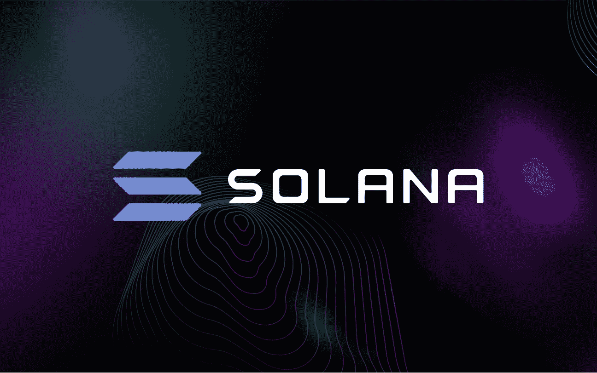

# 索拉纳会很快达到历史新高吗？

> 原文：<https://medium.com/geekculture/will-solana-soon-reach-a-new-all-time-high-caf4f3bf090f?source=collection_archive---------22----------------------->

今天， [**FATPIGSIGNALS**](https://www.fatpigsignals.com/) 我和我会看看索拉纳星盘，看看它在未来会如何演变。

索拉纳价格已经失去了势头。随着秘密情绪恶化，该指数已连续 6 天下跌。SOL token 的交易价格为 161 美元，比 215 美元的历史高点低了约 25%。它的市值超过 470 亿美元，是全球第七大代币。