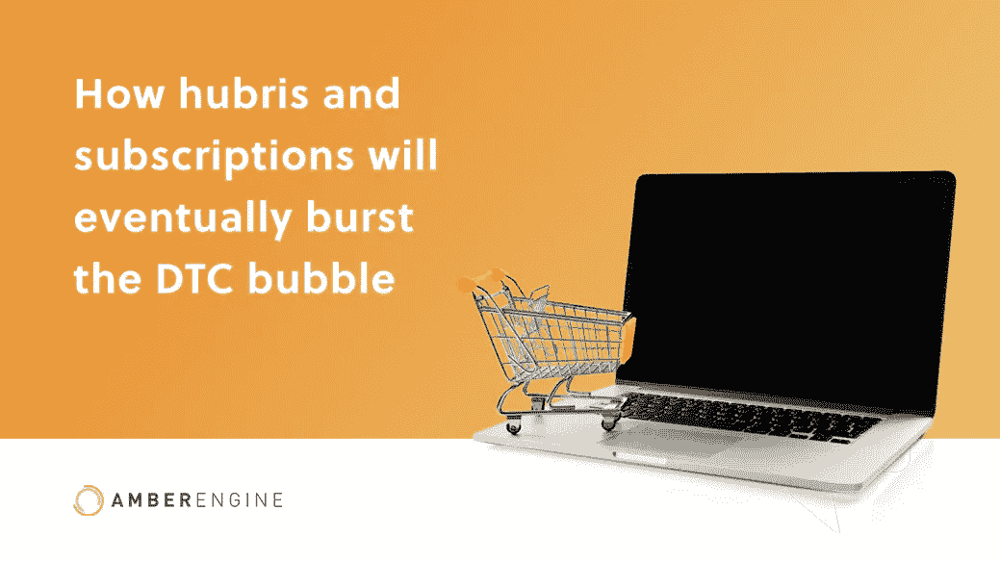
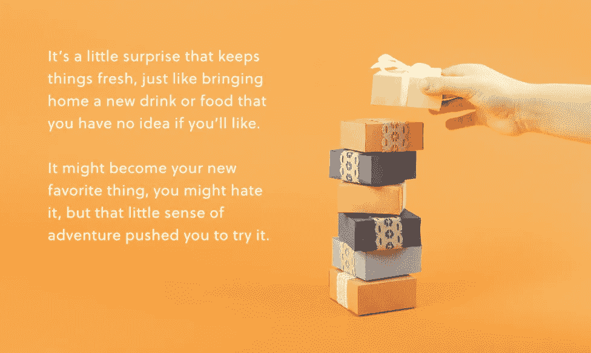
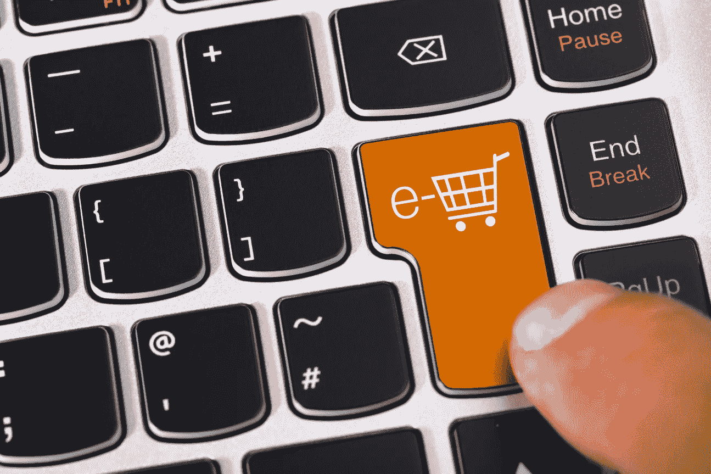

# 傲慢和订阅将如何最终打破 DTC 泡沫

> 原文：<https://medium.com/geekculture/will-subscriptions-kill-the-dtc-model-4f612af8c128?source=collection_archive---------68----------------------->

## DTC 订阅泡沫

对于电子商务品牌来说，DTC 热潮是一个令人兴奋的爆发。直接面向消费者的模式省去了中间商，向以消费者为中心的品牌转变，使得中小型品牌能够与大型企业竞争。很多 DTC 品牌都专注于一个有前途的模式:*订阅*。

早期对订阅的热情很容易解释，不可思议的增长令人印象深刻。然而，出色的初次表演并不代表一切。毕竟，如果你试图登月却失败了，最近的恒星可能也在数光年之外。

订阅模式错过了月亮吗？他们在为 DTC 泡沫拼出厄运吗？让我们来看看。

# DTC 的案例

不可否认的是，正如市场已经发现的那样，收购 DTC 并不难。特别是随着现代品牌高度关注消费者至上的政治，DTC 模式似乎是显而易见的。省去中间商，零售商，对消费者来说通常意味着更低的成本。这也意味着更高效、更便捷的交付，以及卖家和买家之间的直接沟通。整个过程似乎进行得更顺利了。

这种与消费者的直接联系也是品牌的一大优势。这使得消费者行为分析变得更加容易，因为数据就在他们面前。创造美妙的在线客户体验从未如此简单，也从未如此有利可图。

坏处呢？一键购物并不性感。这既不有趣也不古怪。你不会因为拐进了错误的过道而碰上新的小吃。你不必说服自己不要收银台前的巧克力棒。当你回家的时候，你的“购物车”里几乎不可能有任何意想不到的东西让你笑得更开心。

解决办法？订阅箱！对一些人来说，这听起来可能不必要的古怪，但这就是问题的关键！这是一个保持新鲜的小惊喜，就像带回家一种你不知道是否会喜欢的新饮料或食物。它可能会成为你的新宠，你可能会讨厌它，但那种小小的冒险精神会促使你去尝试。

因此，难怪订阅箱和订阅量普遍激增。效率的所有优点都与一点意外收获结合在一起。无论是符合你风格的全新服装、新鲜食材、试尝的食谱，还是新发现的一瓶葡萄酒，这些准神秘盒子都是一场没有任何麻烦的冒险。那么什么会出错呢？

# 订阅的真相

不幸的是，这些品牌中的大多数都出了很多问题。这些概念很棒，对消费者来说也很棒，但中小型品牌很难跟上。

首先，转化率相当低。如果你自己没有网飞账户，你肯定知道有人有，但是我们中有多少人有订阅烹饪盒的朋友呢？现实是，虽然理论上这种模式非常有利可图，但实际上，实际订阅数量还有很多不足之处。

不利的一面是什么？扩大规模不是一个立竿见影的解决方案，至少不是对所有人都是如此。获取新用户并不便宜，订阅服务的实际利润通常也没那么高。通常需要几个月的时间才能让一个用户达到收支平衡，而客户流失是一件很难平衡和成功的事情。

即使当品牌设法获得足够多的有足够兴趣要求大规模扩张的用户，早期的利润可能也不足以[证明转型的成本](https://digiday.com/marketing/big-brands-getting-subscription-box-business/)。这让品牌陷入了一场不自在的游戏:为了证明扩大规模是合理的，要在不稳定的留存数字上加倍努力。

# 全面考虑

这是否意味着订阅一定会扼杀 DTC？

不完全是。[电子商务不会有任何进展](https://www.amberengine.com/blog-content/trends-in-online-sales-temporary-or-here-to-stay?utm_source=blog&utm_medium=referral&utm_campaign=medium-blogs)，如果我们能从 2020 年和 2021 年的情绪旋风中挑出一件好事，那就是 DTC 模型的重要性。不说别的，就因为卫生。当然，无论有无订阅模式，这些数字都反映了这一点。

订阅模式面临的危险与它们一直面临的危险是一样的。如果不提高订阅费，就没有机会增加每个客户的收入。这意味着订阅品牌在决定升级之前必然会停留在静态数字上，而升级的风险往往会吸引大品牌的支持者。在一个充满自豪的小型电子商务品牌的时代，这个代价可能太大了，无法支付。

DTC 和电子商务将继续存在，但对不可持续的订阅模式的依赖迟早会引起很多摩擦。