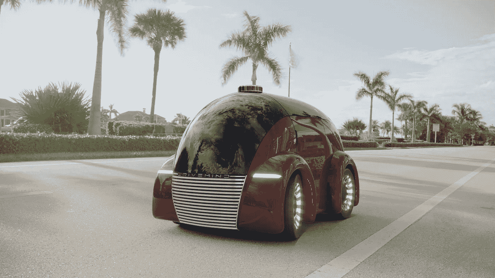
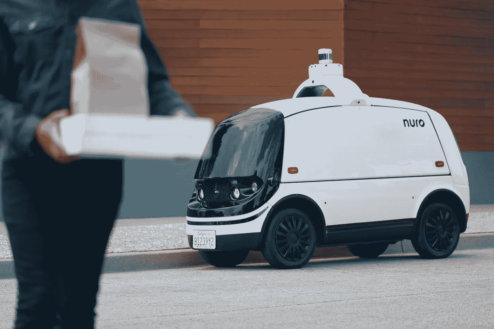
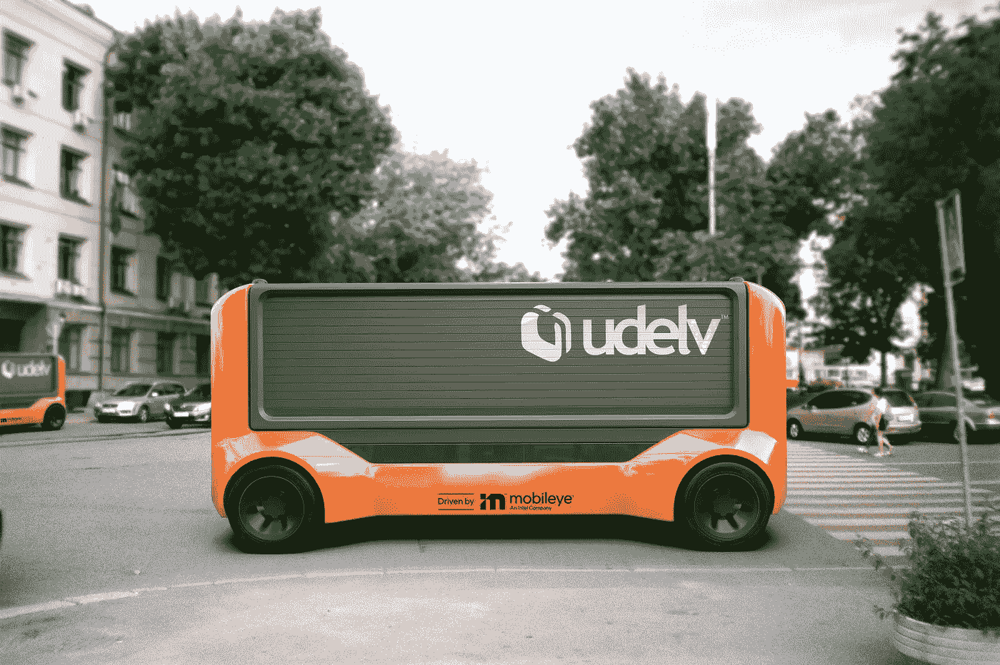
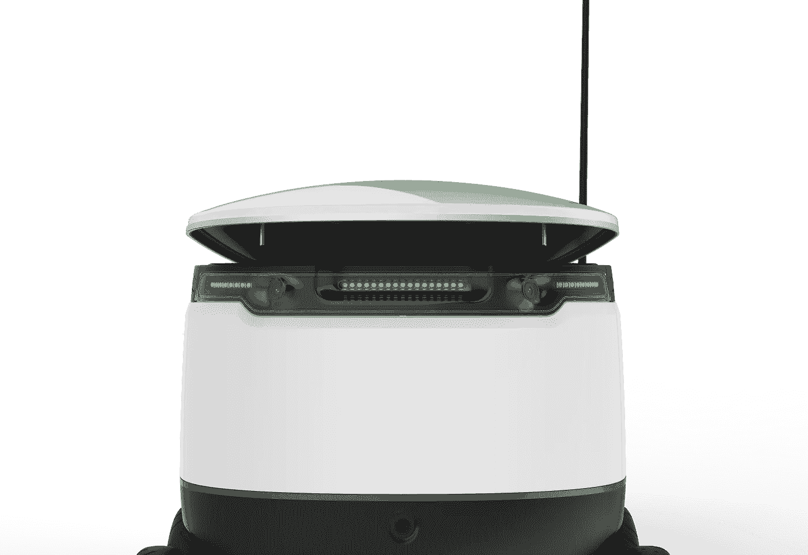
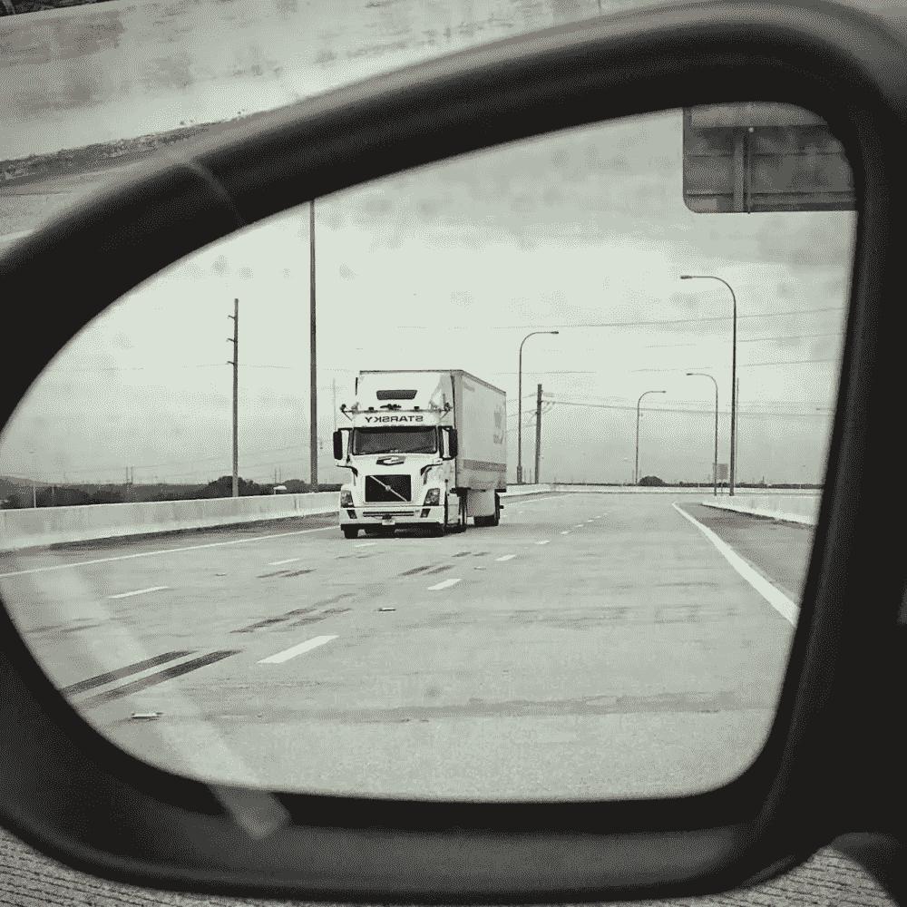

# 送货机器人的梦想会昙花一现吗？

> 原文：<https://medium.com/geekculture/will-the-dream-of-delivery-robots-be-short-lived-45f914d82bcc?source=collection_archive---------16----------------------->

价值数十亿美元的自动驾驶送货公司几乎无法找到商业可行性，但一群雄心勃勃的初创公司希望改变这种情况。

Rendering of self-driving delivery vehicle courtesy of DriveMind.

> “Waymo 的首席执行官约翰·克拉夫茨克(John Krafcik)告诉记者，“与客运相比，无人驾驶送货可能有更好的机会在早期流行起来。"
> 
> — [丹尼尔·劳里，Udelv 首席执行官](/@udelv/autonomous-delivery-the-case-for-fixed-repeatable-autonomous-delivery-routes-19044c29177)

2020 年3 月，最有价值的自动快递公司之一突然宣布退出。Stefan Seltz-Axmacher，现已倒闭的 Starsky Robotics 的前首席执行官，拥有创业公司所希望的一切:一支不可思议的工程师和科学家团队，独特的 B2B 战略，2000 万美元的 C 轮基金。

然而，在五年内，Seltz-Axmacher 解散了他的公司，要求彻底关闭是必要的，因为在这个行业中，交付 autonomus 车辆的问题太难了，而且目前对大多数开发者来说遥不可及。

该行业似乎正在摆脱十年来对自动驾驶汽车商业可行性的过度承诺，但自动驾驶技术的梦想再次落空。“人们一致认为，我们距离无人驾驶汽车至少还有 10 年，” [Seltz-Axmacher 在他关于 Medium](/starsky-robotics-blog/the-end-of-starsky-robotics-acb8a6a8a5f5) 的文章中写道，“……如果是这样的话，几乎没有任何一个当前的自主团队会运送人工智能决策者。”

> “……大多数团队都不可能存活下来。这在如此大胆的事情中是意料之中的。”——[布拉德·邓普顿为《福布斯》撰稿](https://www.forbes.com/sites/bradtempleton/2020/04/02/starsky-robotics-shuts-down-and-worries-everybody-else-will-also-fail-in-robotic-trucks/?sh=7714ed8c3eaf)

切到 2021 年，自动送货领域的老大是 Nuro，这是一家由两名前 Waymo 员工创办的初创公司。经过五年的发展，达美乐比萨推出了一项利用送货机器人的送货服务。随着 5 亿美元的 C 轮融资，估计 50 亿美元的估值，以及包括 Chipotle，沃尔玛和联邦快递在内的一系列主要品牌合作伙伴，看来白日梦正在变成现实。

然而，Starsky 和 Nuro 反映了一个尚未解决将自动驾驶服务纳入主流使用的问题的行业(达美乐目前只为德克萨斯州休斯顿的精选客户运营一辆 Nuro 汽车)。这两者都高度体现了设计远程自动驾驶汽车的技术和创造性挑战。

# 休斯顿，我们有麻烦了

Image courtesy of Nuro. All press kit images provided online.

A 专门为运送消费品而建造的自动驾驶汽车是一种替代措施，这意味着任何自动驾驶汽车都可以有效地将货物直接运送给收件人。Nuro 的小型送货专用 AVs 围绕友好的送货机器人的理念设计，因此允许一些商业可行性的表象，[特别是在一个已经证明对这种技术持矛盾态度的消费市场](https://pavecampaign.org/pave-poll-americans-wary-of-avs-but-say-education-and-experience-with-technology-can-build-trust)。然而，最终任何车辆都可以使用运送乘客的相同系统来运送货物。

这似乎是 Nuro 长期成功的最大障碍。Waymo 最近在[推出了货运业务](https://www.theverge.com/2021/8/18/22628836/waymo-autonomous-truck-hub-texas-ryder)，并正在其打车小货车所在的同一个州测试车辆。根据一些专家的说法，AV 行业将需要更大的公司，而不是像 Nuro 这样的小众公司。Waymo 可能是 ADV 可用性的真正先驱，因为——有了全面服务的能力——没有人会需要送货机器人来取披萨，因为他们最终可以在足球训练后的路上打电话给他们的小货车来取披萨。

考虑到 Nuro 推出其服务的速度(除了 Dominos，它的其他合作伙伴还处于测试阶段)，这基本上允许大型公司将必要的创新整合到他们自己的 AVs 生态系统中，并且可能不会那么缓慢。

# 恕不同意

Image courtesy of Udelev. All press kit images provided online.

同样，你友好的邻居送货机器人也会因其自身的技术限制而丧失生存能力。然而，以下初创公司正在努力提高生存能力。它们包含的设计和商业策略不仅让它们在 Nuro 中独树一帜，还能与 Waymo 等公司竞争:

*   **Udelev** 通过将自动驾驶系统导向固定的 B2B 路线，开发了一种独特的自动交付方法。与这种布局相结合的是车辆本身的灵活设计；它们不是为一种特定的运输类型而设计的汽车，而是为更灵活(和更大)的货运需求而设计的。
*   Starship Technologies 的方法是一种专注于定制基于交付的超本地交易网络的方法。其送货机器人的形状和大小类似于婴儿车，你几乎可以认为它们是 AV 的微交易。这种方法对大学校园来说似乎很理想，在那里，花时间去拿你的冰咖啡或拿干净的衣服已经是过去的事情了。
*   **DriveMind** 是一家早期创业公司，它试图在其无人驾驶概念车中实现几项创新。其中一个特别的是解体概念，它将自动驾驶汽车连接起来，以便在人类参与的碰撞事件中“牺牲”自己。卡车和送货相关事故中人数快速增长的主要解决方案。

Vector courtesy of Starship Technologies.

传统的实用性想法可能需要重新想象人工智能机器设计的可能性，而这正是这些初创公司决心要做的。Stark 告诉我:“我们可以利用这项技术开发更多不明显的产品和服务。”。他提到他的申请将受到专利保护。

# 太大而无法退出

到 2035 年，[adv 预计将产生超过 4 万亿美元的经济效益](https://techcrunch.com/2021/08/16/nuro-ec1-origin/)。除了送货机器人的利基导向性质，这项技术将能够产生的地震后果才是重要的。[全球每年有数百万人死于可预防的车祸](https://www.who.int/news-room/fact-sheets/detail/road-traffic-injuries)，仅 ADVs 就可以减少近 9000 万辆汽车的碳足迹。

自动驾驶汽车行业的一个共同使命是将一项复杂的技术纳入主流使用。但将 AVs 推向市场的问题似乎越来越多样化，就好像自动驾驶汽车的梦想是一种带有自身变异的病毒。

Image courtesy of Starsky Robotics, photo by Tanya Sumang.

与 Nuro 一样，几家较新的创业公司认为，如果自动驾驶汽车要真正起飞，人类操作员将需要成为等式的一部分。“从一开始就将人工智能和真正的人类智能构建到系统中，对于创造一个可靠而经济的解决方案至关重要，”DriveMind 的霍华德·史塔克告诉我，“光靠机器学习是不够的。”

不管短期内实现自动驾驶汽车可行性的方式如何，这条道路上的障碍只是证明了这个新兴行业的价值和丰富的创意和技术雄心。

短短十年间，技术进步、知识产权和工程人才的巨大网络随着每一项重大突破而起伏。不言而喻，创业文化和自动驾驶汽车实际上是同义词，正如一位发明灯泡的开发人员可能会说的那样，我们找到了一千种不制造自动驾驶汽车的方法。但是我们离一个更安全的世界越来越近了，在那里机会和准备在十字路口相遇，一次一次的尝试和旅行。