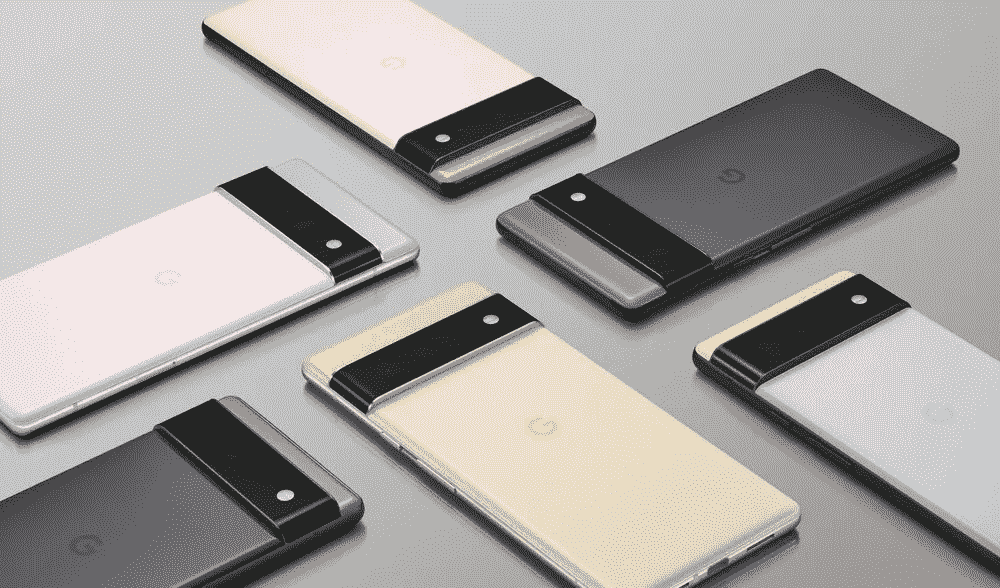
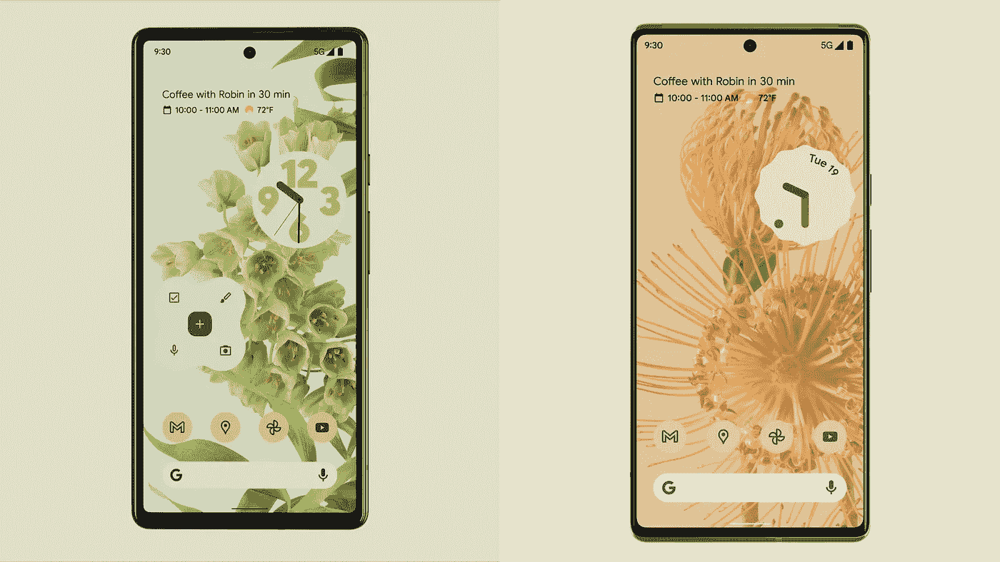
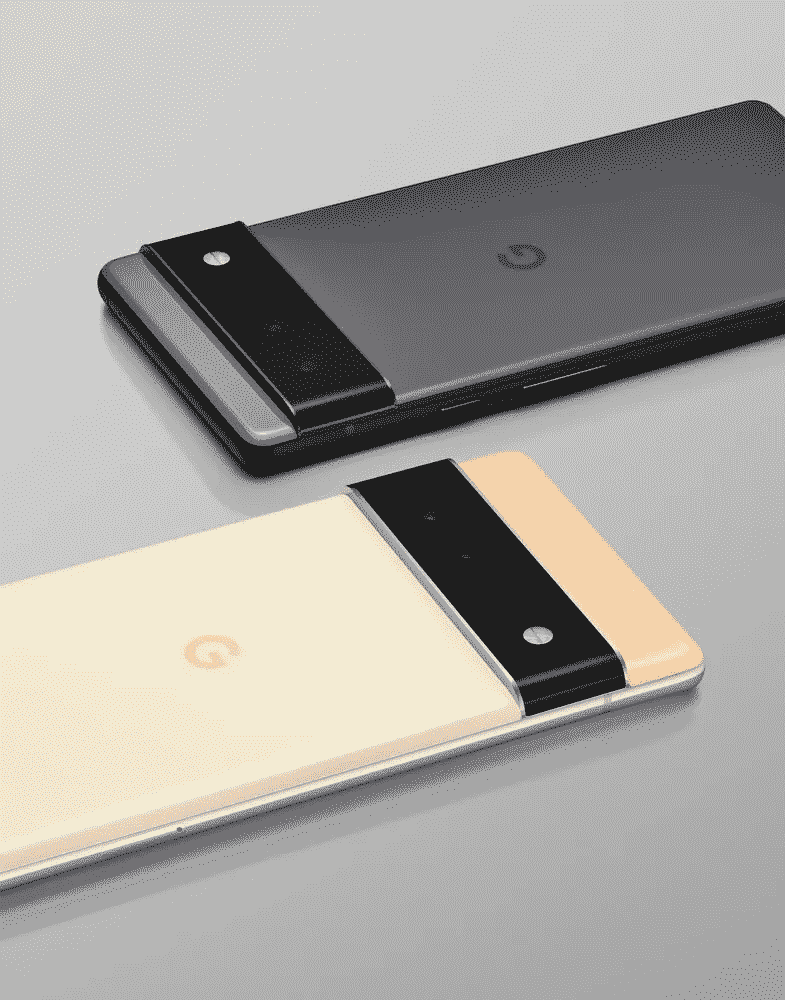
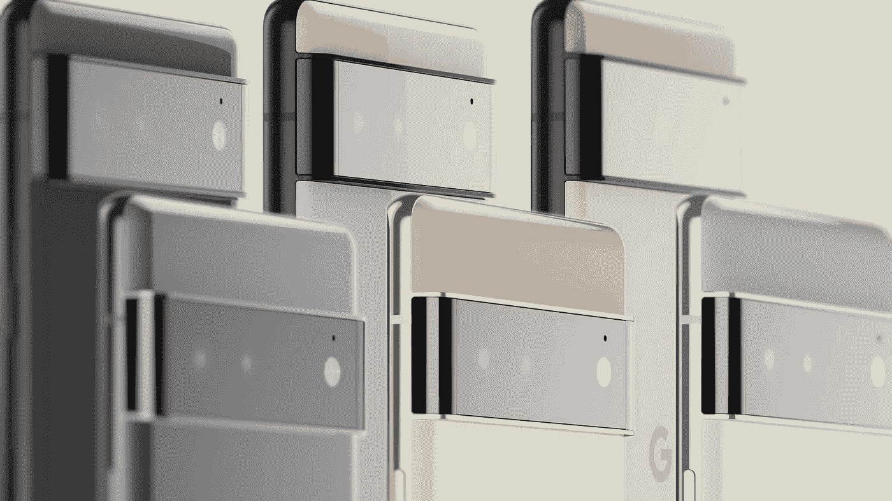
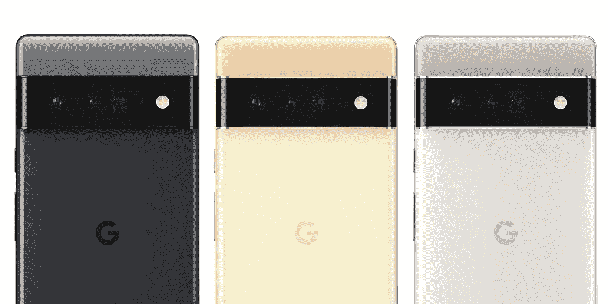
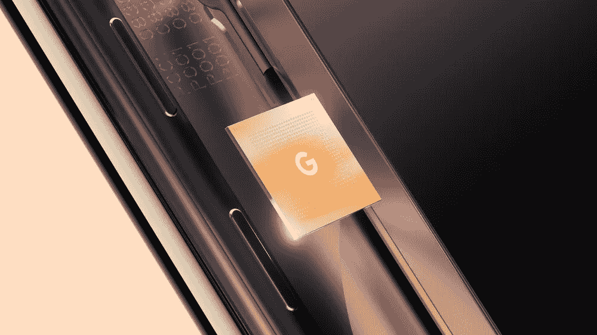
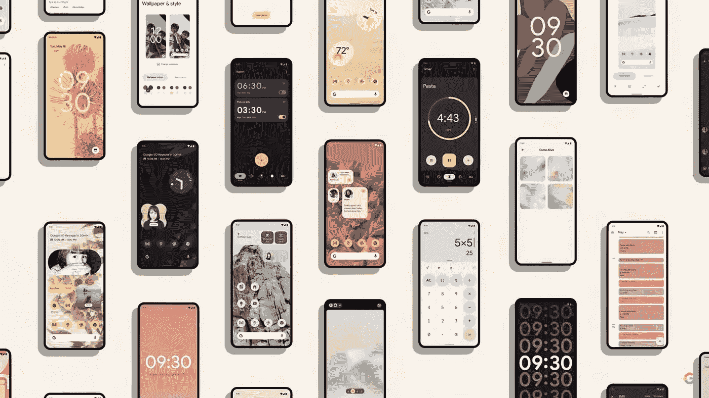
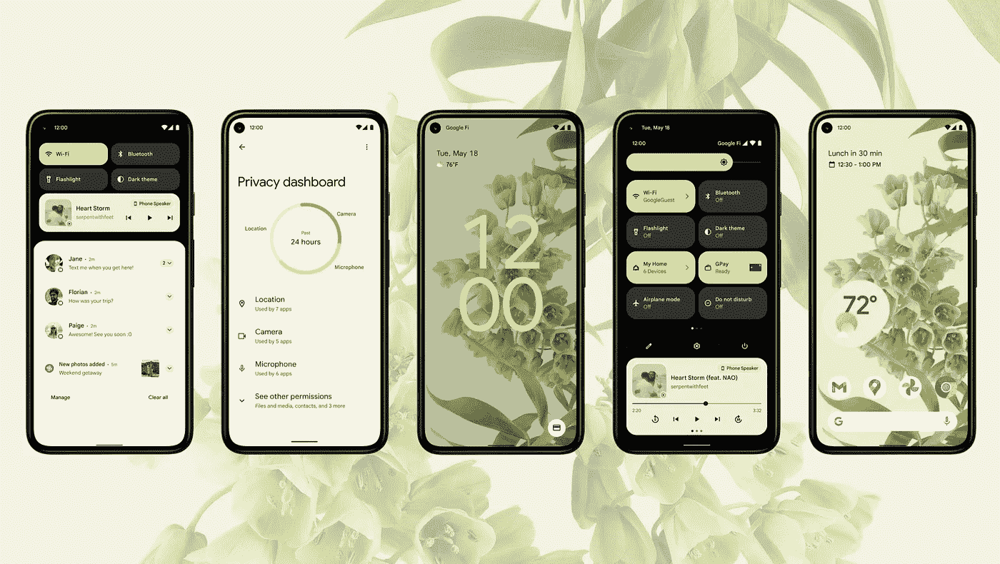
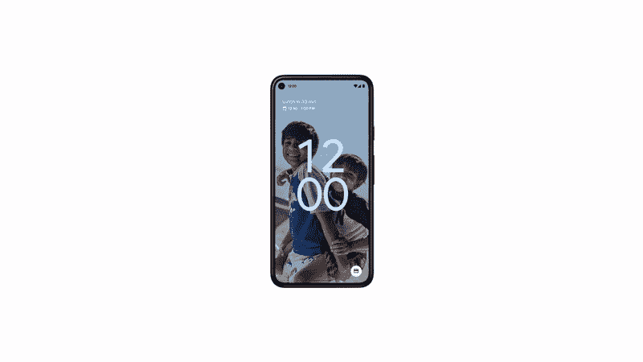
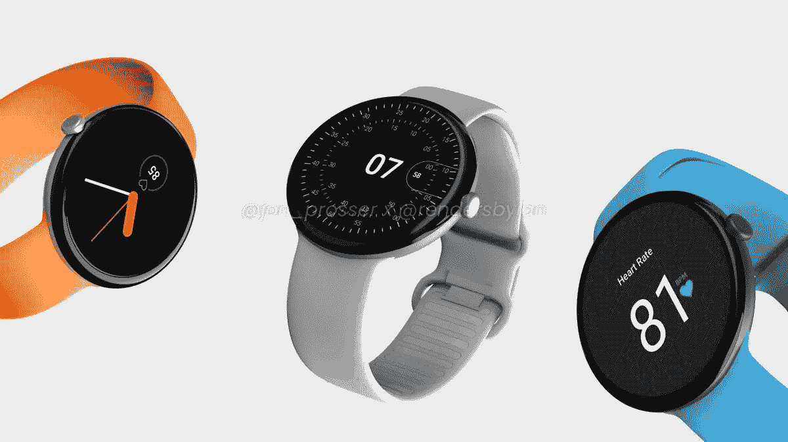

# 谷歌 Pixel 6 会改变安卓游戏吗？

> 原文：<https://medium.com/geekculture/will-the-google-pixel-6-change-the-android-game-3fd89c8f27dc?source=collection_archive---------31----------------------->

谷歌只是让我们先睹为快，看看他们的未来。

这条新闻出乎意料地爆出，我上周登录社交媒体，在一个随机的工作日下午，遇到了大量的技术人员，他们在谈论谷歌刚刚披露的内容。

令人惊讶的是，他们宣布了 Pixel 6、Pixel 6 Pro 和为它们提供动力的新张量芯片。我已经在之前的中谈到过这个[，但是我觉得我需要讨论这些新的细节，以及它对 Android 的普遍意义，因为我们已经知道了这么多。](/geekculture/the-future-of-google-design-in-hardware-and-software-2c12f7090b99)

这次展示没有给我们所有的规格，但大部分只是设计和秋季发布，从泄漏我们知道大部分的内部规格。

这是谷歌在 2020 年推出中端规格的 Pixel 5 后重返高端市场，看起来这些确实是谷歌有史以来最高端的设备，这次实际上已经采取了一些特别的措施。

先说**谷歌** **Pixel 6**

这是两款新设备中较小的一款，配有 6.4 英寸 90Hz AMOLED 平板显示器，带屏幕指纹扫描仪，背面有宽(50mp)和超宽(12mp)摄像头，以及一个中心打孔摄像头。

**Google Pixel 6**

我们还应该期待 Wifi 6E，更快的 5G，超宽带芯片(UWB)，20 或 25W 快速充电和反向无线充电。据传闻，它还将拥有 8GB 内存，4，614 mAh 电池和 128GB/256GB 存储选项。

它将有 3 种颜色，黑色，玫瑰金和绿色，所有型号都有黑色哑光铝框饰面。

我真的很喜欢这个型号，黑色可能是我最喜欢的 Pixel 6 颜色，背面的双配色方案已经回归，黑色在新的相机设计上有一个漂亮的深灰色。

**Google Pixel 6 and Pixel 6 Pro front displays.**

一些人可能不喜欢这款机型的几件事情是 90Hz 显示屏而不是 120Hz，并且没有长焦相机镜头，尽管这两个功能都在 Pro 机型上。

根据价格，这款手机将与 iPhone 13 正面交锋，单从规格来看，它看起来会赢，因为它有更多的 RAM，电池，存储选项，反向无线充电和更大的 90Hz 显示屏。

就相机而言，谷歌像素在照片方面总是很出色，但在视频方面表现平平。随着视频成为谷歌的一个主要改进领域，今年这种情况显然正在改变，相机传感器的变化也应该大大改善照片。

**Pixel 6 (Black) and Pixel 6 Pro (Gold)**

正如你从上面的图片中看到的，与 Pro 相比，Pixel 6 在摄像头上方的空间较小，正面的挡板略大，但这也可能是因为它有一个平板显示器。

**谷歌 Pixel 6 Pro**

说到显示屏，Pro 有一个 6.7 英寸 120 赫兹的 AMOLED 显示屏，边缘弯曲，从正面看确实像三星 Galaxy。

至于其余的规格，这款相机采用了 50MP(广角)、48MP(远摄)和 12MP(超广角)的三镜头设置，因此可以期待一些令人难以置信的照片。我们还将获得 12GB 内存、128GB/256GB/512GB 存储选项和 5,000 mAh 电池。

**Pixel 6 (Top Row) and Pixel 6 Pro (Bottom Row)**

Pro 也有 3 种颜色，黑色、金色和白色，带抛光铝框，Wifi 6E，更快的 5G，超宽带芯片(UWB)，20 或 25W 快速充电和反向无线充电。

**Google Pixel 6 Pro.**

我不太喜欢大屏幕，因为它们很难放在我的口袋里，但我相信这个尺寸会让许多人感到失望，因为我们去年没有得到 Pixel 5 XL。

这就是硬件，让我们来谈谈驱动这些怪兽的硅。

**谷歌张量**

谷歌 Pixel 6 最大的特点是新的张量 SoC，它专注于人工智能和机器学习。例如，张量处理单元可以拍摄一张模糊的人脸图像，并使其变得更清晰。

TPU 知道这是一张脸，并做出必要的调整。

**Google Tensor SoC**

当使用语音转文本时，TPU 可以让你在说话的时候在键盘上编辑单词，而且语音转文本几乎是即时的。这些只是 Tensor 能够做到的一些事情，根据谷歌的说法，凭借 Tensor 的新安全核心和泰坦 M2，Pixel 6 将在任何手机中拥有最多的硬件安全层。

这是第一款没有高通 snapdragon 芯片的 Pixel，看到它能做什么非常令人兴奋，这也是 Android 向前迈出的一大步，关于 Pixel 6 能够接受 **5 年操作系统更新的强烈传言**将改变游戏。

目前，Pixel 和 Galaxy 设备仅支持 3 年，其他品牌甚至更少，这让人们不敢购买。

苹果给你至少 5 年的 iphone 使用时间，这对于那些不想每一两年换一部新手机的人来说一直是一个巨大的卖点，这让谷歌比其他使用高通芯片的安卓设备制造商有巨大的优势。

另一个巨大的优势是，谷歌完全控制了谷歌张量、Android 12 和谷歌硬件的整个体验，这可能意味着更流畅的体验、更强大的软件功能和更多的安全更新。

**安卓 12**

目前处于测试阶段，下个月将发布，Android 12 是 Android 的一个了不起的更新，将在 Pixel 6 上运行。

**Material You design.**

Android 12 从上到下进行了彻底的重新设计，它有一个更个性化的用户界面，可以随着壁纸的变化而变化，给人一种更吸引人和友好的感觉。

**Material You design.**

现在有了更多的曲线，更多的定制，非常需要改进的部件和一些可爱的独特设计选择，我个人喜欢部件，动画和锁屏的外观。

**Material You design.**

这真的感觉 Android 12 是在考虑 Pixel 6 的情况下制作的，新的 UI 感觉它真的很适合 Pixel 6 的工业设计。

ChromeOS 也将在未来收到一份你更新的材料，以提供整个谷歌软件体验的统一外观，随着 Chrome 书籍在世界各地如此畅销，许多人将会喜欢上新的 UI 设计。

我多年来一直是一个重度 iOS 用户，但我发现 Android 12 是自 2013 年 iOS 7 以来最令人兴奋和独特的用户界面改革，这是一个真正为用户量身定制的个人用户界面，Android 上的小工具的大规模更新对我来说非常令人满意，因为我喜欢使用它们。

**谷歌生态系统**

每个人都知道苹果的生态系统，以及它如何将你永远捆绑在一起，但有了谷歌的生态系统，你会有更多的自由。

在硬件方面，你有 Chrome books、Pixel 或任何 Android 手机、Pixel Buds 或任何带 fast pair 的蓝牙 Buds，最后，可穿戴设备将在今年秋天获得重大更新，与三星合作推出 [WearOS 3.0 智能手表。](https://blog.google/products/wear-os/wear-io21/)

这些都与[附近的 share](https://blog.google/products/android/nearby-share/) 、[快速配对 buds](https://blog.google/products/android/fast-pair-easier-bluetooth/) 配合得很好，这是一个电话集线器功能，可以在你的 Chrome book 上发送文本、打电话等，当然，无论你使用什么设备或操作系统，Keep、Drive、Gmail 等软件都可以访问。

你不必使用 Pixel buds 进行快速配对，或者也许你更喜欢 Galaxy 手表而不是 WearOS 手表来跟踪你的健康状况，你可以挑选你喜欢的东西，它仍然会工作得很棒。

我已经谈到了今年即将到来的谷歌硬件的未来，这是非常令人兴奋的东西，从 Pixel 手表到更便宜的 Pixel Buds，选择非常多。

**Google Pixel Watch render** | By [Jon Prosser](https://twitter.com/jon_prosser?ref_src=twsrc%5Egoogle%7Ctwcamp%5Eserp%7Ctwgr%5Eauthor)

Android 正在发生变化，对于那些不太喜欢或不太了解技术的人来说，它变得不那么混乱，也更加用户友好，这是一件很好的事情，但铁杆用户不会因为定制变得更好而落后。

如果 Pixel 6 和 6 Pro 真的可以与苹果和三星的最佳产品竞争，那么这两家公司可能会停止在某些功能上停滞不前，并继续前进。

Pixel 6、Android 12、WearOS 和 ChromeOS 标志着谷歌的一个新开端，因为它们在历史上第一次专注于统一从硬件到软件的整个 Android 体验，Android 将不再被视为复杂或难以使用，因为谷歌专注于令人惊叹的硬件，简单的 UX 和友好的用户界面。

据传，Pixel 6、Pixel 6 Pro 和 Pixel Watch 将在 9 月 30 日的一次活动中全面公布。

*所有图片均来自谷歌。*