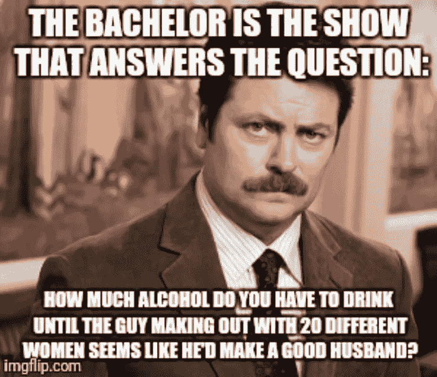
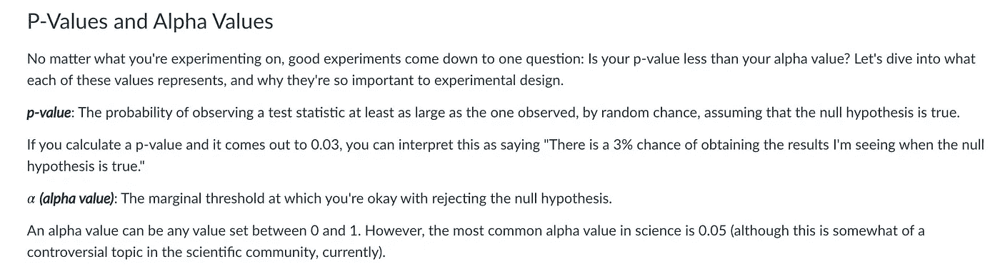
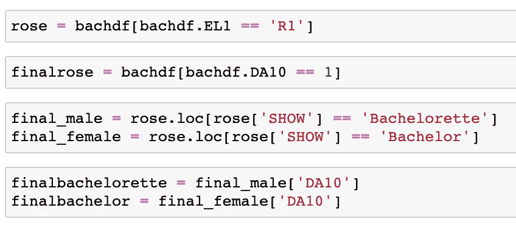
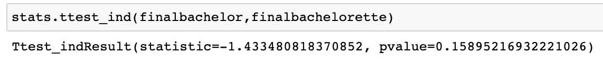
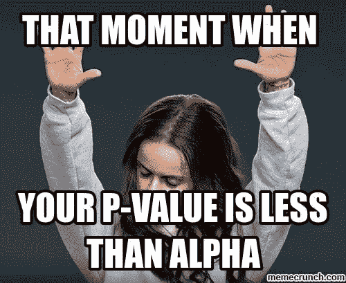
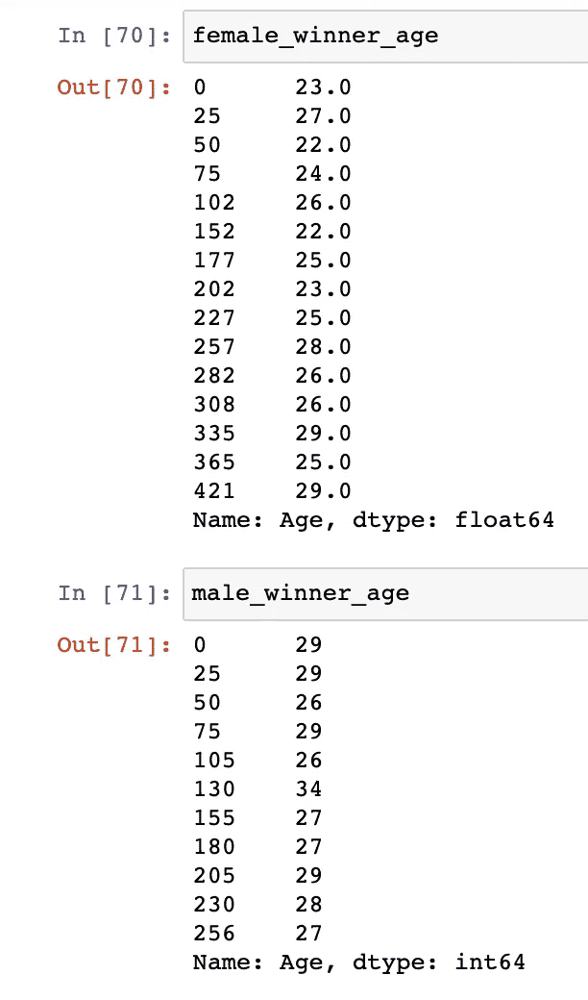
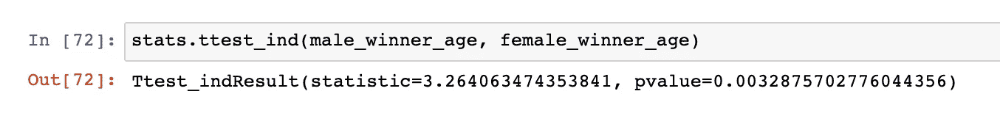

# 你会接受这个假设吗？

> 原文：<https://medium.com/geekculture/will-you-accept-this-hypothesis-1adc2087fed?source=collection_archive---------69----------------------->

简要概述我如何利用单身汉作为工具，试图更好地理解假设检验。

在过去的 5 年里，我一直试图为自己参与“单身国家”这种异规范的荒谬行为开脱罪责，但是，唉，我们现在就是这样。*我主要归因于这样一个事实:我喜欢有所期待，如果大多数周一我都可以期待喝酒、点外卖、看令人麻木的真人秀，我会去做！所以今天，我要去许多愚蠢的人在我之前已经去过的地方——试图分析在 ABC 庞大的特许经营中发生了什么。

我的“参与”包括观看单身汉特许经营秀和偶尔阅读与该特许经营相关的“新闻”。

目前，在熨斗数据科学训练营第二阶段，我们淹没在统计数据中！作为一个非常自我的学生，我喜欢将内容与我自己的生活联系起来，我一直在与假设检验以及随之而来的各种辅音作斗争。

Thanks Flatiron.

为了挖得更深一点，并试图获得一些进一步的理解，我冒险去 [Kaggle 找一些光棍国家的数据](https://www.kaggle.com/danoozy44/bachelorette-bachelor)。为了一点点的背景---《单身汉》和《单身女郎》赛季开始时，大约有 30 名选手争夺主角的爱情。选手们通过领舞者提供的玫瑰来确定他们是否能晋级下周。有很多种方法可以得到一朵玫瑰，但最常见的是在玫瑰仪式上说“你愿意接受这朵玫瑰吗？”从理论上讲，这部剧的结局是主角在经历了所有参与者的情绪起伏后，从两个决赛选手中选择一个。

不用说，我决定开始一段旅程，看看单身汉和未婚女子是否有什么显著的不同。

免责声明:我完全承认我的样本是小的，不是随机的！

1.  第一印象玫瑰:[最能说明问题的玫瑰](https://www.refinery29.com/en-us/is-the-bachelor-winner-the-first-impression-rose-contestant)据说是每个季节赠送的第一朵。第一印象玫瑰是在第一天晚上给给主角留下最好第一印象的选手。通常，这朵玫瑰预示着一位选手将在这一季中走得很远。这就引出了我的第一个假设:

零假设:如果第一印象是玫瑰，那么一个单身汉或未婚女选手成为两个决赛选手之一的可能性没有区别。

另一种假设:如果一个单身汉或未婚女子收到第一朵印象玫瑰，他们成为两个决赛选手之一的可能性是不同的。

使用了来自 Kaggle 的数据集。我找到了收到第一印象玫瑰的名单——共有 45 位。然后，我继续筛选那些收到第一印象并晋级到最后一集的人。有 29 个。

接下来，我分离出数据来比较单身汉参赛者和未婚女子参赛者。我的 t 检验表明我的 p 值不足以拒绝零假设。

我继续寻找，因为不像一个值得信赖的研究员或统计学家，我决心在单身汉和未婚季节之间找到一些不同的东西，瞧，我终于做到了。

在向 Kaggle 咨询了一些关于单身汉/贵族参赛者的更深入的数据后，我决定调查这些节目“获胜者”的年龄

零假设:赢得单身汉和未婚女子的参赛者年龄没有差别。

另一种假设:赢得单身汉的参赛者比赢得单身女郎的参赛者年轻。

你瞧，在 0.003，我们的 P 值比 0.05 的α值小得多！我们可以拒绝我们的无效假设！

因为我强迫自己以某种方式让这个信息有用，我要做一个预测，我们现在的单身女子凯蒂会选择一个年龄接近 28 岁而不是 25 岁的男人！

## 总之，我还是对 p 值 p 沮丧，但是是时候继续前进了！