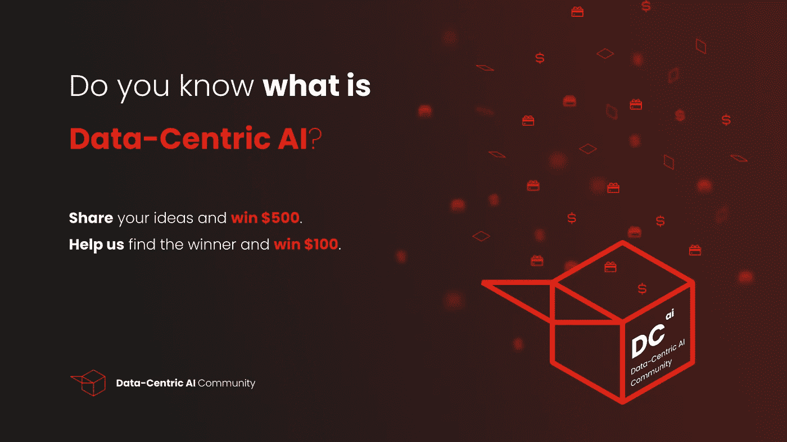

# 赢得 500 美元，书写人工智能的未来

> 原文：<https://medium.com/geekculture/win-500-to-write-the-future-of-ai-dfc871b67cc9?source=collection_archive---------17----------------------->

## 以数据为中心的人工智能社区发起了一场比赛，为以数据为中心的人工智能寻找最佳定义。获胜者可以拿 500 美元回家。

在[吴恩达谈到以数据为中心的人工智能的概念后近一年，](https://www.youtube.com/watch?v=06-AZXmwHjo&ab_channel=DeepLearningAI)在全球范围内发起竞赛和研讨会，仍然缺乏一个同行学习&共享社区，在专家的指导下，以数据为中心的运动得以建立和发展。

因此，[以数据为中心的人工智能](https://datacentricai.community)社区的诞生帮助数据科学家通过提高数据集的质量来改善他们的人工智能模型。

> *让社区推动向以数据为中心的人工智能的范式转变至关重要。它专注于数据剖析、* [*合成数据、*](https://syntheticdata.community) *，以及数据标注，这是数据科学家最显著的痛点。*

由于是一个新的和不断发展的概念，专家们根据他们的经验和用例定义了以数据为中心的人工智能。[以数据为中心的人工智能社区](https://datacentricai.community)认为，应该由成员主动为概念找到最合适的定义，因此我们[在社区内发起一场竞赛，奖金为 500 美元](https://contest.datacentricai.community)以获得最佳定义。

你需要做的就是[加入以数据为中心的人工智能社区](https://tiny.ydata.ai/Join-DC-AI)并[用你的最佳定义填写这张表格。社区和竞赛都可以自由加入。](https://contest.datacentricai.community)

如果你自己不是那种有创造力的人，我们鼓励你与朋友或同事分享这个机会。如果你是指赢家，你可以赢得 100 美元！

> *The plan it 将在社区内举办许多像这样有意义的比赛，这将推动参与，同时为运动中的成员增加价值——让成员自己真正定义运动。*

[以数据为中心的人工智能社区](https://datacentricai.community/)拥有数百名数据专家，他们正在进行有意义的以数据为中心的对话。借助这一机会，我们的目标是为数据科学团队、研究人员和初学者打破障碍，创造讨论和学习数据质量问题的最佳场所。

获胜者将由社区投票和评审团评估相结合的方式选出， [**您** **可以在此提交您的最佳定义，截止时间为 6 月 30 日 23:59 PT** 。](https://contest.datacentricai.community)

# #祝你好运！