# SQL 中的窗口函数

> 原文：<https://medium.com/geekculture/window-functions-in-sql-221187e991df?source=collection_archive---------11----------------------->

Sql vector created by pikisuperstar — [www.freepik.com](http://www.freepik.com)

## 带示例

窗口函数是一组函数(**聚集和排名**)，其作用于某组行(定义为**窗口**)，其特征在于定义了**窗口**的条件的 **OVER** 子句。

> **为什么窗口功能:**

为什么要使用窗口函数，正常使用聚合函数和使用 with window 函数有什么区别:

假设您有一个员工数据库:

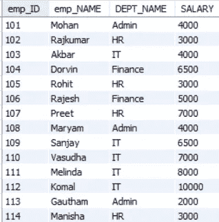

snippet from the employee database

现在你想找出每个部门的平均工资

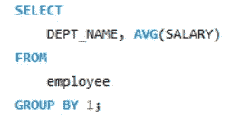

query to find avg salary of every department

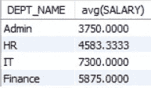

result of the above query

但是现在你想比较每个雇员的工资和他们的平均部门工资，那么我们能做什么呢，一个想法是在 dept_name 相同的情况下将 employee 表和上面的结果连接起来。

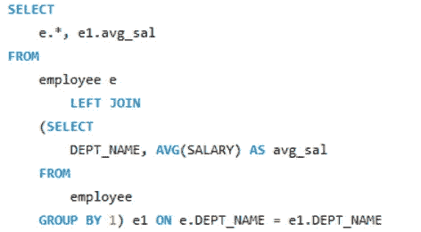

query to compare every employee salary with their dept avg salary

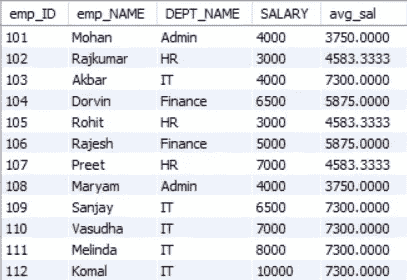

results of the above query

但是窗口函数使我们能够用更简单的查询给出相同的结果

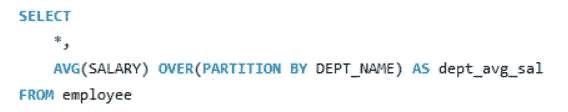

Query to compare with avg dept salary by using window functions

over partition by 定义窗口的条件现在，我们希望查询在每个不同的 DEPT_NAME 上定义 avg(SALARY)函数。

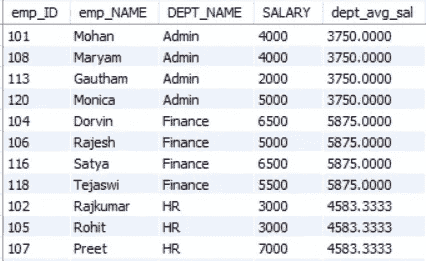

results of the above query

我们甚至根据部门名称对结果进行了排序。

我们可以对任何聚合函数做同样的事情，比如 AVG()、MIN()、MAX()、COUNT()、SUM()。

> **排名功能:**

排名函数是一组窗口函数，它们根据我们提供的条件为行分配编号/排名，因此它们中的每一个都有不同的函数和不同的用例，让我们逐一查看。

> **ROW_NUMBER():**

顾名思义，这个函数根据给定的条件给行分配连续的数字。

snippet of the employee database

现在让我们分配按部门名称分组并按薪金排序的行号。

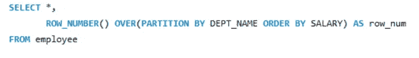

query to get row number

因此，该查询将窗口定义为 dept_name，并按薪金排序

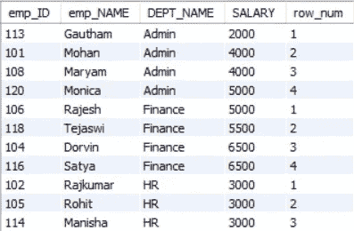

results of the above query

如您所见，该查询对每个部门进行了分组，并按升序对工资进行了排序，然后给出了每个部门的连续行号。

在这个结果中，你可以注意到，即使行政部门的 Mohan 和 Maryam 有相同的薪水，但被分配了不同的号码，如果我们必须将相同的号码分配给两行，这就是 **RANK()和 DENSE_RANK()** 发挥作用的地方。

> **RANK():**

此函数根据不同的条件为行分配等级，主要区别在于处理联系，让我们根据按部门划分的薪金来分配等级。

query to assign ranks based on salary segregated into each department

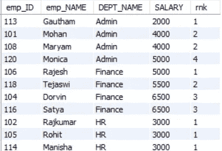

results of the above query

如你所见，行政部门的**莫汉和玛利亚姆**以及财务部门的**多文和萨蒂亚**以及人力资源部门的**拉杰库马尔、罗希特和马尼沙**被给予相同的级别，因为他们的工资相同。

但是如果你能注意到这个结果有一个小问题，管理部门的 Monica 被给予 4 级，尽管她在管理部门的工资排名第三，这是因为有两个人具有相同的级别- 2，数字 3 被跳过，这就是 **DENSE_RANK()** 有用的地方**。**

> **DENSE_RANK():**

该函数的功能与 **RANK()** 相同，但在出现平局的情况下，它不会像 **RANK()** 函数那样跳过等级。

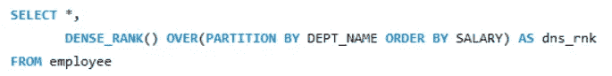

query to assign rank without skipping ranks in case of ties

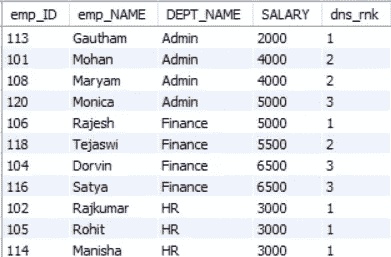

results of the above query

您可以注意到，现在查询没有跳过任何等级，而是为 Monica 指定等级 3。

> **NTILE(n):**

NTILE(n)函数将数据分成 n 个桶，并给它们连续的编号，如排名。

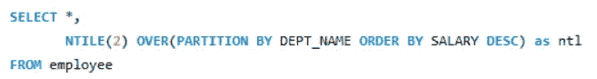

query to assign ntile rank

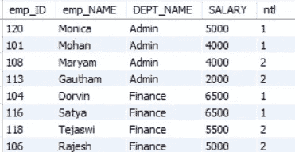

results of the above query

您可能会注意到，对于每个部门，查询分为两个时段，并为每个时段分配连续的数字。

您甚至可以使用没有分区依据的窗口函数，而只使用 order by like:

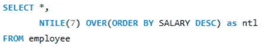

query to just order salary as a whole not segregate department

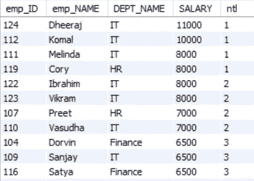

results of the above query

现在，ntile 函数只是按薪水降序排列我们的表，并将它们分成 7 个桶，并给出连续的数字。

还有另一类窗口函数，称为值窗口函数，它在某些条件下返回表本身的值。

> **值窗口功能:**
> 
> **FIRST_VALUE():**

这个函数返回分区窗口的第一个值和提到的顺序。

比如现在，您希望显示所有员工数据以及在相应部门中获得最高工资的员工姓名。

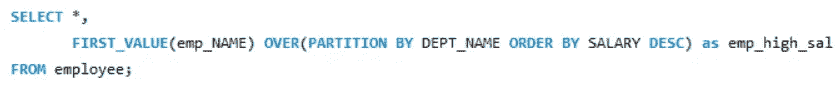

query for getting the employees name with highest salary among dept along with all the other data

在这里，您可以注意到，我们希望 emp_name 的第一个值按照 dept_name 进行分区，并按照薪金降序排序。

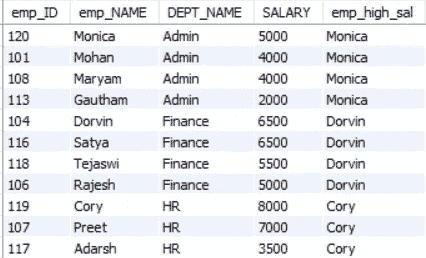

result of the above query

> **LAG():**

这个函数为指定窗口中的前一行赋值，如果没有前一行的值，那么它只给出空值，就像将窗口中的指定值下移一行。

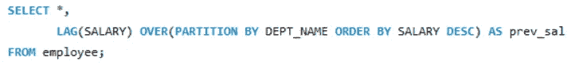

query to return the salary value in previous row in the window defined by dept_name

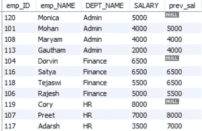

results of the above query

正如你所看到的，每一行前一行的工资值被分配，在没有前一个值的情况下，它只给出空值。

> **导语**():

这个函数的作用与 LAG()相同，但它不赋前一行的值，而是赋下一行的值。

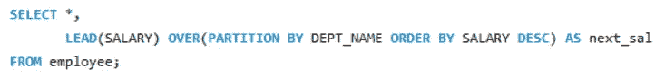

query to return the salary value in next row in the window defined by dept_name

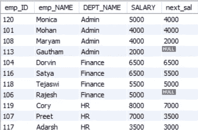

results of the above query

正如您所看到的，每一行都被分配了下一行的薪金值，如果指定的窗口中没有行，则返回 null 值。

> **概要:**

在这篇文章中，我试图尽可能清晰地解释一组重要的和最常用的窗口功能。如果您对文章有任何建议或疑问，请留下建设性的批评或通过 LinkedIn 与我联系。

谢谢你……..