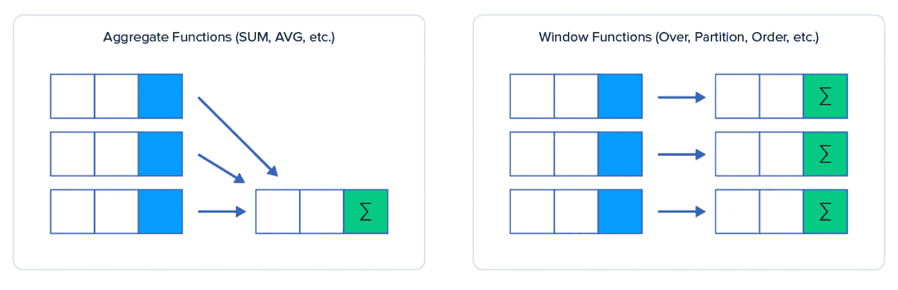

# SQL 中的窗口函数

> 原文：<https://medium.com/geekculture/window-functions-in-sql-b630b0c11a57?source=collection_archive---------16----------------------->

窗口函数是一个强大的工具，有助于利用 SQL 的能力进行数据分析。

窗口函数可以简单地认为是使用一个集合，但是我们不是为所有表(如 sum、average、min、max 或 count)获取一个输出，而是将获取的值传播到所有输出表或特定窗口，我们理想的是通过“PARTITION by”来指示窗口大小。