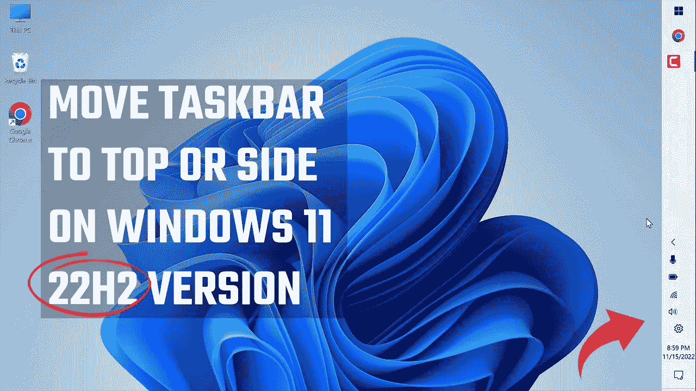

# Windows 11 22H2 任务栏定制:将任务栏移动到顶部或侧面！

> 原文：<https://medium.com/geekculture/windows-11-22h2-taskbar-customization-move-the-taskbar-to-the-top-or-side-d2a7049f03e7?source=collection_archive---------6----------------------->

通过将任务栏移动到任意一侧或顶部来定制任务栏的简单方法

在本文中，我们将快速了解如何将 Windows 11 22H2 版本(最新版本)中的任务栏移动到顶部或左侧或右侧。使用旧版本的 Windows 11(即 21H1)，您可以使用注册表移动任务栏，但使用新的…