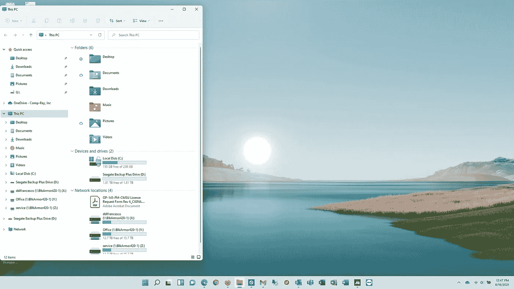

# Windows 11:经过一个月的日常使用，我喜欢它

> 原文：<https://medium.com/geekculture/windows-11-after-a-month-of-daily-use-i-like-it-df33ad0d33dc?source=collection_archive---------23----------------------->

## 我将继续使用它

Windows 11 (Image by Author)

## 概观

自从我从 Windows Insider dev 频道安装了第一个 Windows 11 版本以来，已经过去了一个多月。我想是时候更新一下了。

我一直在我的日常驱动程序上使用 Windows 11 Pro，这是一台微软 Surface Laptop 2，具有 8 GB RAM 和 256 GB 的…