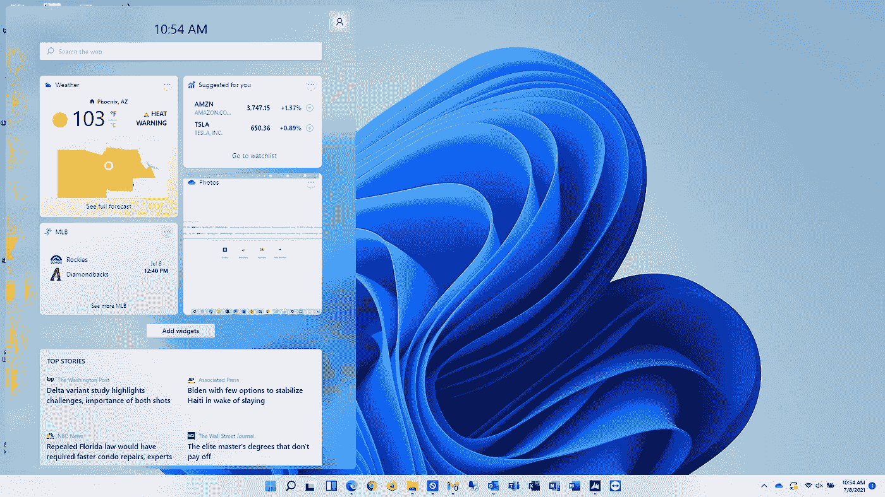

# Windows 11 使用一周后

> 原文：<https://medium.com/geekculture/windows-11-after-one-week-of-use-3eedc08c8d6a?source=collection_archive---------7----------------------->

Image by Author

现在使用 Windows 11 开发者预览版一周左右，不得不说印象深刻。到目前为止，我注意到的问题很少。

到目前为止，我唯一遇到的情况是文件浏览器没有响应，但大约 30 秒后它恢复了活力，其次，我注意到在谷歌文档中输入时有一些延迟。这两个问题在几天内都没有再次出现…