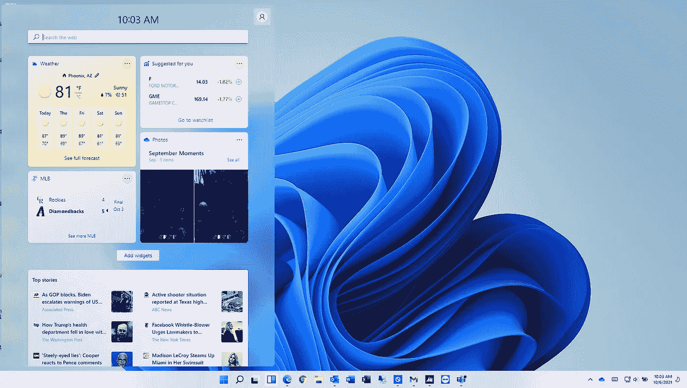

# Windows 11 终于发布了

> 原文：<https://medium.com/geekculture/windows-11-has-finally-been-released-a2aeea355ba7?source=collection_archive---------21----------------------->

## 问题是，你应该升级吗

Windows 11 desktop and widgets (Image by Author)

终于正式发布了，微软已经向公众发布了 Windows 11，只要你有一台符合要求的电脑。

我本周购买了一台新的笔记本电脑，它的规格比 Surface Book 2 更现代，我一直在运行 Windows 11 Insider 预览版和测试版。