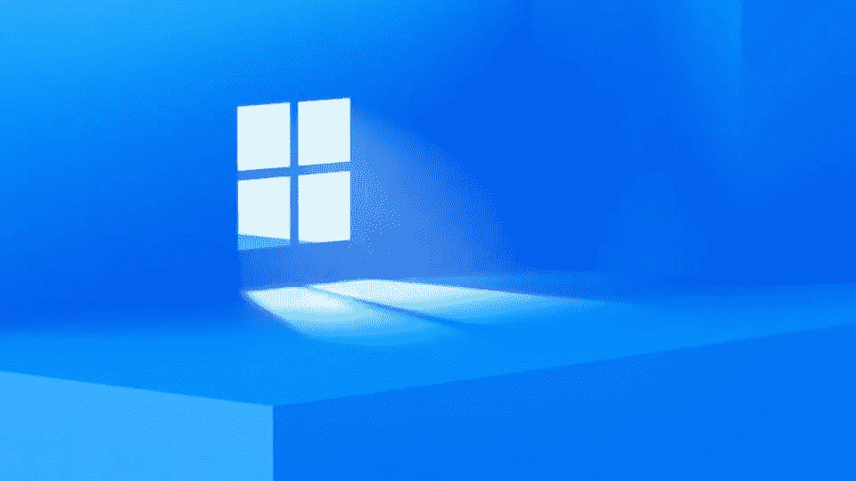

# Windows 11 刚刚发布:有什么新内容？

> 原文：<https://medium.com/geekculture/windows-11-is-just-out-whats-new-c740c091147c?source=collection_archive---------37----------------------->

## 一切看起来都是圆的。

Source: [Microsoft](https://www.forbes.com/sites/barrycollins/2021/06/19/windows-11-will-it-be-a-free-upgrade/?sh=46c0ccb03658)

在漫长的 10 年后，微软发布了 Windows 的新版本。

它带来了很酷的用户界面和 UX 改进，符合我们的新期望。早些时候，当 Windows 10 发布时，微软公开表示，“**这将是最后一个*T2 版本的 Windows。***“他们撒谎了。

> “Windows 10 是……